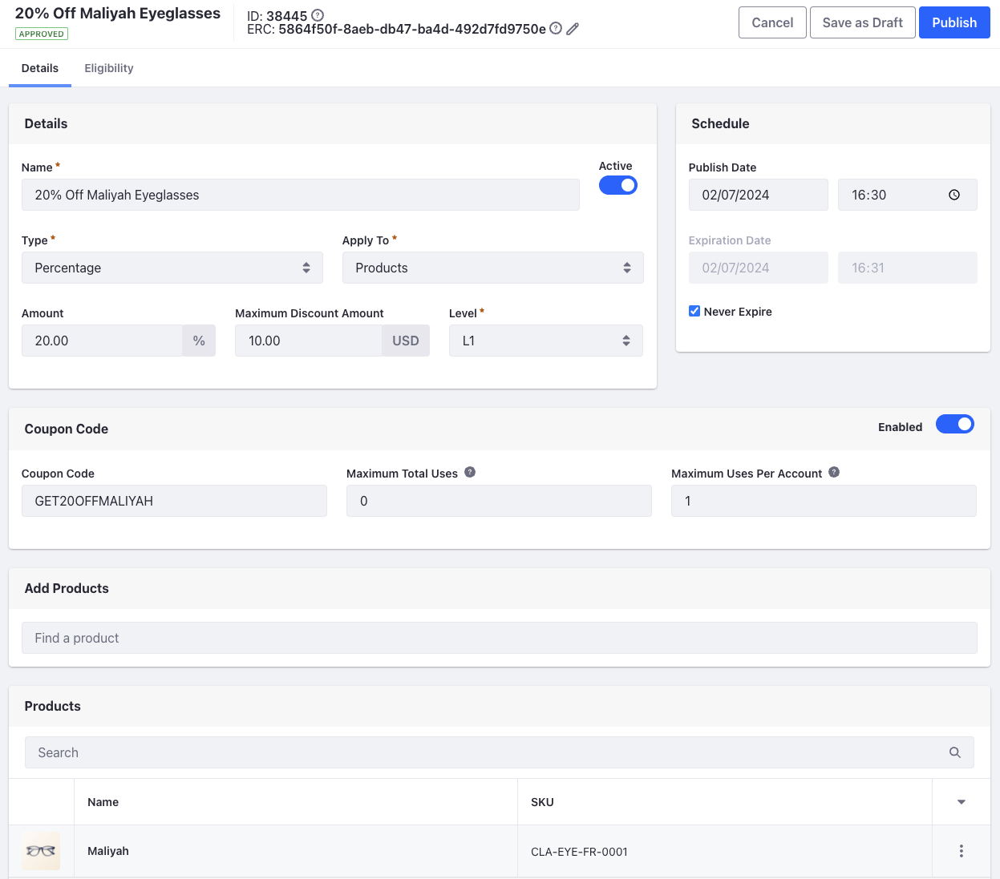
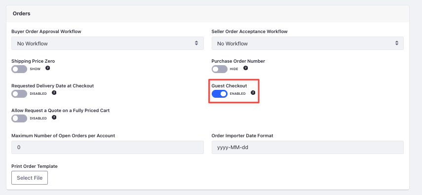

# Creating a Discount and Enabling Guest Checkout

Now, you’ll create a discount that offers a price reduction for the Maliyah eyeglasses for a limited period of time. After creating the discount, you’ll enable guest checkout for the B2C site so that users can place orders without having an account. 

## Creating a Discount

1. Open the *Global Menu* () and navigate to *Commerce* &rarr; *Discounts*.

1. Click *Add* () and enter the following details:

   **Name:** 20% Off Maliyah Eyeglasses

   **Type:** Percentage

   **Apply To:** Products

1. Click *Submit*. This opens a page with more configuration options for the created discount.

1. In the Details section, set the Amount to *20*, Maximum Discount Amount to *$10* and activate the discount using the *Active* toggle.

1. In the Coupon Code section, activate it using the *Enabled* toggle and set the Coupon Code field to `GET20OFFMALIYAH` and Max Uses Per Account to *1*.

   

1. In the Add Products section, search for *Maliyah* and click *Select*.

1. Click *Publish*.

## Enabling Guest Checkout

Since this is a website for consumers, Clarity supports guest checkout, so customers can place orders without having to create an account. To enable guest checkout,

1. Open the *Global Menu* () and navigate to *Commerce* &rarr; *Channels*.

1. Select *Clarity B2C*.

1. In the Orders section, enable the toggle for *Guest Checkout*.

   

1. Click *Save*.

With that, you should have a discount that you can use on the Maliyah eyeglasses. During checkout, enter the promo code to avail the discount. 

Congratulations on building a fully functional B2C storefront. In the next module, you'll create the B2B storefront for Clarity's business customers.

[Back to Course](../../commerce-architect.md)
