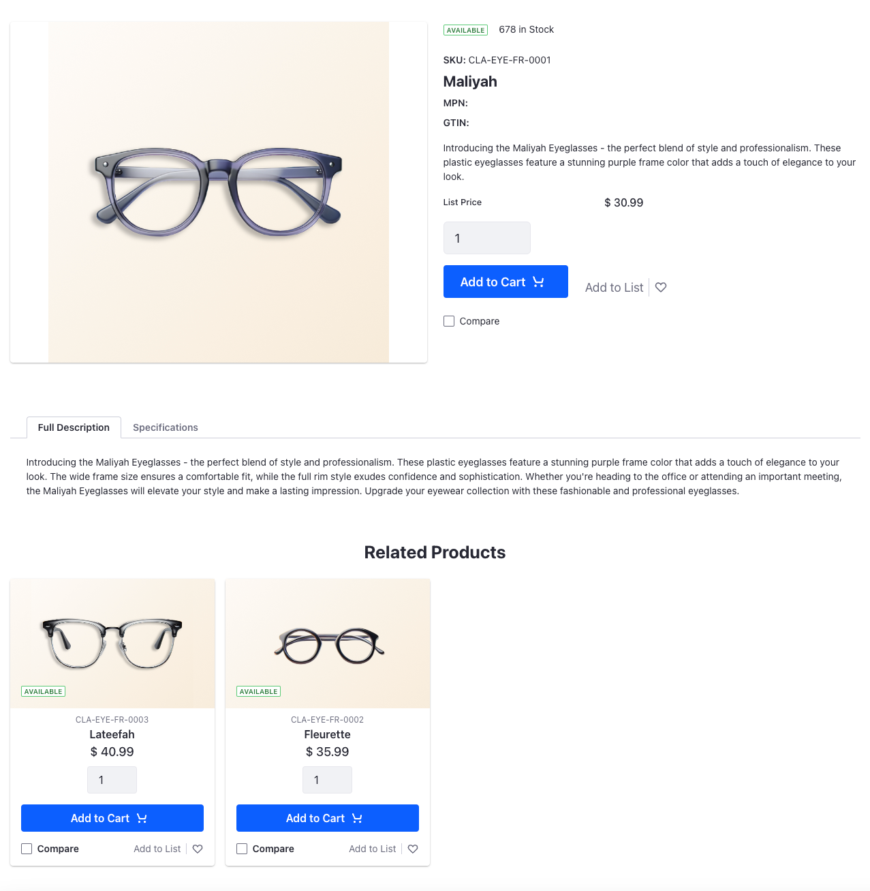

# Creating a Product Details Page

The product details page displays all the information about a selected product. So far, you've only added the shop page containing the product catalog, but you cannot select any of these products to view more details about them. 

## Creating a New Page

1. Open the *Product Menu* (), and navigate to *Site Builder* &rarr; *Pages*.

1. To add a child page, click *Add* () next to the shop page and click *Add Page*.

1. Select the master page template.

1. Enter the name as `Product Details` and click *Add*. This opens the new page in edit mode.

## Customizing the Product Details Page

1. Drag and drop a container on the page. Change the Container Width to *Fixed Width*.

1. Go to the *Styles* tab and in the Spacing settings, choose *Spacer 5* for the margin on the top of the element.

1. Drag and drop the *Product Details* widget inside the fixed width container.

1. Drag and drop a Heading fragment below the Product Details widget.

1. Set the header title to *Related Products*.

1. Go to the *Styles* tab and in the Spacing settings, choose *Spacer 4* for the margin on the top and bottom of the element.

1. In the Text settings, set the text alignment to center.

1. Drag and drop the *Product Publisher* widget inside the fixed width container below the heading fragment.

1. Click *Actions* () to customize the widget.

1. Under Product Selection, select *Data Source*.

1. From the Data Source drop-down, select *Product Relations related*.

The product details page is ready to use now. Go back to the shop page and click on one of the featured products to view more details about it. You can also view products related to the currently selected product in the related products section below it. 

Next: [Creating an Orders Page](./creating-an-orders-page.md)
