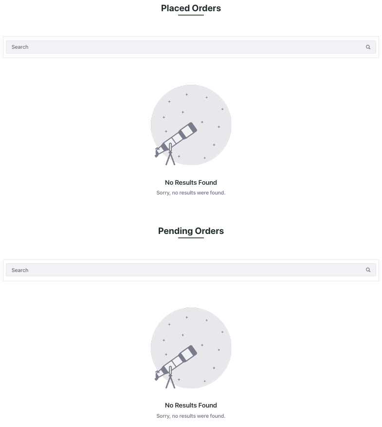

# Creating an Orders Page

The Orders page displays any open orders or placed orders that the customer currently has. You can select pending orders and continue to checkout or delete them completely. You can select a placed order to view more details about the order. 

## Creating a New Page

1. Open the *Product Menu* (), and navigate to *Site Builder* &rarr; *Pages*.

1. Click *Add* () next to the shop page, to add a child page, and click *Add Page*.

1. Select the master page template.

1. Enter the name as *Orders* and click *Add*. This opens the new page in edit mode.

## Applying the CSS Client Extension

You must now configure the created page in Liferay to use your deployed client extension:

1. Open the orders page, click on *Edit* () at the top.

1. In the sidebar, navigate to the *Page Design Options* menu () and click the *Configuration* () icon at the top of the menu.

1. In the CSS Client Extensions section toward the bottom of the page, click *Add CSS Client Extensions*.

1. Select your CSS client extension from the pop-up modal and click *Add*.

1. Click *Save*.

## Customizing the Orders Page

1. Drag and drop a container on the page. Change the *Container Width* to *Fixed Width*.

1. In the *Advanced* section, give it the CSS class `p-3`.

1. Drag and drop a heading fragment and a separator fragment below it.

1. Set the header title to *Placed Orders* and the *Heading Level* to *H3*.

1. In the *Advanced* section of the header fragment, add the `text-center` and `mb-1` CSS classes. 

1. Click on the separator and go to the *Advanced* section. Add the `section-text-line` and `mb-5` CSS classes.

1. Drag and drop the placed orders widget inside the fixed width container.

1. Drag and drop a heading fragment and a separator fragment below the placed orders widget.

1. Set the header title to *Pending Orders* and the *Heading Level* to *H3*.

1. In the *Advanced* section of the header fragment, add the `text-center`, `mb-1`, and `mt-5` CSS classes. 

1. Click on the separator and go to the *Advanced* section. Add the `section-text-line` and `mb-5` CSS classes.

1. Drag and drop the open carts widget inside the fixed width container.

The orders page is ready to use now. 

Next: [Creating a Checkout Page](./creating-a-checkout-page.md)
