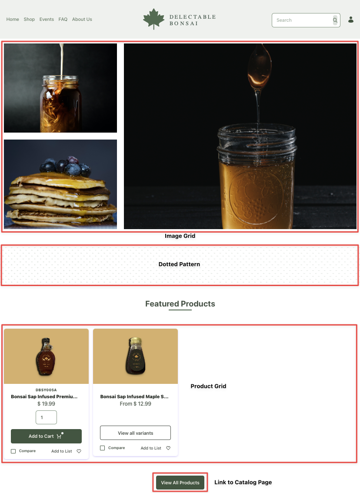
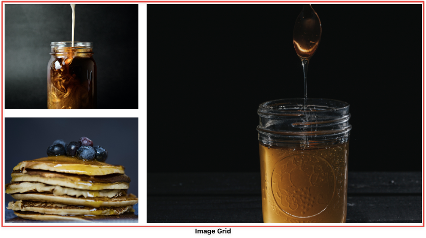
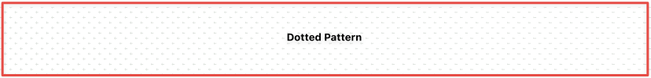
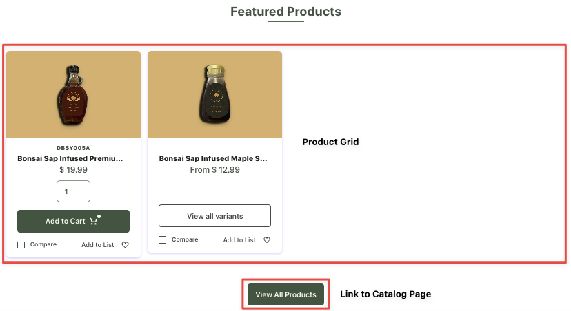

# Creating the B2C Homepage

The homepage for the shop will contain attractive images, featured products, and interesting articles from the blog. You can also go to the catalog page from the homepage to view all available products. There’s a blank page already created for the shop that uses the Master Page template created in the Site Designer course.

<!-- ## Deploying the CSS Client Extension

The B2C store uses styles that are not relevant to the other pages. For this purpose, you can use a CSS client extension and use it only on the pages you want.  

 Add instructions about deploying the Global CSS Client Extension 
I have a CSS client extension locally, but with the change of DB to Clarity, I can't push it up to Brian nor add instructions here. 
I think it's best to leave this part blank for now. Let me know what you think?
-->

## Applying the CSS Client Extension

You must now configure the created page in Liferay to use your deployed client extension:

1. Open the shop page, click on *Edit* () at the top.

1. In the sidebar, navigate to the *Page Design Options* menu () and click the *Configuration* () icon at the top of the menu.

1. In the CSS Client Extensions section toward the bottom of the page, click *Add CSS Client Extensions*.

1. Select your CSS client extension from the pop-up modal and click *Add*.

1. Click *Save*.

## Adding the Image Grid

The first element on the shop’s homepage is an image grid. To create this,

1. Open the *Product Menu* () and go to *Site Builder* &rarr; *Pages*.

1. Select the shop page. This opens the page in edit mode.

1. Drag and drop a container from the left-hand menu. 

1. In the right-hand configuration menu, set the *Container Width* to *Fixed Width*.

1. Go to the *Advanced* section of the container and give it the CSS class `p-3`. 

1. Drag and drop a grid inside the container and set the *Number of Modules* to *2*.

1. Drag and drop two containers inside the first module, and one container inside the second module.

1. Set the height of the third container in the second module to `640px`.

1. Set the height of both containers in the first module to `calc((640px - 1.5rem)/2)` and *Overflow* to *Hidden*.

1. Go to the *Advanced* section of the first container in the first module and give it the CSS class `mb-4`. 

1. Now, go to the Styles section of the first container in the first module and select `banner_image_1.png` from your Documents and Media library. Repeat the same for the other two containers while selecting the following two images:

   * `banner_image_2.png`

   * `banner_image_3.png`

1. Go to the *Advanced* section for each image in the grid and add the `banner-img-transition` CSS class.

## Adding the Dotted Pattern

1. Drag and drop a container below the image grid.

1. Go to the *Advanced* section and give it the `dotter-pattern` and `m-5` CSS classes.

1. Click *Publish*.

## Adding the Section Title

1. Drag and drop a heading fragment and a separator fragment below the dotted pattern.

1. Set the header title to *Featured Products* and the *Heading Level* to *H3*.

1. In the *Advanced* section of the header fragment, add the `text-center` and `mb-1` CSS classes. 

1. Click on the separator and go to the *Advanced* section. Add the `section-text-line` and `mb-5` CSS classes.

1. Click *Publish*.

## Adding the Featured Products Grid

1. Drag and drop a container below the separator.

1. In the right-hand configuration menu, set the *Container Width* to *Fixed Width*.

1. Now, drag and drop a product publisher widget inside the container.

1. Go to the *Advanced* section and add the `p-3` CSS class.

1. Click on the *Actions* () icon for the widget and select *Configuration*.

1. Under the *Filter* section, click *Add* () and create a new rule:

   * Contains any of the following tags. 

1. Click *Select* and choose *featured*.

1. Click *Done*.

1. Drag and drop a button fragment below the product publisher within the fixed width container. 

1. Go to the *Advanced* section and add the `text-center` and `mb-5` CSS classes.

1. Change the button text to *View All Products*. Clicking this button takes you to the catalog page. You’ll add this link after creating the catalog page.

Next: [Creating a Catalog Page](./creating-a-catalog-page.md)
