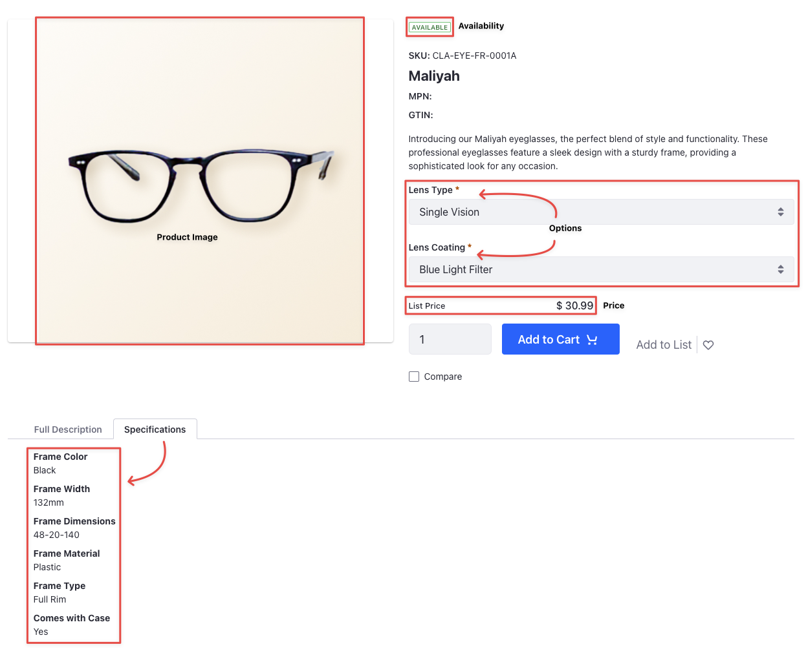
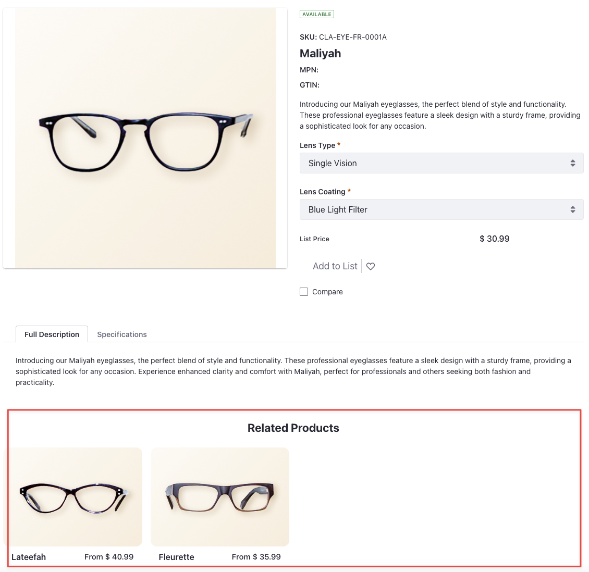

---
toc:
  - ./configuring-products-and-skus/adding-product-specifications.md
  - ./configuring-products-and-skus/adding-options.md
  - ./configuring-products-and-skus/adding-media.md
  - ./configuring-products-and-skus/adding-product-relations.md
  - ./configuring-products-and-skus/configuring-skus.md
uuid: f0887bb7-fcc2-4e88-8b1a-27b54a2efadf
---
# Configuring Products and SKUs

After creating channels, a product catalog, warehouses, and products, you must now configure them. This module enriches products with information about various attributes. You'll also dive deeper into creating product relations that lead to more sales opportunities.

By the end of this module, you’ll know how to add product specifications, options, media, configure product relations, and SKUs.

* Specifications depict a single piece of product information. Examples of specifications include dimensions, color, weight, etc. For Clarity, some of the specification you'll add are frame type, frame color, frame size, frame material, etc. In the image above, you can see that the product has 6 different specifications.

* Using product options, your customers can choose between different product variants. For instance, when buying a pair of eyeglasses, your customers can choose from different types of lenses and lens coatings. The Maliyah eyeglasses come with three different lens types and two different lens coatings. The price of the product changes based on your customer's selection. 

* Product media can include images and attachments that give more information about the product. 

* You can use product relations to create more sales opportunities. Using it, you can display other products that your customers may want to purchase along with the product being viewed currently. For instance, when viewing the Maliyah eyeglasses, you can view two other related eyeglasses below it. 

   

* SKU (Stock Keeping Unit) is the basic unit of a product tracked in inventory. Configuring a SKU includes adding details such as an external reference code, pricing information, inventory information, shipping information, expiry date (if applicable), and more. 

[Let’s Go!](./configuring-products-and-skus.md/adding-product-specifications.md)
