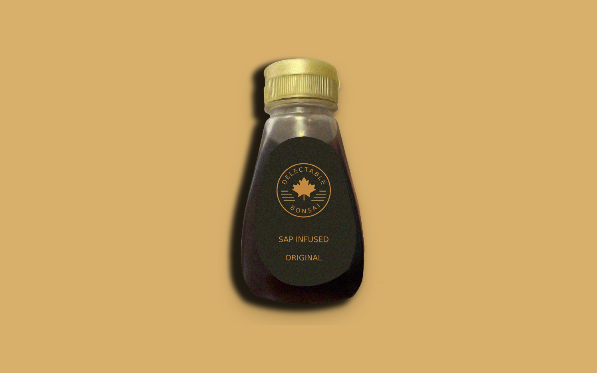

# Adding Media

So far, you've configured a product and added specifications to give more information about the product to customers. One of the main components of product information is the product image itself. In this lesson, you'll learn how to add a product image to an existing product. 

1. Open the *Global Menu* () and navigate to *Commerce* → *Products*.

1. Select *Sap Infused Maple Syrup*.

1. Click on the *Media* tab.

1. Click *Add* () or *Add Image*.

1. Click on *Select File* and choose the image from the library. 

   

1. Enter title as *Sap Infused Maple Syrup*.

1. Click *Publish*.

This adds an image for the first product. Repeat the steps above to select images for the remaining two products. 

In the section below images, you can also add attachments to a product. This is useful when the product has data sheets or other relevant information in the form of documents. 

Next: [Adding Product Relations](./adding-product-relations.md)

## Related Topics

* [Product Images](https://learn.liferay.com/web/guest/w/commerce/product-management/creating-and-managing-products/products/product-images)
* [Product Attachments](https://learn.liferay.com/web/guest/w/commerce/product-management/creating-and-managing-products/products/product-attachments)
