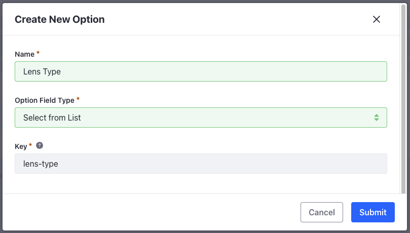
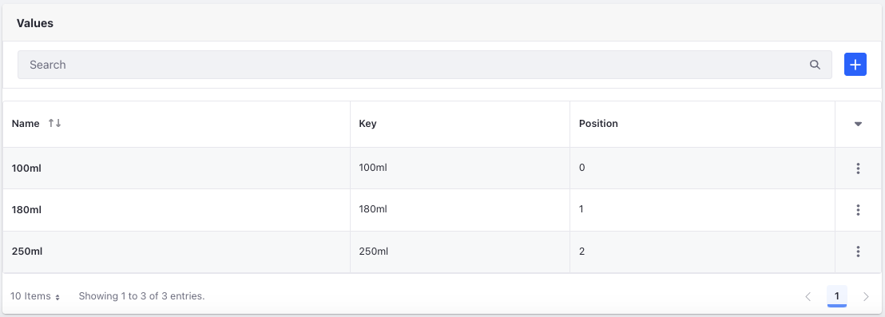
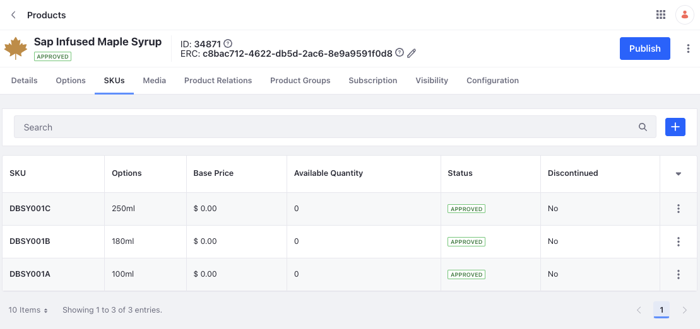

# Adding Options

In the first module, you created three products all having a single SKU, or Stock Keeping Unit. Often, products have multiple SKUs. For instance, a product that has different quantities. In this lesson, you’ll learn how to edit an existing product and add multiple SKUs using options.

1. Open the *Global Menu* () and navigate to *Commerce* &rarr; *Options*.

1. Click *Add* () and enter the following information:

   **Name:** Lens Type

   **Option Field Type:** Select from List

   

1. Click *Submit*.

1. Select the created option.

1. Enable all three toggles: *Use in Faceted Navigation*, *Required*, *SKU Contributor*.

1. In the Values section, click *Add* ().

1. Enter name as *Single Vision* and position as *0*.

1. Click *Submit*. 

1. Repeat the same for two more values: *Progressive* with position *1* and *Bifocal* with position *2*. 

   

1. Click *Save*.

This creates an option template called Lens Type that you can add to multiple products. You can also create options directly from the product configuration page. Repeat the steps for another option, *Lens Coating*, with the following values:

* Blue Light Filter
* Blue Light Filter + UV Protection

## Adding Options to a Product

When adding an SKU-contributing option to a product, it renders the existing SKU inactive. After adding the option to a product, you can generate all SKU combinations based on the available options. Since you've created two options, one with three values and one with two values, it adds six SKUs for a single product. 

1. Open the *Global Menu* () and navigate to *Commerce* &rarr; *Products*.

1. Select *Maliyah*.

1. Go to the SKUs tab and delete the *CLA-FR-EYE-001* sku.

1. Go to the Options tab and search for *Lens Type*.

1. Click *Select*. Repeat the same for lens coating. 

1. Click *Save*.

1. Go to the *SKUs* tab and click *Add* (). 

1. Select *Generate All SKU Combinations*.

   

1. Click on each SKU option and change the name as follows:

   | SKU                                            | Name             |
   | :--------------------------------------------- | :--------------- |
   | SINGLE VISIONBLUE LIGHT FILTER                 | CLA-EYE-FR-0001A |
   | SINGLE VISIONBLUE LIGHT FILTER + UV PROTECTION | CLA-EYE-FR-0001B |
   | BIFOCALBLUE LIGHT FILTER                       | CLA-EYE-FR-0001C |
   | BIFOCALBLUE LIGHT FILTER + UV PROTECTION       | CLA-EYE-FR-0001D |
   | PROGRESSIVEBLUE LIGHT FILTER                   | CLA-EYE-FR-0001E |
   | PROGRESSIVEBLUE LIGHT FILTER + UV PROTECTION   | CLA-EYE-FR-0001F |

   

1. Repeat the above steps for the other two products with the following information.

   | Product   | SKUs                                                                                                       |
   | :-------- | :--------------------------------------------------------------------------------------------------------- |
   | Fleurette | CLA-EYE-FR-0002A, CLA-EYE-FR-0002B, CLA-EYE-FR-0002C, CLA-EYE-FR-0002D, CLA-EYE-FR-0002E, CLA-EYE-FR-0002F |
   | Lateefah  | CLA-EYE-FR-0003A, CLA-EYE-FR-0003B, CLA-EYE-FR-0003C, CLA-EYE-FR-0003D, CLA-EYE-FR-0003E, CLA-EYE-FR-0003F |

1. Click *Publish*. 

This creates six SKUs each for the three products in the catalog giving a total of 18 SKUs. In the next exercise, you’ll add product images for each of the created products.

Next: [Adding Media](./adding-media.md)
