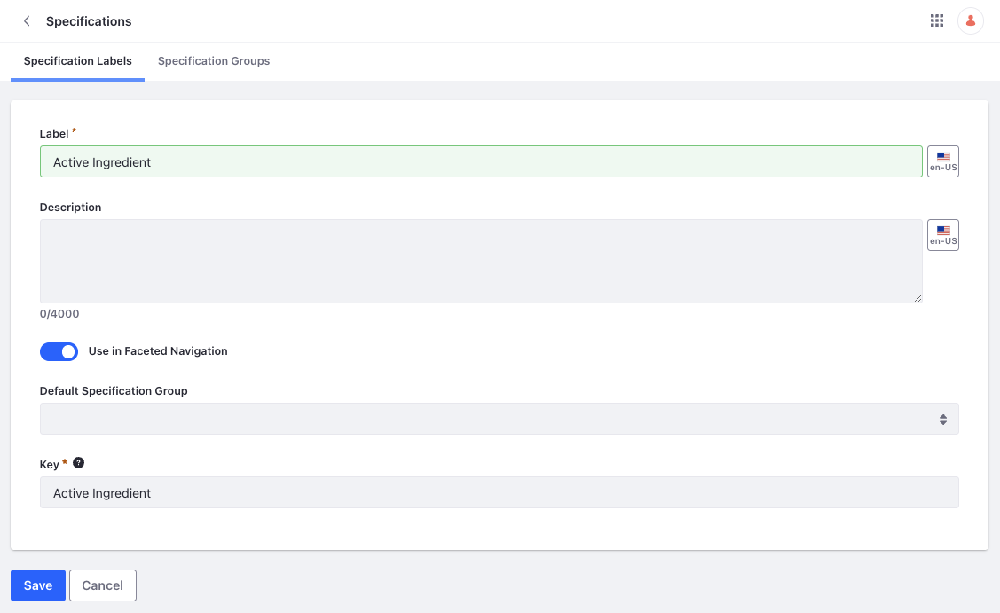
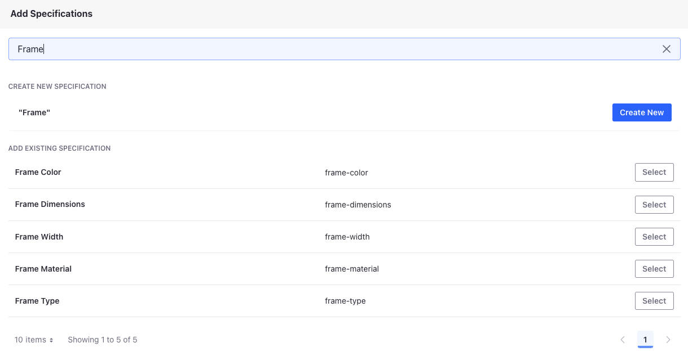

# Adding Product Specifications

Log in as Damian Dunne, the category manager for Clarity. Damian wants to enrich the products with attributes that give more information to customers. You can use product specifications to achieve this. You'll add the following specifications to the products. 

* Frame Color
* Frame Dimensions
* Frame Width
* Frame Size
* Frame Material
* Frame Type
* Comes with Case
* Sunglass Style

1. Open the *Global Menu* () and navigate to *Commerce* &rarr; *Specifications*.

1. Click *Add* () under *Specification Labels* and enter these details:

   **Label:** Frame Color

   **Use in Faceted Navigation:** Enabled

   

1. Click *Save*.

This creates a new specification called frame color. Now, create the remaining specifications following the steps above. 

* Frame Dimensions
* Frame Width
* Frame Size
* Frame Material
* Frame Type
* Comes with Case
* Sunglass Style

For *Frame Dimensions*, *Frame Width*, and *Frame Size*, you must disable the *Use in Faceted Navigation* toggle. 

## Adding Specifications to Products

The next step is to add these specifications to products. You can do this through the product configuration page.

1. Open the *Global Menu* () and navigate to *Commerce* &rarr; *Products*.

1. Select *Maliyah*.

1. Scroll down to the *Specifications* section.

1. Search for *Frame Color* and click *Select*.

   

   This adds the specification to the product. Now, you must enter the value for the specification.

1. Click on the added specification and enter *Black* as the value. 

1. Click *Save*.

1. Following the steps above, add the remaining specifications to the same product. 

   | Specification    | Specification Value |
   | :--------------- | :------------------ |
   | Frame Width      | 132mm               |
   | Frame Dimensions | 48-20-140 (in mm)   |
   | Frame Size       | Medium              |
   | Frame Material   | Plastic             |
   | Frame Type       | Full Rim            |
   | Comes with Case  | Yes                 |

1. Now, add the following specifications to the other two products:

   | Product   | Specifications                      |
   | :-------- | :---------------------------------- |
   | Lateefah  | Frame Color: Black                  |
   |           | Frame Width: 123mm                  |
   |           | Frame Dimensions: 45-17-130 (in mm) |
   |           | Frame Size: Extra Narrow            |
   |           | Frame Material: Plastic             |
   |           | Frame Type: Full Rim                |
   |           | Comes with Case: Yes                |
   | Fleurette | Frame Color: Brown                  |
   |           | Frame Width: 138mm                  |
   |           | Frame Dimensions: 51-20-140 (in mm) |
   |           | Frame Size: Wide                    |
   |           | Frame Material: Plastic             |
   |           | Frame Type: Full Rim                |
   |           | Comes with Case: Yes                |

Next: [Adding Options](./adding-options.md)

## Related Topics

* [Specifications](https://learn.liferay.com/web/guest/w/commerce/product-management/creating-and-managing-products/products/specifications)
