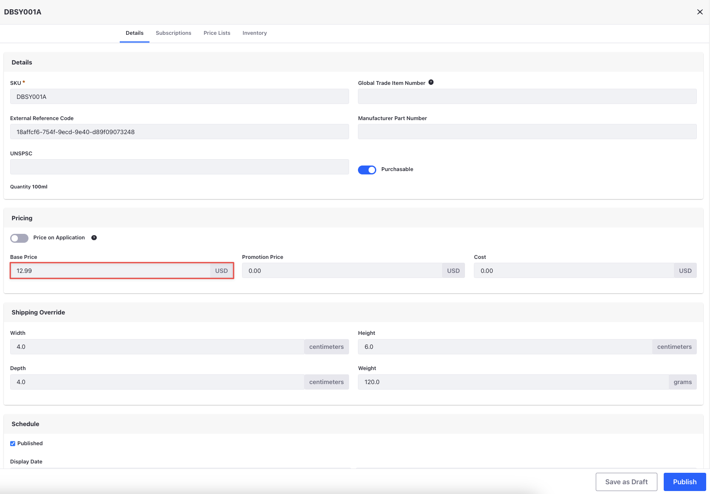
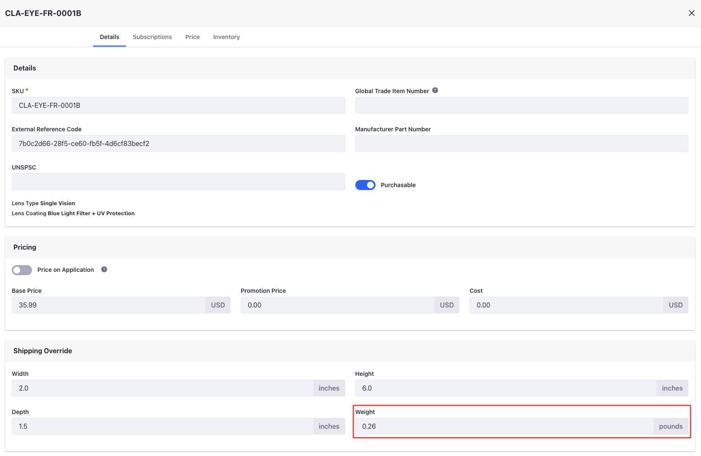
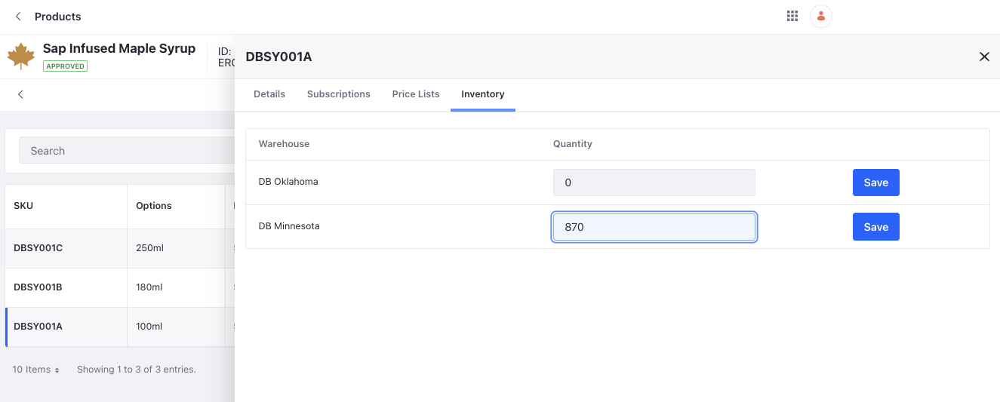

# Configuring SKUs

Now that you've configured all of the basic details for a product, it’s time to configure the SKUs. The SKUs represent the actual physical item in the warehouse. Configuring them involves setting their dimensions, inventory, and pricing. 

## Configuring SKU Prices

After creating the catalog, a base price list and a base promotion list are generated automatically. You'll now add prices for each SKU. There are two ways to do this. The first way is to add pricing information from the product configuration page. The second way is to add an entry in the base price list directly through the pricing application. The steps below show how to add pricing information from the product configuration page. 

1. Open the *Global Menu* () and navigate to *Commerce* &rarr; *Products*.

1. Select *Maliyah*.

1. Click the *SKUs* tab.

1. Select the *CLA-EYE-FR-0001A* SKU.

1. Under the Pricing section, enter the *Base Price* as `$30.99`.

   

   Leave the Promotion Price and Cost fields blank. You can also navigate to the *Price Lists* tab, click *Actions* (), and select *Edit* to enter a price in the base price list. 

1. Enter the pricing information for the remaining SKUs as follows:

   | SKU              | Price  |
   | :--------------- | :----- |
   | CLA-EYE-FR-0001B | $35.99 |
   | CLA-EYE-FR-0001C | $49.99 |
   | CLA-EYE-FR-0001D | $55.99 |
   | CLA-EYE-FR-0001E | $59.99 |
   | CLA-EYE-FR-0001F | $64.99 |

1. Next, repeat the same steps to set prices for all SKUs of the other 2 products. 

   | SKU              | Price  |
   | :--------------- | :----- |
   | CLA-EYE-FR-0002A | $35.99 |
   | CLA-EYE-FR-0002B | $39.99 |
   | CLA-EYE-FR-0002C | $45.99 |
   | CLA-EYE-FR-0002D | $49.99 |
   | CLA-EYE-FR-0002E | $54.99 |
   | CLA-EYE-FR-0002F | $59.99 |
   | CLA-EYE-FR-0003A | $40.99 |
   | CLA-EYE-FR-0003B | $45.99 |
   | CLA-EYE-FR-0003C | $49.99 |
   | CLA-EYE-FR-0003D | $55.99 |
   | CLA-EYE-FR-0003E | $59.99 |
   | CLA-EYE-FR-0003F | $64.99 |

## Configuring SKU Dimensions and Weight

Remember adding the dimensions and weight for the products on the configuration page? These dimensions are applied automatically to all SKUs in the product as well. In this example, there are six SKUs for one product. The weight of each of these differ since they have different lenses and coatings. To change it for each SKU, 

1. Open the *Global Menu* () and navigate to *Commerce* &rarr; *Products*.

1. Select *Maliyah*.

1. Click on the *SKUs* tab.

1. Don't change the dimensions for the CLA-EYE-FR-0001A SKU. 

1. Select the *CLA-EYE-FR-0001B* SKU.

1. Under the *Shipping Override* section, enter the following values:

   **Weight:** 0.26

   

1. Enter the shipping information for the remaining SKUs as follows:

   | SKU              | Weight |
   | :--------------- | :----- |
   | CLA-EYE-FR-0001B | 0.26   |
   | CLA-EYE-FR-0001C | 0.27   |
   | CLA-EYE-FR-0001D | 0.28   |
   | CLA-EYE-FR-0001E | 0.28   |
   | CLA-EYE-FR-0001F | 0.30   |

1. Click *Publish*.

This completes the configuration for one product. Use the following information to repeat the steps above for the other two products. 

   | Product   | SKU Weight                      |
   | :-------- | :------------------------------ |
   | Fleurette | CLA-EYE-FR-0002B - Weight: 0.26 |
   |           | CLA-EYE-FR-0002C - Weight: 0.27 |
   |           | CLA-EYE-FR-0002D - Weight: 0.28 |
   |           | CLA-EYE-FR-0002E - Weight: 0.28 |
   |           | CLA-EYE-FR-0002F - Weight: 0.30 |
   | Lateefah  | CLA-EYE-FR-0003B - Weight: 0.26 |
   |           | CLA-EYE-FR-0003C - Weight: 0.27 |
   |           | CLA-EYE-FR-0003D - Weight: 0.28 |
   |           | CLA-EYE-FR-0003D - Weight: 0.28 |
   |           | CLA-EYE-FR-0003D - Weight: 0.30 |

## Configuring SKU Inventory

Just as with pricing, there are two ways to add inventory for a SKU. The first way is to add inventory through the product configuration page. The second way is to add inventory for each SKU directly through the Inventory application. The steps below shows how to add inventory from the product configuration page. 

1. Open the *Global Menu* () and navigate to *Commerce* &rarr; *Products*.

1. Select *Maliyah*.

1. Click on the *SKUs* tab.

1. Select the *CLA-EYE-FR-0001A* SKU.

1. Click the *Inventory* tab.

   Only the warehouse in Minnesota serves both consumer orders and business orders. The warehouse in Oklahoma fulfills only business orders. 

1. Enter the quantity as 100 for the Minnesota warehouse. 

   

1. Click *Save*. 

Repeat the same process for each SKU of all products. After adding the inventory, you can confirm this by going to the Inventory application. 

1. Open the *Global Menu* () and navigate to *Commerce* &rarr; *Inventory*. 

1. Verify that the inventory is available for all the SKUs. You can also add inventory from here by clicking *Add* () and entering the SKU, warehouse, and quantity. Click *Submit*.

You completed adding and configuring channels, a catalog, warehouses, and products. It’s now time to build the storefront. In the next module, you'll build out the B2C storefront. 

[Building the B2C Storefront](../building-the-b2c-storefront.md)
