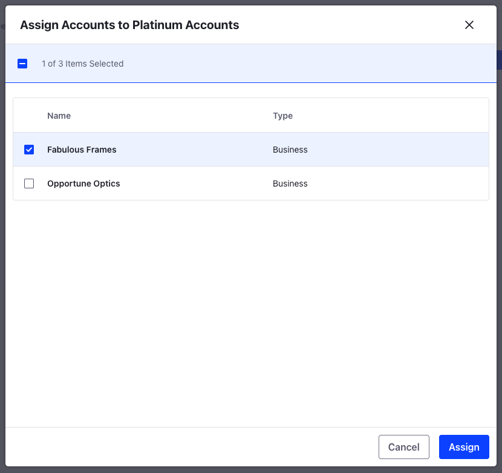
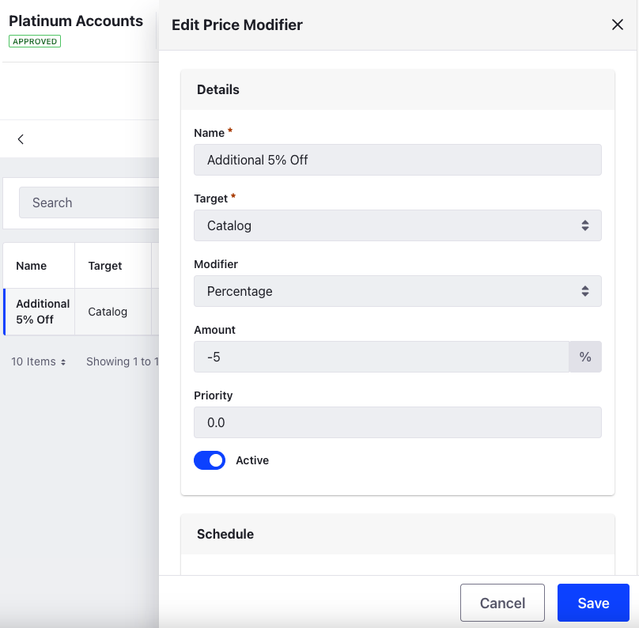

# Creating Account Groups to Offer Specialized Pricing

The administrator, Kyle Klein, wants to create an account group for Platinum Accounts. These are accounts that have a long-standing relationship with Clarity Vision Solutions, and Clarity wants to introduce an additional 5% discount for these accounts. Currently, only Fabulous Frames qualifies as a platinum account, so Kyle will add them to the newly created account group.

## Creating a New Account Group

1. Open the *Global Menu* () and navigate to *Control Panel* &rarr; *Account Groups*.

1. Click *New* and enter *Account Group Name* as Platinum Accounts.

1. Click *Save*.

1. After saving, go to the *Accounts* tab at the top.

1. Click *New* and select *Fabulous Frames*.

   

1. Click *Assign*.

This adds Fabulous Frames to the Platinum Accounts account group. 

## Creating a Custom Price List for Platinum Accounts

1. Open the *Global Menu* () and navigate to *Commerce* &rarr; *Price Lists*.

1. Click *Add* () and enter the following information:

   **Name:** Platinum Accounts

   **Catalog:** Clarity Product Catalog

   **Currency:** USD

1. Click *Submit*.

## Configuring the Custom Price List

In the newly opened configuration page,

1. Go to the *Eligibility* tab.

1. Select *Specific Account Groups* and search for Platinum Accounts.

1. Click *Select* next to the account group.

1. Go to the *Price Modifiers* tab.

1. Click *New* and enter the following information:

   **Name:** Additional 5% Off

   **Target:** Catalog

   **Modifier:** Percentage

1. Select the newly created price modifier.

1. Set the *Amount* to `-5` and activate the price modifier using the *Active* toggle.

   

1. Click *Save*.

This creates the new price modifier on the custom price list that's currently only applicable to Fabulous Frames. They'll receive a 5% discount on the entire catalog in addition to other available discounts. 

Next: [Creating Order Types for Bulk and Regular Orders](./creating-order-types-for-bulk-and-regular-orders.md)
