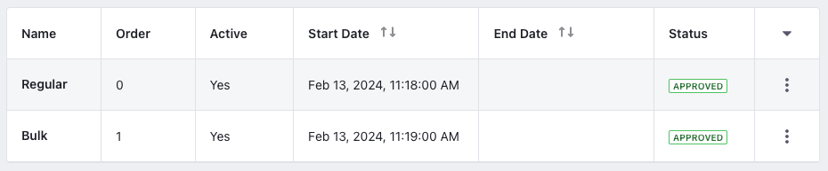
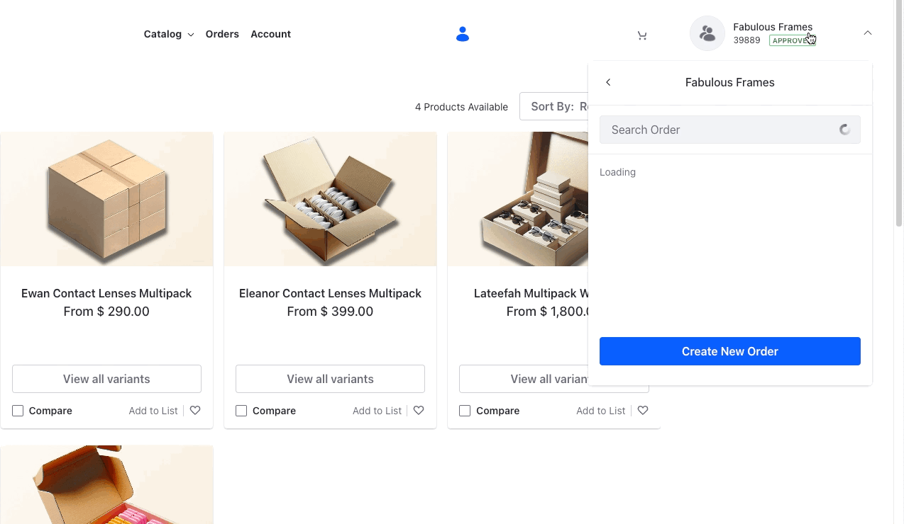

# Creating Order Types for Bulk and Regular Orders

As Clarity caters to a different businesses with varying supply demands, they must offer incentives to businesses that make large purchases. Kyle, the administrator, wants to create two order types: regular and bulk, and offer a 10% discount to all businesses that place bulk orders.

## Creating Regular and Bulk Order Types

1. Open the *Global Menu* () and navigate to *Commerce* &rarr; *Order Types*.

1. Click *Add* () and enter Name as *Regular*.

1. Click *Submit*.

1. In the newly opened configuration page, set the Display Order to 0.

1. Activate the order type using the *Active* toggle.

1. Click *Publish*.

Now, go back to the Order Types application page and create one more order type for bulk orders.

1. Click *Add* () and enter Name as *Bulk*. 

1. Click *Submit*.

1. In the newly opened configuration page, set the display order to 1.

1. Click *Publish*.

## Creating a new Discount for Bulk Orders

1. Open the *Global Menu* () and navigate to *Commerce* &rarr; *Discounts*.

1. Click *Add* () and enter the following information:

   **Name:** Bulk Order Discount

   **Type:** Percentage

   **Apply To:** Total

1. Click *Submit*.

1. In the newly opened configuration page, set the *Amount* to 10. 

1. Activate the discount using the *Active* toggle.

1. Click *Publish*.

## Configuring the new Discount

This only creates a 10% discount but it is eligible to all orders. You must configure it so that it applies to only bulk orders. To avoid users creating bulk orders without actually having the cart total beyond a certain amount, you must also set up a rule for the discount.

1. Under the Rules section, click *Add* () and enter the following information:

   **Name:** Cart Total Check

   **Rule Type:** Cart Total

1. Click *Submit*.

1. Select the newly created rule and set the *Cart Total Minimum Amount* field to $5000.

1. Click *Save*.

1. Go to the *Eligibility* tab and select *Specific Order Types*.

1. Search for Bulk and click *Select* next to it.

1. Click *Publish*.

This creates additional specificity for the discount so that only orders above $5000 of the bulk order type qualify for it.

## Selecting the Order Type

1. Log in as Robert Reed, the buyer for Fabulous Frames (`robert.reed@fabulousframes.com`, `learn`).

1. Click on the Account Selector and select *Create New Order*.

1. In the newly opened dialog box, choose between Regular or Bulk.

1. Click *Add Order*.

You can now go back to the catalog page and add products to your cart to checkout. If you don't select an order type at the time of order creation, it defaults to the regular order type as it has a lower display order value.

Next: [Using Price Tiers to Promote More Buying](./using-price-tiers-to-promote-more-buying.md)