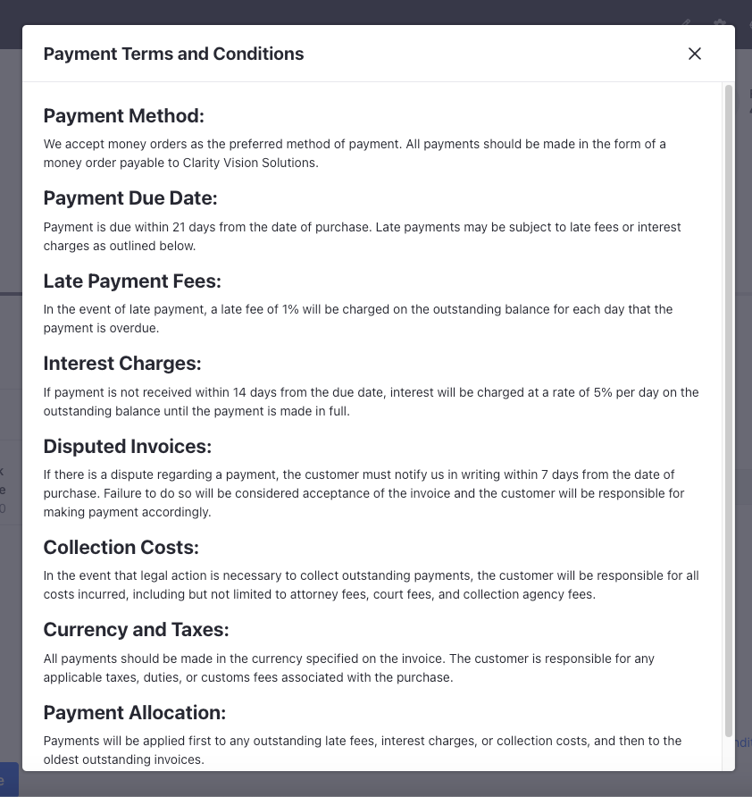
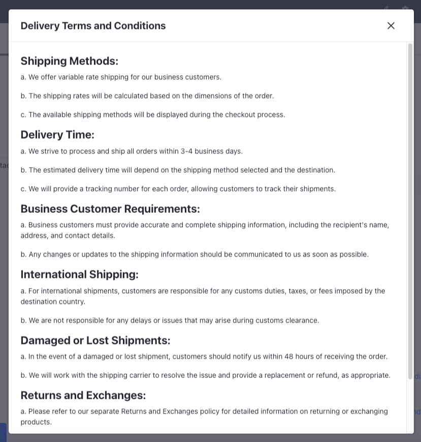

# Setting Terms and Conditions for Payment Methods and Shipping Options

Clarity has terms and conditions attached to their payment methods and shipping options. Businesses must assess these terms and conditions before proceeding with a purchase. They can also raise a dispute if there's a change from what's mentioned on the terms and conditions. 

There are two types of terms and conditions: 

1. Payment terms attached to payment methods 

1. Delivery terms attached to shipping options 

Clarity's terms offer money order as a payment option for business customers and a variable rate shipping method for shipping orders based on their weight.

Kyle, the administrator, will now add payment terms to the payment method and delivery terms to the shipping options. 

## Creating Payment Terms for Money Order

1. Open the *Global Menu* () and navigate to *Commerce* &rarr; *Terms and Conditions*.

1. Click *Add* () and enter the following information:

   **Name:** Money Order Payment Terms

   **Type:** Payment Terms

   **Priority:** 0.0

1. Click *Submit*.

1. In the newly opened configuration page, activate the payment terms using the *Active* toggle.

1. In the Description field, add the following payment terms displayed to the user while checking out.

   ```
   Payment Method:
   We accept money orders as the preferred method of payment. All payments should be made in the form of a money order payable to Clarity Vision Solutions.

   Payment Due Date:
   Payment is due within 21 days from the date of purchase. Late payments may be subject to late fees or interest charges as outlined below.

   Late Payment Fees:
   In the event of late payment, a late fee of 1% is charged on the outstanding balance for each day that the payment is overdue.

   Interest Charges:
   If payment is not received within 14 days from the due date, interest is charged at a rate of 5% per day on the outstanding balance until the payment is made in full.

   Disputed Invoices:
   If there is a dispute regarding a payment, the customer must notify us in writing within 7 days from the date of purchase. Failure to do so is considered acceptance of the invoice and the customer is responsible for making payment accordingly.

   Collection Costs:
   In the event that legal action is necessary to collect outstanding payments, the customer is responsible for all costs incurred, including but not limited to attorney fees, court fees, and collection agency fees.

   Currency and Taxes:
   All payments should be made in the currency specified on the invoice. The customer is responsible for any applicable taxes, duties, or customs fees associated with the purchase.

   Payment Allocation:
   Payments are applied first to any outstanding late fees, interest charges, or collection costs, and then to the oldest outstanding invoices.
   ```

1. Format the text inside the text area by setting all the headings to *Heading 2*.

1. Click *Publish*.

## Linking the Payment Terms to Money Order

1. Open the *Global Menu* () and navigate to *Commerce* &rarr; *Channels*.

1. Select *Clarity B2B* and scroll down to the Payment Methods section.

1. Select *Money Order*.

1. Go to the Eligibility page and select *Specific Payment Terms*.

1. Search for `Money Order Payment Terms`, click *Select*, and then click *Save*.

1. Click *Save*.

The payment terms are now attached to the order during checkout. Your business customers can view these terns and conditions when they place an order and ensure that they're not in violation of any of them.



## Creating Delivery Terms for Variable Rate Shipping

1. Open the *Global Menu* () and navigate to *Commerce* &rarr; *Terms and Conditions*.

1. Click *Add* () and enter the following information:

   **Name:** Variable Rate Delivery Terms

   **Type:** Delivery Terms

   **Priority:** 0.0

1. Click *Submit*.

1. In the newly opened configuration page, activate the delivery terms using the *Active* toggle.

1. In the Description field, you can add the delivery terms that's displayed to the user while checking out.

   ```
   Shipping Methods:
   a. We offer variable rate shipping for our business customers.
   b. The shipping rates are calculated based on the dimensions of the order.
   c. The available shipping methods are displayed during the checkout process.

   Delivery Time:
   a. We strive to process and ship all orders within 3-4 business days.
   b. The estimated delivery time depends on the shipping method selected and the destination.
   c. We provide a tracking number for each order, allowing customers to track their shipments.

   Business Customer Requirements:
   a. Business customers must provide accurate and complete shipping information, including the recipient's name, address, and contact details.
   b. Any changes or updates to the shipping information should be communicated to us as soon as possible.

   International Shipping:
   a. For international shipments, customers are responsible for any customs duties, taxes, or fees imposed by the destination country.
   b. We are not responsible for any delays or issues that may arise during customs clearance.

   Damaged or Lost Shipments:
   a. In the event of a damaged or lost shipment, customers should notify us within 48 hours of receiving the order.
   b. We will work with the shipping carrier to resolve the issue and provide a replacement or refund, as appropriate.

   Returns and Exchanges:
   a. Please refer to our separate Returns and Exchanges policy for detailed information on returning or exchanging products.

   Modifications:
   a. We reserve the right to modify these delivery terms and conditions at any time. Any changes will be communicated to customers through our website or other appropriate channels.
   ```

1. Format the text inside the text area by setting all the headings to *Heading 2*.

1. Click *Publish*.

## Linking the Delivery Terms to Variable Rate Shipping

1. Open the *Global Menu* () and navigate to *Commerce* &rarr; *Channels*.

1. Select *Clarity B2B* and scroll down to the Payment Methods section.

1. Select *Variable Rate*.

1. Go to Shipping Options and select *Standard Shipping*.

1. Go to Eligibility and select *Specific Delivery Terms*.

1. Search for `Variable Rate Delivery` Terms and click *Select* and then click *Save*.

1. Click *Save*.

The delivery terms are now attached to the order during checkout. Your business customers can view these terms and conditions when they place an order and ensure that they're not in violation of any of them.



Next: [Setting up a Workflow for Buyers](./setting-up-a-workflow-for-buyers.md)
