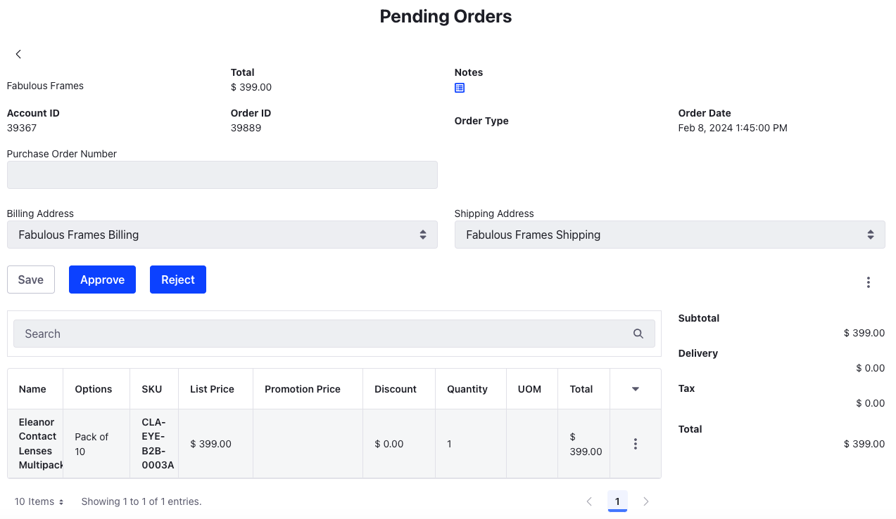
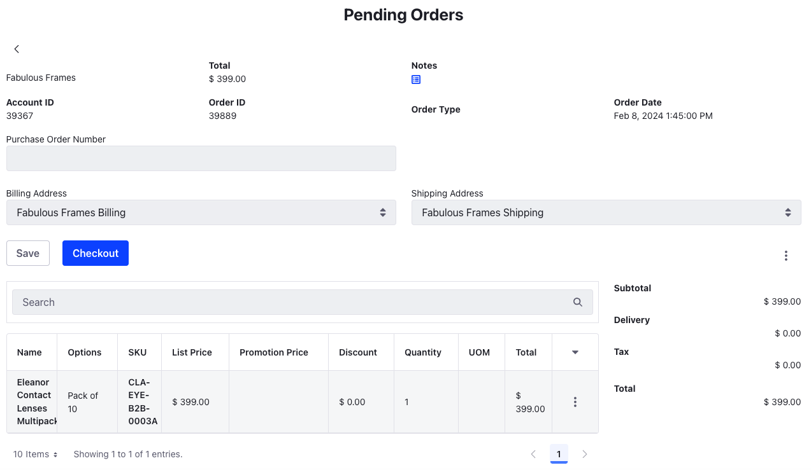

# Setting up a Workflow for Buyers

Clarity wants to implement a buyer order approval workflow for its customers. Kyle Klein, the administrator, must enable the buyer order approval workflow setting for the B2B channel and choose the out-of-the-box *Single Approver* option. 

## Enabling a Buyer Order Approval Workflow

1. Open the *Global Menu* () and navigate to *Commerce* &rarr; *Channels*.

1. Select *Clarity B2B* and scroll down to the Orders section.

1. Choose *Single Approver (Version 1)* from the *Buyer Order Approval Workflow* drop-down.

1. Click *Save*.

This enables the out-of-the-box buyer order approval workflow for buyers. Buyers from Opportune Optics and Fabulous Frames must receive approvals from their order managers for the orders they place.

## Seeing the Workflow in Action

To see the workflow in action, you must first log in as a buyer. After placing an order, you must log out and log back in as an order manager. The order manager gets a notification that the order is pending approval.

1. Log in as Robert Reed, the buyer for Fabulous Frames (`robert.reed@fabulousframes.com`, `learn`).

1. Go to Clarity's product catalog and add any product to cart.

1. Open the mini cart and select *Review Order*.

1. Click *Submit*.

1. Log in as Preston Palmer, the order manager for Fabulous Frames [`preston.palmer@fabulousframes.com`, `learn`].

1. Go to Clarity's Orders page and select the order submitted by Robert Reed.

1. There's an option to Approve or Reject the order. Choose *Approve*. Add a comment and click *Done*.

   

   After approving the order, the buyer can log back in and proceed to check out. To do this,

1. Log back in as Robert Reed (`robert.reed@fabulousframes.com`, `learn`).

1. Go to Clarity's Orders page and select the order submitted earlier. You'll notice the order status is now *Approved*.

1. Click *Checkout* to start the checkout flow.

That was a lot!

Congratulations! You've completed the Commerce Architect course. View the [Courses](../../index.md) page to go through some of the other available courses on Liferay Learn.
