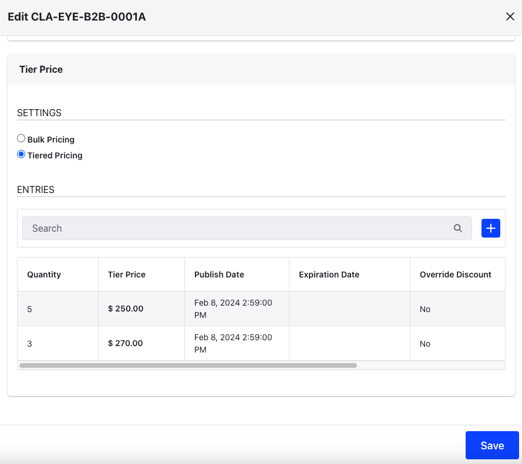
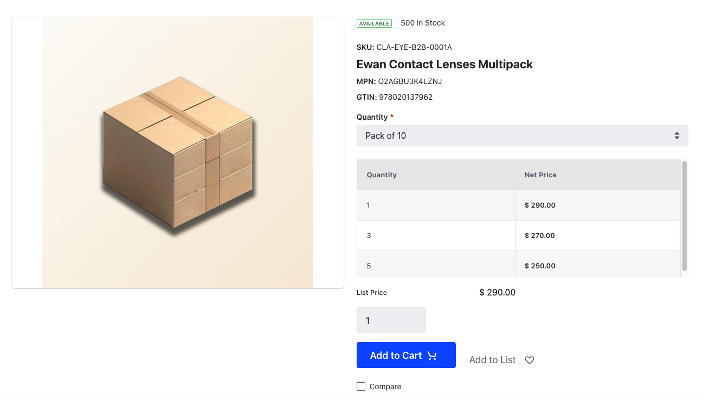

# Using Price Tiers to Promote More Buying

Apart from having unique discounts to specific account groups and a discount for orders above $5000, Clarity also offers tiered pricing for some of their products to encourage businesses to spend more. Tiered pricing adjusts the unit price of a product when purchased in additional quantity. You'll log in as Kyle Klein, the administrator for Clarity, and enable tiered pricing for one of their products.

## Enabling Tiered Pricing

To create a price tier for certain products, you must first create a custom price list. 

1. Open the *Global Menu* () and navigate to *Commerce* &rarr; *Price Lists*.

1. Click *Add* () and enter the following information:

   **Name:** Clarity B2B - Tiered Pricing

   **Catalog:** Clarity Product Catalog

   **Currency:** USD

1. Click *Submit*.

## Configuring the Custom Price List

In the newly opened configuration page,

1. Go to the Eligibility tab.

1. Select *Specific Channels* and search for Clarity B2B.

1. Click *Select* next to the channel.

1. Go to the Entries tab.

1. In the Add SKUs search bar, search for the following SKUs and click *Select*.

   * CLA-EYE-B2B-0001A
   * CLA-EYE-B2B-0002A

1. Select the first entry and enter `$290` as the *Price List Price*.

1. In the Settings section, enable *Tiered Pricing*. 

1. Click Add in the Entries section.

1. Enter *Quantity* as `3` and *Tier Price* as `$270.00`.

1. Add another entry and set *Quantity* as `5` and *Tier Price* as `$250.00`.

   

1. Click *Save*.

Repeat the same steps for the second SKU also.

1. Go to Clarity's product catalog and select *Ewan Contact Lenses Multipack*. You'll notice a new unit price chart below the quantity selector that displays the available tiers. The price chart disappears for quantities which doesn't have tiered pricing enabled.

   

1. Add 3 units of the product to your cart.

1. Open the mini cart to see the tiered price in effect. You'll notice that when adding 3 units of the product, the first two units are billed at $290 each and the third unit is billed at $270 bringing the effective total to $850, instead of $870.

Next: [Setting Terms and Conditions for Payment Methods and Shipping Options](./setting-terms-and-conditions-for-payment-methods-and-shipping-options.md)