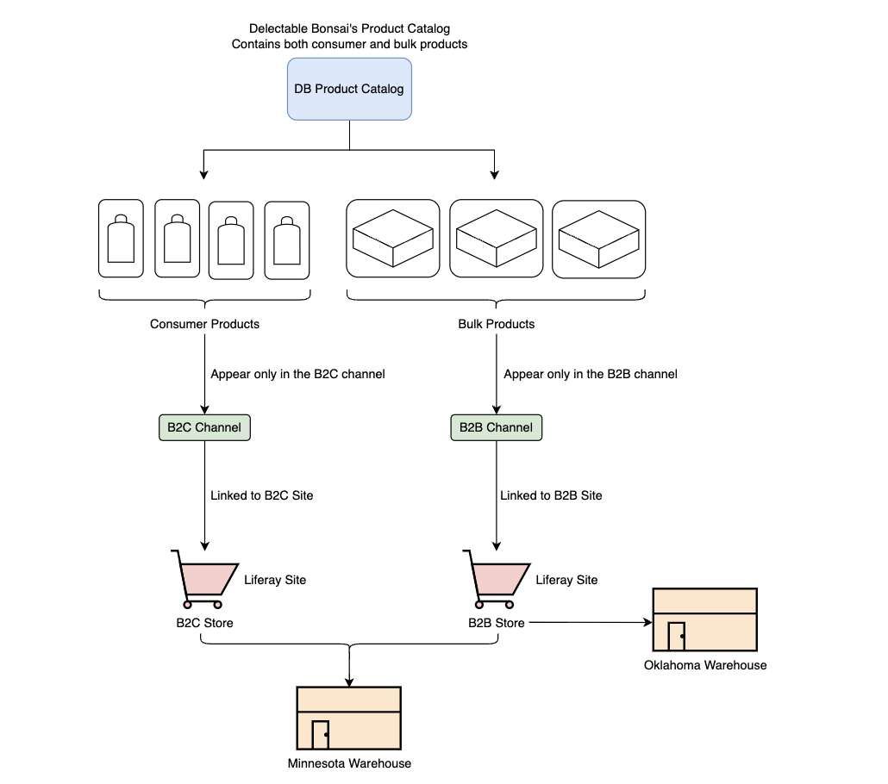

---
toc:
  - ./setting-up-and-creating-products/creating-and-configuring-channels.md
  - ./setting-up-and-creating-products/configuring-workflows-and-notifications.md
  - ./setting-up-and-creating-products/creating-and-configuring-warehouses.md
  - ./setting-up-and-creating-products/creating-and-configuring-catalogs.md
  - ./setting-up-and-creating-products/creating-products.md
uuid: 55c921fc-97c5-4f6a-b7ae-60fbea19cbd1
---
# Setting Up and Creating Products

Kyle and Damian need your help to create the required channels, catalogs, and products for the B2B and B2C stores. Kyle, the administrator, is in charge of creating the channels, while Damian, the category manager, is responsible for creating the catalogs, products, configuring their prices, and adding inventory.

*Channels* are scoped to a Liferay instance. A channel is an avenue for selling products, such as a customer portal, a B2B marketplace, or back office phone sales. To sell products on a Liferay site, you must first link it to a channel. Delectable Bonsai has one store that caters to consumers and another that caters to business customers. To support this, you'll create two channels and link them to their corresponding sites. Later, you'll also create two supplier channels. This makes it easy for Delectable Bonsai's suppliers to view and manage their own orders. 

A *catalog* is scoped to a Liferay instance and stores product information. You can set basic parameters for a catalog like its name, default currency, base price list, base promotion list, and also link it to a supplier account if required. You'll create one catalog to hold all the products that Delectable Bonsai has to offer. Later, you'll create two supplier catalogs containing products from two different suppliers. When placing an order containing products from multiple catalogs, it gets split automatically. This allows the suppliers to fulfill their part of the order while Delectable Bonsai can fulfill theirs. 

*Products* are scoped to a catalog. Since there's no direct relationship between a catalog and channel, you must configure products to display them in the right channel. You can display products from multiple catalogs in the same channel. You'll be creating multiple products, SKUs, configuring them, adding inventory, pricing, and other necessary information. 

*Warehouses* represent physical locations that store product inventory. You'll create two warehouses for Delectable Bonsai: one that fulfills both business and consumer orders, and another that fulfills only business orders. To do this, you'll link the main warehouse to both the B2B and B2C channels and the second one only to the B2B channel. 

After completing this module, you'll have

* A product catalog containing different products
* Channels configured and linked to both sites
* Payment methods and shipping methods set up
* Warehouses that serve both online stores

Ready?

[Let's Go!](./setting-up-and-creating-products/creating-and-configuring-channels.md)
