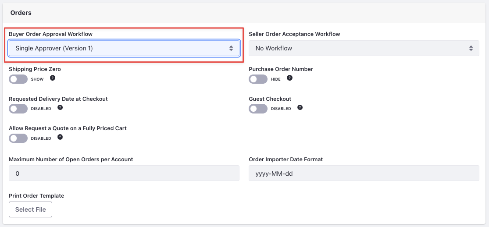
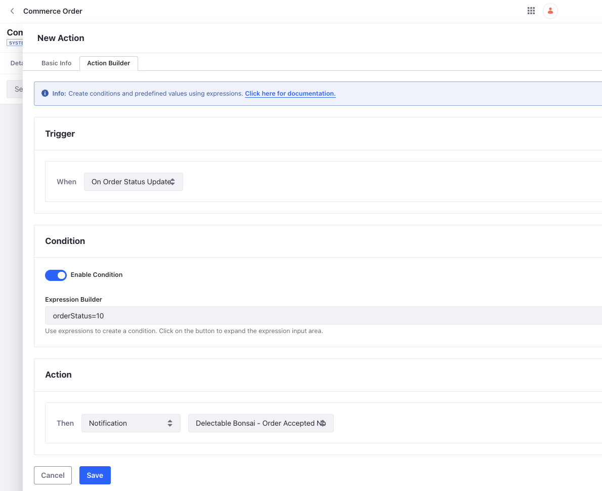

# Configuring Workflows and Notifications

During channel configuration, you can enable workflows so that all orders go through at least one step of approval before they’re placed. Delectable Bonsai’s B2B site employs a buyer order approval workflow using the out-of-the-box single approver workflow. This ensures that all orders placed by buyers are approved by their order managers. To enable this, 

1. Open the *Global Menu* () and navigate to *Commerce* → *Channels*. 

1. Select the B2B channel created earlier. 

1. In the *Orders* section, select *Single Approver (Version 1)* from the *Buyer Order Approval Workflow* dropdown.

   

1. Click *Save*.

This enables the single order approver workflow for buyers when they place orders. A user with the buyer role in the customer account can create an order. But it requires a user with the order manager role in the customer account to approve the order before it can be checked out. A user with the sales agent role can also approve orders. This workflow helps when there’s a budget allocated for buying and requires approvals.

The seller order acceptance workflow, if enabled, requires all orders to go through one step of approval before they’re accepted. This is applicable for Delectable Bonsai when they receive an order from a customer and it requires an approval before it’s accepted. 

The Single Approver (Version 1) workflow is the only type of workflow available out-of-the-box, but you can customize it further in the workflow editor. Read [Introduction to Order Workflows](https://learn.liferay.com/w/commerce/order-management/order-workflows/introduction-to-order-workflows) for more information about workflows. 

## Creating a Notification Template

Kyle needs your help to set up notifications so that users are notified when an order is accepted. To do this, you must set up a notification template and an object action for the commerce order system object. 

1. Open the *Global Menu* () and navigate to *Control Panel* → *Templates*. 

1. Click the *Add* () button and select *Email*.

1. Enter the following details:

   **Name:** Delectable Bonsai - Order Accepted Notification Template

   **Description:** Notification template for emails sent when orders are accepted by Delectable Bonsai.

   **To:** `[%COMMERCEORDER_AUTHOR_EMAIL_ADDRESS%]`

   **From Address:** `orders@delectablebonsai.com`

   **From Name:** `Orders @ Delectable Bonsai`

   **Subject:** `Your Order: [%COMMERCEORDER_ID%] has been accepted`

   **Template:**

   ```
   Hi [%COMMERCEORDER_AUTHOR_FIRST_NAME%] [%COMMERCEORDER_AUTHOR_LAST_NAME%],

   Your recent order from Delectable Bonsai with Order ID: [%COMMERCEORDER_ID%] has been accepted. Visit the orders page from your account to know the latest status of your order. 

   Thanks,

   Orders @ Delectable Bonsai
   ```

1. Click *Save*.

This creates a notification template for sending notifications whenever an order is accepted. You must now create an object action on the commerce order system object to trigger this. 

## Creating a Commerce Order Object Action

1. Open the *Global Menu* () and navigate to *Control Panel* → *Objects*. 

1. Select the *Commerce Order* system object.

1. Navigate to the *Actions* tab and click *Add* ().

1. Enter *Order Accepted* as the *Action Label*. The action name gets populated automatically. 

1. Go to *Action Builder*.

1. Under *Trigger*, select *On Order Status Update* from the dropdown.

1. Activate the *Enable Condition* toggle, and enter the following expression:

   `orderStatus=10`

   Each [order status](https://learn.liferay.com/web/guest/w/commerce/order-management/orders/order-life-cycle) corresponds to an integer. See below to learn more.

   | Order Status      | Integer Value |
   | :---------------- | :------------ |
   | Open              | 2             |
   | In Progress       | 6             |
   | Pending           | 1             |
   | Processing        | 10            |
   | Shipped           | 15            |
   | Completed         | 0             |
   | Cancelled         | 8             |
   | Partially Shipped | 14            |
   | On Hold           | 20            |

1. Under *Action*, choose *Notification* and select the *Delectable Bonsai Order Accepted* notification template. 

   

1. Click *Save*. 

This creates the object action on the commerce order system object. It gets triggered every time an order is accepted and sends the email based on the template. 

Next: [Creating and Configuring Warehouses](./creating-and-configuring-warehouses.md)