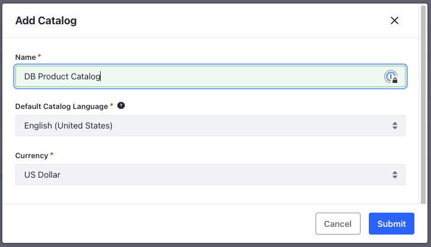
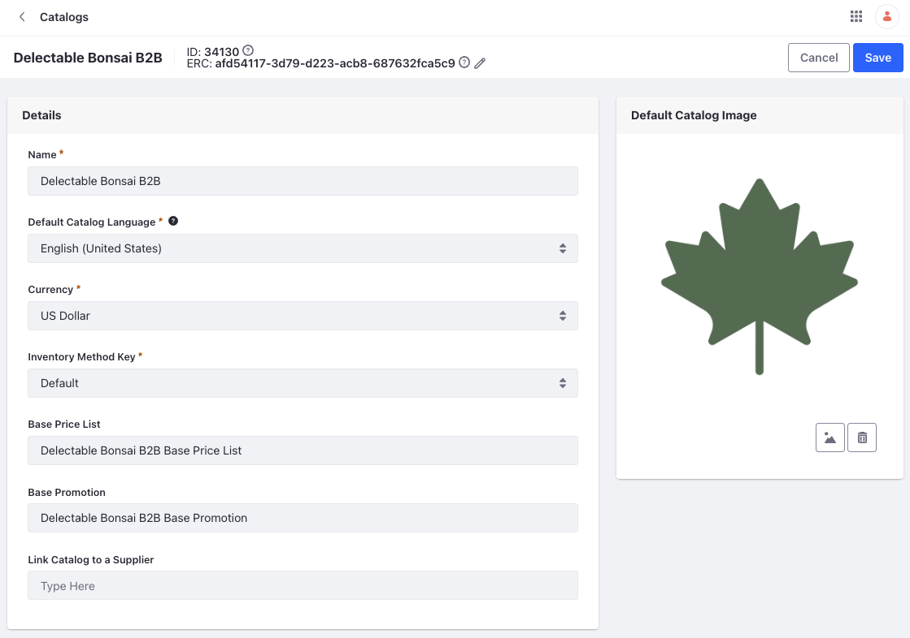

# Creating and Configuring Catalogs

As Delectable Bonsai caters to businesses and regular customers, Damian, the category manager, wants different catalogs to separate these products. Some products are fulfilled by third-party suppliers and they'll have their own catalogs. 

To create a new catalog,

1. Open the *Global Menu* () and navigate to *Commerce* &rarr; *Catalogs*.

1. Click *Add* () and enter the following:

   **Name:** Delectable Bonsai B2B

   **Default Language:** English (United States)

   **Currency:** US Dollar

   

1. Click *Submit*.

After creating a catalog, a base price list and a base promotion list is also created for you. There’s an option to add a default catalog image. When you don't have images for products in the catalog, the default catalog image appears as the product image. You also have the option to link the catalog to a supplier account. We’ll cover this in a further module, so for now, you can leave all the defaults as it is. 

<!-- Use logo for catalog image and add steps for it -->

Now, follow the same steps to create a catalog named Delectable Bonsai B2C for their regular products. Use the following image as the default catalog image for the B2C catalog.

Next: [Creating Products](./creating-products.md)
