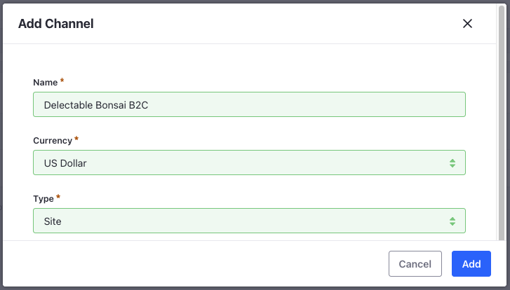
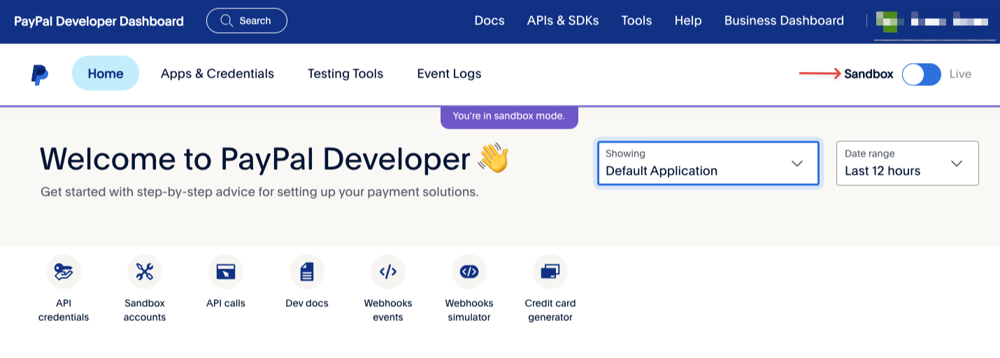
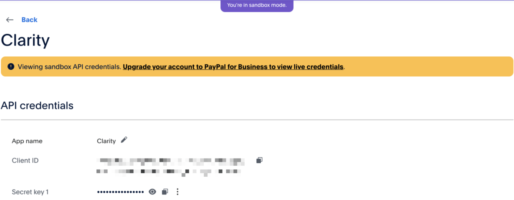
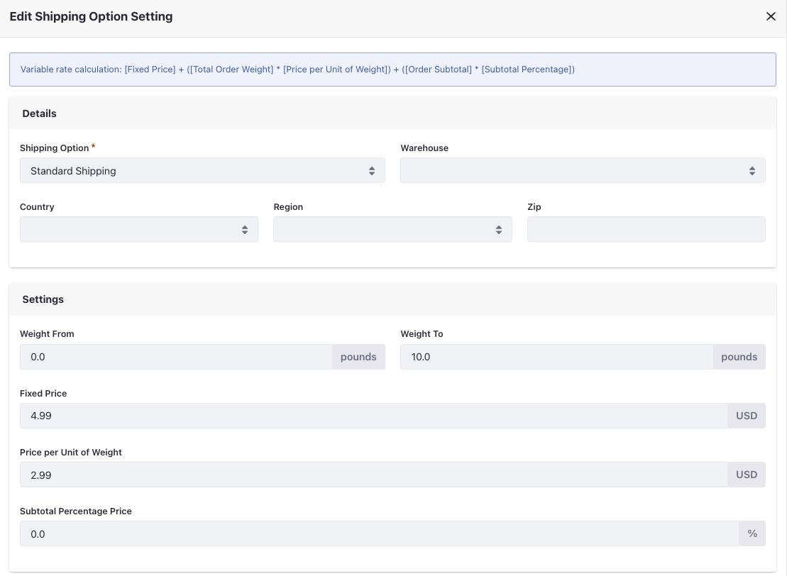

# Creating and Configuring Channels

A channel is an avenue for selling products, such as a customer portal, a B2B marketplace, or back office phone sales. You must link a channel to a site to sell products on that site. Clarity operates two online stores, one for B2C customers and one for B2B customers. To support this, you must help Kyle create two channels and link them to their corresponding sites. 

To create a channel,

1. Open the *Global Menu* () and navigate to *Commerce* → *Channels*.

1. Click *Add* () and enter the following details:

   **Name:** Clarity B2C

   **Currency:** USD

   **Type:** Site

   

1. Click *Add*.

This creates a new channel for the B2C store. Repeat the steps to create a B2B channel with the following information. 

| Name        | Currency | Type |
| :---------- | :------- | :--- |
| Clarity B2B | USD      | Site |

After creating both channels, you must link them to the corresponding Liferay sites and configure them. 

## Configuring the B2C Channel

For the B2C channel, you’ll configure a payment method, shipping method, and ensure that the site type is set to B2C. 

1. In the Details section, set the Commerce Site Type to *B2C*. When the [site type](/w/commerce/starting-a-store/sites-and-site-types#site-types) is B2C, every account in the site must be a personal account. 

1. Select the *Type* tab and click *Select Site*. 

1. Choose the *Clarity B2C* site 

1. Click *Save*. 

You can now use this channel to accept customer orders from your site. 

Clarity offers their B2C customers an option to pay by PayPal. Customer orders are shipped using a flat rate shipping method. You can use Liferay’s out-of-the-box payment and shipping methods to implement both of these. 

### Configuring PayPal

1. Visit the [PayPal Developer Dashboard](https://developer.paypal.com/dashboard/) and sign up for an account. 

1. Switch to *Sandbox* mode.

   

1. Navigate to the *Apps & Credentials* tab.

1. Click *Create App*.

1. Enter *Clarity* as the name and set the type as *Merchant*. 

1. Click *Create App*.

This creates the app with a name, client ID, and secret key. 

1. Copy the client ID and secret key.

   

1. Now, go back to your Liferay instance. Open the *Global Menu* () and navigate to *Commerce* → *Channels*.

1. Select *Clarity B2C*.

1. Scroll down to the *Payment Methods* section and select *PayPal*.

1. Activate it using the toggle.

1. Click *Save*.

1. Go to the *Configuration* tab and paste the client ID and secret key copied from PayPal. 

1. Set the *Mode* to sandbox.

1. Click *Save*. 

### Configuring Flat Rate Shipping Method

1. Go to the Shipping Methods section and select *Flat Rate*.

1. Activate it using the toggle.

1. Click *Save*.

1. Go to the *Shipping Options* page, click the *Add* () button.

1. Enter the name as *Regular Shipping* and amount as *$4.99*.

1. Click *Save*.

1. Click *Add* () once more.

1. Enter the name as *Express Shipping* and amount as *$9.99*.

1. Click *Save*.

## Configuring the B2B Channel

For the B2B channel, you’ll configure a payment method, shipping method, and ensure that the site type is set to B2B. 

1. In the Details section, set the Commerce Site Type to *B2B*. When the [site type](https://learn.liferay.com/web/guest/w/commerce/starting-a-store/sites-and-site-types#site-types) is B2B, every account in the site must be a business account. 

1. Select the *Type* tab and click *Select Site*. 

1. Choose the *Clarity B2B* site.

1. Click *Save*. 

Clarity offers their B2B customers an option to pay by money order. They ship using a variable shipping rate that's calculated based on the weight of the shipment. You can use Liferay’s out-of-the-box payment and shipping methods to implement both of these. 

### Configuring Money Order

1. Go to the Payment Methods section and select *Money Order*.

1. Activate it using the toggle.

1. Click *Save*.

   This should be eligible for all order types. 

### Configuring Variable Rate Shipping Method

1. Now, go to the Shipping Methods section and select *Variable Rate*.

1. Activate it using the toggle.

1. Click *Save*.

1. Go to the Shipping Options page and click *Add* ().

1. Enter the name as *Standard Shipping* and click *Save*.

1. Go to *Shipping Option Settings* and click *Add* (). 

1. Select the shipping option created earlier from the drop-down.

1. In the Settings section, enter the following details:

   **Shipping Option:** Standard Shipping

   **Weight From:** 0.0

   **Weight To:** 10.0

   **Fixed Price:** 4.99

   **Price per Unit of Weight:** 2.99

   

1. Repeat this two more times with the following details: 

   | Shipping Option   | Weight From | Weight To | Fixed Price | Price per Unit of Weight |
   | :---------------- | :---------- | :-------- | :---------- | :----------------------- |
   | Standard Shipping | 10.01       | 20.0      | 5.99        | 3.99                     |
   | Standard Shipping | 20.01       | 30.0      | 6.99        | 4.99                     |

In the next section, you’ll set up order notifications and enable buyer order approval workflows. This shows how the order life cycle changes when there’s a workflow in place, and how users are notified when an order is accepted. 

Next: [Configuring Workflows and Notifications](./configuring-workflows-and-notifications.md)

## Related Topics

* [Site Types](https://learn.liferay.com/web/guest/w/commerce/starting-a-store/sites-and-site-types#site-types)
* [Accelerators](https://learn.liferay.com/web/guest/w/commerce/starting-a-store/accelerators)
