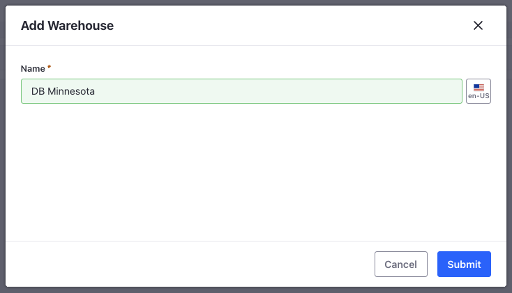
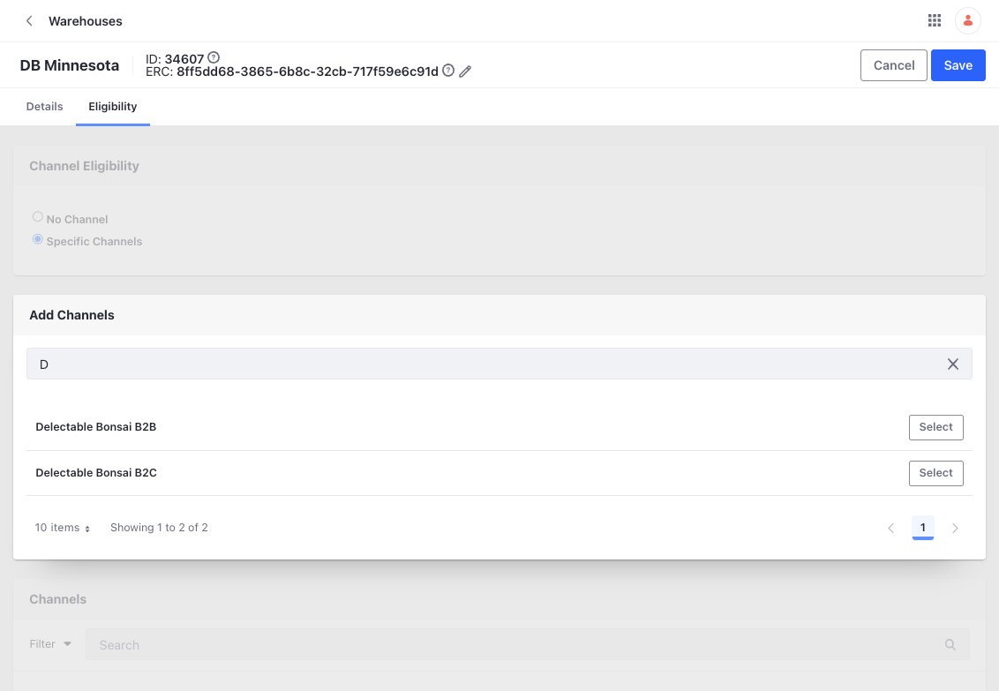

# Creating and Configuring Warehouses

Clarity has a main warehouse in Minnesota that fulfills both their consumer and business orders, while a second warehouse in Oklahoma is solely for business orders. Kyle must set up these warehouses and requires your help. After the first one, you can follow the same steps to create the second warehouse. 

1. Open the *Global Menu* () and navigate to *Commerce* &rarr; *Warehouses*.

1. Click *Add* () to create a new warehouse.

1. Enter the name as *Clarity Minnesota* and click *Submit*. 

   

   Warehouses are inactive by default. You must set its latitude and longitude coordinates before activating them. 

1. In the *Geolocation* card, enter the following coordinates:

   **Latitude:** 47.38630877

   **Longitude:** -93.5477618

1. In the *Address* card, enter this:

   **Street 1:** Wolf Pack Path

   **Country:** United States

   **Region:** Minnesota

   **Postal Code:** 55744

   **City:** Grand Rapids

1. You must link a warehouse to a channel after creating it. This ensures accurate display of inventory information for the channel. Multiple warehouses can be linked to one channel. Go to the *Eligibility* tab and select *Specific Channels*.

1. Search for Clarity’s B2B channel and click *Select*. Do the same for the B2C channel as well.

   

1. Click *Save*.

Now, repeat the same steps and to add Clarity’s B2C warehouse. Use the location details given below.

| Warehouse Name   | Latitude    | Longitude    | Address                                                                                                             |
| :--------------- | :---------- | :----------- | :------------------------------------------------------------------------------------------------------------------ |
| Clarity Oklahoma | 36.39431868 | -96.68525807 | **Street:** E 0430 Road, **City:** Pawnee, **Region:** Oklahoma, **Country:** United States, **Postal Code:** 74058 |

After creation, link it to the appropriate channel and activate it. Now that you have created warehouses, it’s time to create catalogs and add products. Let’s go!

Next: [Creating and Configuring Catalogs](./creating-and-configuring-catalogs.md)
