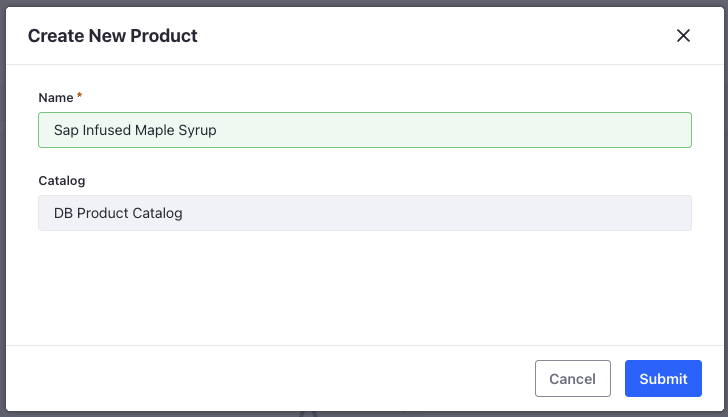
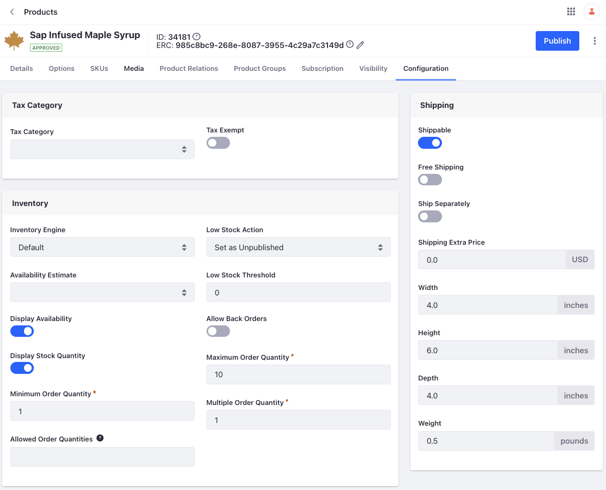

# Creating Products

Delectable Bonsai offers a wide range of products starting from bonsai trees, flavored syrups to pruning equipment, seedlings, and swag. With Liferay’s out-of-the-box product management capabilities, you can create different kinds of products through a unified interface. Liferay also supports importing products from third party systems. Damian now needs your help to create a few products in the catalog. 

Let’s start off by creating a simple product in the product catalog. We’ll create Delectable Bonsai’s signature product, sap infused maple syrup. 

1. Open the *Global Menu* () and navigate to *Commerce* &rarr; *Products*.

1. Click *Add* () and enter the following:

   **Name:** Sap Infused Maple Syrup

   **Catalog:** DB Product Catalog

   

1. Click *Submit*.

This creates the product in draft status. You can publish it as it is, but it is best to do some basic configuration first.

## Basic Product Configuration

Let's add some basic details for the product. 

1. Under *Details*, enter the following description:

   ```
   Level up your breakfast game with Delectable Bonsai's bestselling signature sap infused maple syrup. 
   ```

1. Under *Categorization*, click *Select* next to Delectable Bonsai. Choose the *Syrup* category. You can use these categories in facets when building the storefront. 

1. Go to the *SKUs* tab and select the `default` sku. Enter `DBSY001` in the SKU text field. 

1. Click *Publish*.

1. Navigate to the *Configuration* tab and enter the following values in the *Shipping* card.

   **Width:** 4

   **Height:** 6

   **Depth:** 4

   **Weight:** 0.5

1. Disable *Free Shipping* and *Ship Separately*.

1. In the *Inventory* card, set *Low Stock Action* to *Set as Unpublished*.

1. Disable *Allow Back Orders* and enable *Display Availability* and *Display Stock Quantity*. 

1. Set the *Maximum Order Quantity* as 10.

   

1. Go back to the *Details* tab and click *Publish*.

This publishes the product with some basic details. Now, create two more products using the following information. Enable or disable the same toggles as with the product created earlier. 

| Product Name                   | Catalog            | Category | SKU     | Dimensions                       | Weight | Maximum Order Quantity | Low Stock Action   |
| :----------------------------- | :----------------- | :------- | :------ | :------------------------------- | :----- | ---------------------- | ------------------ |
| Sap Infused Orange Maple Syrup | DB Product Catalog | Syrup    | DBSY002 | Width: 4, Height: 6, Depth: 4    | 0.5    | 10                     | Set as Unpublished |
| Bougainvillea Bonsai           | DB Product Catalog | Bonsai   | DBBO001 | Width: 10, Height: 10, Depth: 10 | 12     | 10                     | Set as Unpublished |

In the next module, we’ll configure the products and its SKUs, add inventory, prices, and other necessary information to enrich the storefront experience.
