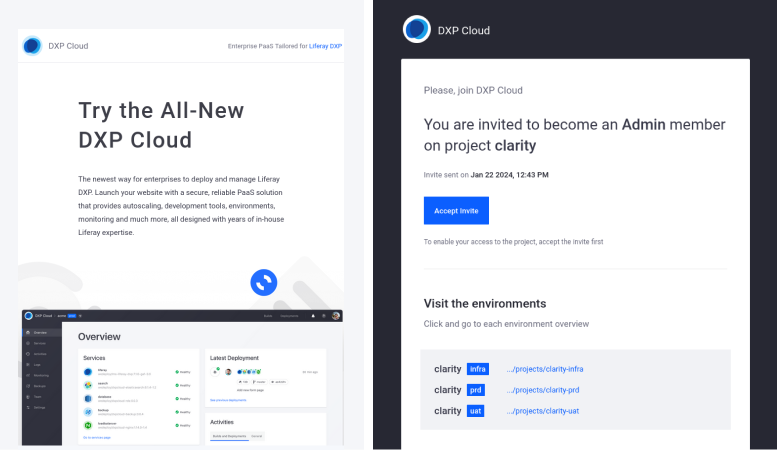

# Installing Liferay PaaS

Liferay will provide you an environment, and your first task is to access the cloud console, which is a user interface where you interact with Liferay Cloud. You use the cloud console to manage each of your environment's services, including the [web server](https://learn.liferay.com/w/liferay-cloud/platform-services/web-server-service) and [database](https://learn.liferay.com/w/liferay-cloud/platform-services/database-service/database-service).

## Setting Up Your Liferay Cloud Console

Once your project is provisioned, you should receive a Liferay Cloud onboarding email along with email invitations for each purchased Liferay Cloud environment. The link takes you to the [Liferay Cloud console](https://console.liferay.cloud/), and you must log in to accept the invitation. If you don't yet have an account, click *Sign up* and fill out the form.

!!! note
    If your invitation was for a single environment (such as `dev` or `uat`) instead of the whole project, only that environment appears in the list. Accept the invitation for all environments to make sure you have access to all of them.

## Accessing Your Liferay Cloud Console

Once you have signed in, the invitation is accepted and you have full access to the project. Logging into the console at any time (or going to [https://console.liferay.cloud/projects](https://console.liferay.cloud/projects)) shows a list of all the environments you can access.

From here, you can access and manage environments and deployments, as well as invite other team members.

## Accessing the Provisioned GitHub Repository

New Liferay Cloud projects are provisioned a GitHub repository hosted in the `dxpcloud` organization. This repository contains the template for a Liferay Cloud development project. To access your new project repository, accept the subsequent GitHub invitation.

