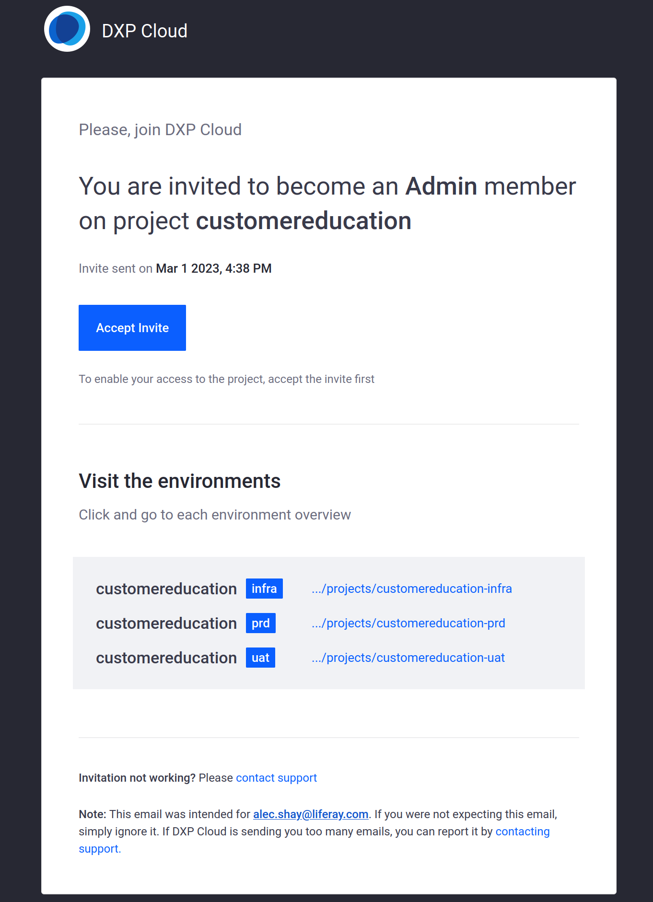
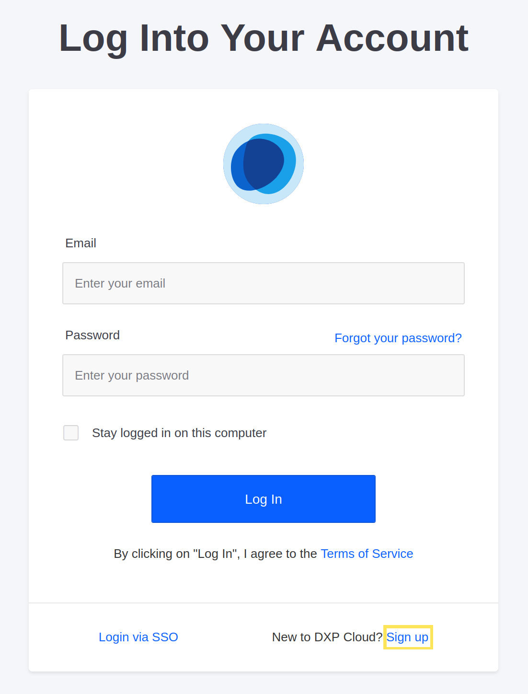
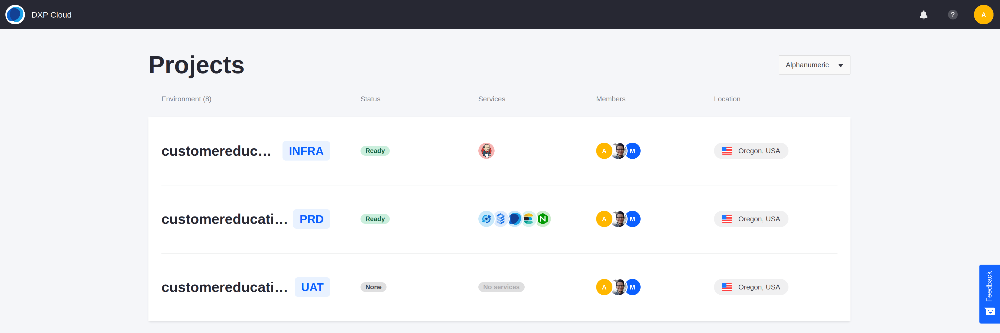

# Accessing the Liferay Cloud Console

The Delectable Bonsai project has been provisioned, but Marcus and his staff first need to gain access to the necessary controls.

Here, you'll access the Liferay Cloud console so you can start working with your project.

## Accept the Project Invitation

Check your inbox with whichever email you used to sign up for Liferay Cloud. Once your project has been provisioned, an email from **liferay.cloud** appears with an invitation to your project. Click *Accept Invite*.



The link takes you to the [Liferay Cloud console](https://console.liferay.cloud/). You must log in to accept the invitation. If you have not yet done so, click *Sign up* and fill out the form to create your account.



Once you have signed in, the invitation is accepted and you have full access to the project. Logging into the console at any time (or going to https://console.liferay.cloud/projects) shows a list of all of the environments that you have accepted invitations to.

```{note}
If your invitation was for only a single environment (such as `dev` or `uat`) instead of the whole project, only that environment appears in the list. Accept the invitation for all environments to make sure you have access to all of them.
```



Take some time to navigate around the console to familiarize yourself with the available controls. Once you're ready, proceed to add more team members to your project.

## Related Concepts

* [Check Setup Emails](https://learn.liferay.com/liferay-cloud/latest/en/getting-started/initial-setup-overview.html#check-setup-emails)
* [Access the Liferay Cloud Console](https://learn.liferay.com/liferay-cloud/latest/en/getting-started/initial-setup-overview.html#access-the-liferay-cloud-console)
