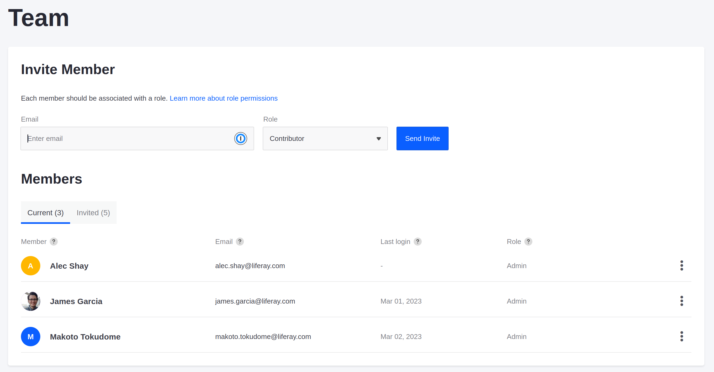

# Adding Team Members to the Project

Marcus has access to the Liferay Cloud console for the whole Delectable Bonsai project, but now he needs to invite his staff member, Kyle.

Here, you'll learn how to send invitations for your team members.

## Send Team Invitations

Help Marcus add Kyle Klein as a contributor to the team by sending an invitation to his email address.

1. In the Liferay Cloud console, select your `prd` environment from the drop-down menu at the top of the screen.

1. Click *Team*.

1. On the Team page, enter the team member's email address (e.g., kyle.klein@bonsaisyrup.com).

    

1. Select *Contributor* from the Role drop-down menu for the appropriate role.

1. Click *Send Invite*.

An invitation is sent to the provided email address to join your project. If the invited team members don't have accounts for the console yet, they must make accounts to accept the invitations.

Repeat this process for your other environments (such as `uat`) to make sure your team member has access to all of the appropriate environments.

```{note}
Give your team members roles that are appropriate to their role in each environment. For example, developers should have the Admin role in a `dev` environment if they are expected to handle all tasks in that environment. Check [Environment Teams and Roles](https://learn.liferay.com/liferay-cloud/latest/en/manage-and-optimize/environment-teams-and-roles.html for more information.
```

Next, you'll set up your GitHub repository so that you can push and deploy changes to your services.

## Related Concepts

* [Environment Teams and Roles](https://learn.liferay.com/liferay-cloud/latest/en/manage-and-optimize/environment-teams-and-roles.html)
