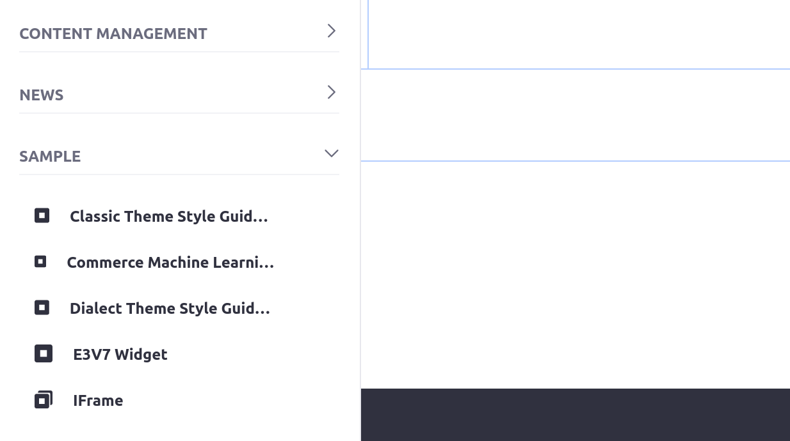

# Restoring Data from a Backup

Kyle wants to start testing changes that could affect data on the site.

Here, you'll restore a manual backup to recover data lost during a test.

## Create a Manual Backup from Production

You should always make sure your Liferay instance is backed up before you test changes that could cause data loss or instability.

Create a manual backup before you begin testing.

1. In the Liferay Cloud console, navigate to your production environment.

1. Click *Backups* on the left side of the screen.

1. Click *Backup Now* to create a manual backup.

    ```{tip}
    You can also skip creating a manual backup and use the most recent automatic backup, if you don't need specific data for your testing.
    ```


The backup service is unavailable and the buttons on the page are disabled until the backup completes.

```{tip}
If you are testing something that does not rely on your data in production and has no performance impact, you can optionally make a backup of UAT instead and skip restoring it.
```

## Restore the Backup to UAT

Once the backup from production is completed, restore it to your UAT environment.

1. Click the Actions menu (  ) next to the manual backup at the top of the list and click *Restore to...*

    

1. From the *Select environment* drop-down menu, select your UAT environment.

1. Click the checkboxes that appear to confirm the impact of the backup restore.

    

1. Click *Restore to Environment*.

Your UAT environment's services are temporarily unavailable while the backup is restored.

## Access Your UAT Instance

Before you can start making changes to your Liferay instance in UAT, you need the credentials to access it.

```{note}
You may be able to skip these steps if you are already authenticated to access your UAT Liferay instance. If your session hasn't expired yet, click *Visit Site* from your UAT environment and skip to [deleting some data](#try-deleting-data).
```

1. Navigate to your `infra` environment.

1. Click *Settings* on the left side of the screen.

1. Select the *Secrets* tab.

1. Click the `lcp-secret-ci-customer-user` secret.

    

1. Click *View* to confirm the secret value you need to log into your UAT instance.

    

    ```{tip}
    The default username is `customer`.
    ```

1. Click the back arrow to return to the list of secrets.

1. Click the `lcp-secret-ci-customer-password` secret.

1. Click *View* to see the secret value. You can click the value itself to copy it to your clipboard.

1. Navigate to your UAT environment.

1. Click *Visit Site* at the top of the page.

1. When prompted for credentials, enter the username and password you found from the `lcp-secret-ci-customer-user` and `lcp-secret-ci-customer-password` secrets, respectively.

Now you have successfully logged in and accessed your UAT Liferay instance.

## Try Deleting Data

Try deleting your default home page.

1. Log in as the [default administrator](https://learn.liferay.com/web/guest/w/dxp/getting-started/introduction-to-the-admin-account).

1. In the navigation menu on the left side of the screen, click *Site Builder* &rarr; *Pages*.

1. Next to the Home page, open the Actions menu (  ) and click *Delete*.

    

    A pop-up dialogue appears asking to confirm the deletion.

1. Click *Delete*.

The home page is deleted and the deletion cannot be undone. The *Home* button in the top-right corner of the screen also disappears since there is no longer a home page.

## Restore the Backup

Kyle realizes after deleting the page that it shouldn't have been deleted, and he can't remember how to easily make a new one.

Help Kyle recover the data in UAT by restoring the backup you took before accessing the Liferay instance.

1. In the Liferay Cloud console, navigate to your production environment (or the environment you took a backup from).

1. Click *Backups*.

1. Click the Actions menu (  ) next to your manual backup and click *Restore to...*

1. From the *Select environment* drop-down menu, select your UAT environment.

1. Click the checkboxes that appear to confirm the impact of the backup restore.

1. Click *Restore to Environment*.

Your UAT Liferay service is temporarily unavailable while the backup is being restored. Once it's finished, you can visit the site again to see the home page is restored.

Next, you'll access your services' files directly using the shell in the Liferay Cloud console.

## Related Concepts

* [Backup Service](https://learn.liferay.com/web/guest/w/liferay-cloud/platform-services/backup-service/backup-service-overview)
* [Restoring Data from a Backup](https://learn.liferay.com/web/guest/w/liferay-cloud/platform-services/backup-service/restoring-data-from-a-backup)
* [Logging into Your Liferay Cloud Services](https://learn.liferay.com/w/liferay-cloud/getting-started/logging-into-your-liferay-cloud-services)
