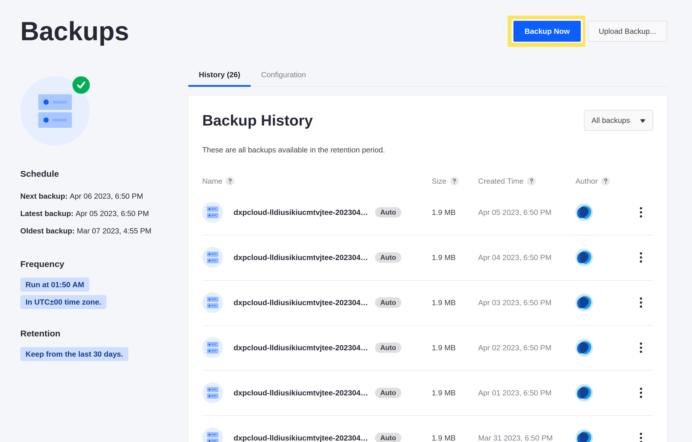
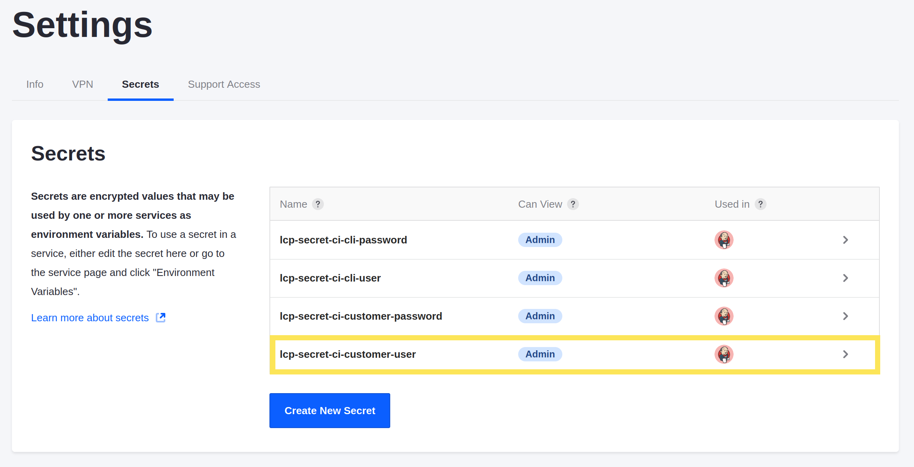

# Restoring Data from a Backup

Kyle wants to start testing changes that could affect data on the site.

Here, you'll restore a manual backup to recover data lost during a test.

## Create a Manual Backup from Production

You should always make sure your Liferay instance is backed up before you test changes that could cause data loss or instability.

Create a manual backup before you begin testing.

1. In the Liferay Cloud console, navigate to your production environment.

1. Click *Backups* on the left side of the screen.

1. Click *Backup Now* to create a manual backup.

The backup service is unavailable and the buttons on the page are disabled until the backup completes.

## Restore the Backup to UAT

When the backup from production finishes, restore it to your UAT environment.

1. Click _Actions_ (  ) next to the manual backup at the top of the list and click *Restore to...*

   

1. From the Select Environment drop-down menu, select your UAT environment.

1. Click the checkboxes to confirm the impact of the backup restore.

   

1. Click *Restore to Environment*.

Your UAT environment's services are temporarily unavailable while the backup is restored.

## Simulate A Disaster

Simulate disaster by deleting your default home page from your UAT Liferay instance.

1. Navigate to your UAT environment.

1. Click *Visit Site* at the top of the page to access your UAT Liferay instance. If your session has expired from logging in previously, [use your project's credentials](./deploying-and-promoting-to-production.md#accessing-your-uat-environment) to authenticate.

1. Log in as the [default administrator](https://learn.liferay.com/web/guest/w/dxp/getting-started/introduction-to-the-admin-account).

1. In the navigation menu on the left side of the screen, click *Site Builder* &rarr; *Pages*.

1. Next to the Home page, open the Actions menu (  ) and click *Delete*.

   

   A pop-up dialog appears asking to confirm the deletion.

1. Click *Delete*.

The home page is deleted, and the deletion cannot be undone. The *Home* button in the top-right corner of the screen also disappears since there is no longer a home page.

## Restore the Backup

Kyle realizes after deleting the page that it shouldn't have been deleted, and he can't remember how to make a new one easily. Help Kyle recover the data in UAT by restoring the backup you took before accessing the Liferay instance.

1. In the Liferay Cloud console, navigate to your production environment.

1. Click *Backups*.

1. Click the Actions menu (  ) next to your manual backup and click *Restore to...*

1. From the *Select environment* drop-down menu, select your UAT environment.

1. Click the checkboxes that appear to confirm the impact of the backup restore.

1. Click *Restore to Environment*.

Your UAT Liferay service is temporarily unavailable while the backup is being restored. Once it's finished, you can visit the site again to see the home page is restored.

Next, you'll query your Liferay database directly using the shell in the Liferay Cloud console.

## Relevant Concepts

* [Backup Service](https://learn.liferay.com/web/guest/w/liferay-cloud/platform-services/backup-service/backup-service-overview)
* [Restoring Data from a Backup](https://learn.liferay.com/web/guest/w/liferay-cloud/platform-services/backup-service/restoring-data-from-a-backup)
* [Logging into Your Liferay Cloud Services](https://learn.liferay.com/w/liferay-cloud/getting-started/logging-into-your-liferay-cloud-services)
