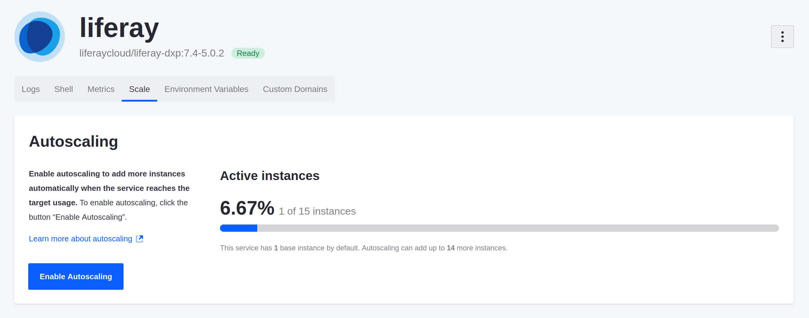
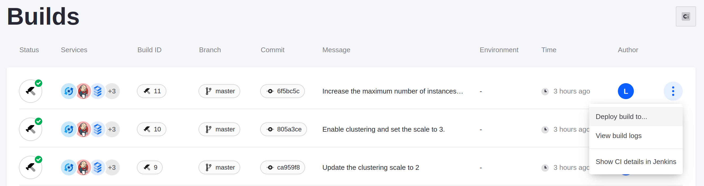

# Configuring Auto-scaling

Now that Marcus has enabled clustering with a minimum number of nodes, he can set up auto-scaling for the production environment for better flexibility handling site traffic in peak hours.

## Enable Auto-scaling in the Console

Use the Liferay Cloud console to enable auto-scaling for your production environment.

1. In the Liferay Cloud console, navigate to your production environment.

1. Navigate to *Services* &rarr; *Liferay*.

1. Select the *Scale* tab.

    

1. Click *Enable Auto Scaling*.

Auto-scaling is now enabled, up to the default maximum of ten instances.

## Set the Maximum Number of Instances

Marcus knows that traffic for the site at peak hours might require more than the default ten Liferay instances. He chooses to configure a maximum of 15 instances that auto-scaling can scale up to.

Set the maximum number of instances via the `maxInstances` property in your Liferay service's `LCP.json` file:

1. In your project repository, navigate to the `liferay/` directory and open the `LCP.json` file.

1. Set the `maxInstances` value to 15, within the `autoscale` JSON object:

    ```json
    "autoscale": {
        "maxInstances": 15
    }
    ```

1. Commit and push the changes in your Git repository.

    ```bash
    git add liferay/LCP.json
    ```

    ```bash
    git commit -m "Increase the maximum number of instances to 15."
    ```

    ```bash
    git push origin <branch_name>
    ```

Your repository on GitHub now has the updated number of maximum instances, and Liferay Cloud creates a new build with your changes.

## Deploy the Configuration

Deploy the updated configuration to your production environment.

1. Log in to the Liferay Cloud console.

1. Click the *Builds* link at the top-right of the screen to access the Builds page.

1. Click the Actions menu  for the build corresponding to the commit with your new changes, and select *Deploy build to...*

    

1. Select your production environment in the *Environment* drop-down menu.

1. Check the boxes acknowledging the impacts of the deployment.

    

1. Click *Deploy Build*.

Once your services restart, auto-scaling is enabled, up to a maximum of 15 instances.

Next, you'll enable Dynatrace integration to keep track of your project's usage metrics.

## Related Concepts

* [Auto-scaling](https://learn.liferay.com/liferay-cloud/latest/en/manage-and-optimize/auto-scaling.html)
* [Deploying to the Liferay Service](https://learn.liferay.com/liferay-cloud/latest/en/using-the-liferay-dxp-service/deploying-to-the-liferay-service.html)
* [Deploying Changes via the Liferay Cloud Console](https://learn.liferay.com/liferay-cloud/latest/en/build-and-deploy/deploying-changes-via-the-liferay-cloud-console.html)
