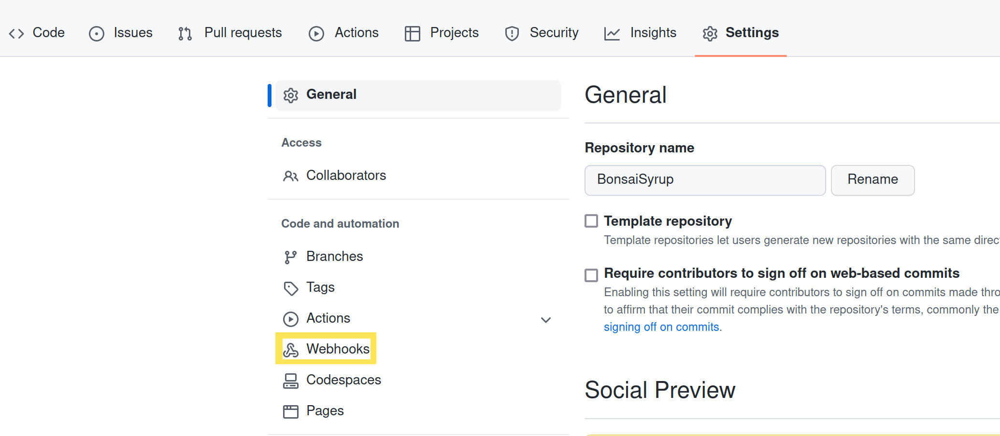

# Setting Up the GitHub Repository

Before configuring the Delectable Bonsai project on Liferay Cloud, Marcus takes some time to set up the project's Git repository to make sure he can push and deploy configurations as an administrator. Kyle waits for him to set up the GitHub repository and creates his own fork, too, so that he can deploy configurations or code changes as well.

Set up the repository and complete your first push to ensure it's working.

## Install the CLI Tool

Marcus and Kyle both need the CLI tool to be able to quickly deploy changes to different services in Liferay Cloud. They install it while setting up the repository so that they have it ready when they need it later.

Install the CLI tool via your command prompt.

**On Linux/MacOS**:

```bash
curl https://cdn.liferay.cloud/lcp/stable/latest/install.sh -fsSL | bash
```

**On Windows**:

Download the latest version of the [Windows installer](https://cdn.liferay.cloud/lcp/stable/latest/lcp-install.exe) and follow the steps in the wizard.

## Transfer to Your Own GitHub Repository

Begin by setting up your own GitHub repository to switch your Liferay Cloud project over to.

1. On the provisioned repository's page on [GitHub](https://github.com), click the *Code* button and copy the SSH link to the repository. See the official [GitHub documentation](https://docs.github.com/en/authentication/connecting-to-github-with-ssh/generating-a-new-ssh-key-and-adding-it-to-the-ssh-agent) for help if you have not generated an SSH key on your machine yet.

    

1. Run this command to clone the repository into a directory on your own system, in a new directory for the project:

    ```bash
    git clone <copied link> BonsaiSyrup
    ```

1. Create a [new private repository on GitHub](https://docs.github.com/en/get-started/quickstart/create-a-repo), and copy the SSH link for it.

1. Remove the old origin from your local repository:

    ```bash
    git remote remove origin
    ```

1. Add your new repository as the new origin using link you copied:

    ```bash
    git remote add origin <copied link>
    ```

Now you have your own private repository with the Liferay Cloud project structure.

## Configure the Webhook

Next, configure a webhook to allow Liferay Cloud to access the new repository.

1. On the GitHub website, go to your repository’s Settings page and click *Webhooks*.

    

1. Click *Add Webhook*.

1. In the *Payload URL* field, add the domain of your Liferay Cloud `infra` environment's CI service with `github-webhook/` at the end (e.g., `https://ci-bonsai-infra.lfr.cloud/github-webhook/` for the `bonsai` project).

1. In the *Content type* drop-down menu, select *application/json*.

1. Ensure that *Enable SSL verification* is selected.

    

1. Under *Which events would you like to trigger this webhook?*, select *Let me select individual events*.

1. Select *Pushes* and *Pull Requests* from the list of events that appears.

    

1. Ensure that the *Active* checkbox is selected.

1. Click *Add webhook*.

Now your repository allows Liferay Cloud to access it.

## Point Liferay Cloud to Your Private Repository

Finally, configure the CI service in your `infra` environment to work with the private repository.

1. Log in to the Liferay Cloud console.

1. Navigate to your `infra` environment, and click *Services*.

1. Select the CI service.

1. Under the *Environment Variables* tab, add the values for these environment variables:

    | **Name** | **Value** |
    | :--- | :--- |
    | `LCP_CI_SCM_PROVIDER` | `github` |
    | `LCP_CI_SCM_REPOSITORY_NAME` | <Your repository's name> |
    | `LCP_CI_SCM_REPOSITORY_OWNER` | <Your repository owner's account> |
    | `LCP_CI_SCM_TOKEN` | <Personal access token> |

    Use a [personal access token](https://docs.github.com/en/authentication/keeping-your-account-and-data-secure/creating-a-personal-access-token) that has every permission checked under the *repo* and *admin:repo_hook* categories.

Once the CI service restarts, any pushes or pull requests to your private repository trigger new builds in your Liferay Cloud project.

Next, you'll use the repository to complete your first push and deployment.

## Related Concepts

* [Configuring Your GitHub Repository](https://learn.liferay.com/liferay-cloud/latest/en/getting-started/configuring-your-github-repository.html)
* [Command-Line Tool](https://learn.liferay.com/liferay-cloud/latest/en/reference/command-line-tool.html)
* [Configuring Your Bitbucket Repository](https://learn.liferay.com/liferay-cloud/latest/en/getting-started/configuring-your-bitbucket-repository.html)
* [Configuring Your GitLab Repository](https://learn.liferay.com/liferay-cloud/latest/en/getting-started/configuring-your-gitlab-repository.html)
