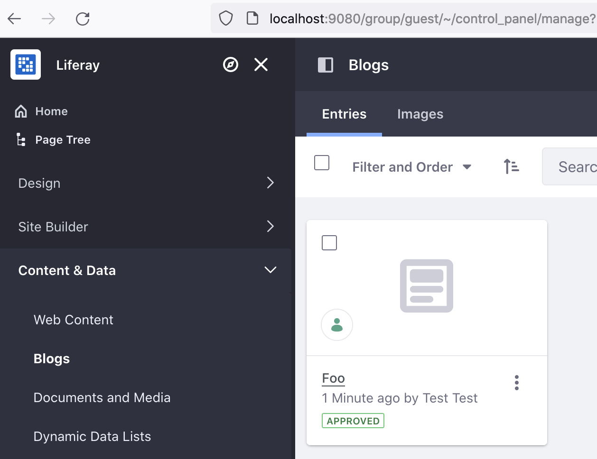

# Configuring the DXP Cluster

You can run two docker containers to demonstrate a simple clustered environment. See [Clustering for High Availability](https://learn.liferay.com/web/guest/w/dxp/installation-and-upgrades/setting-up-liferay/clustering-for-high-availability) to learn more.

## Configuring Elasticsearch for Each Node

1. Navigate back to the same local folder (i.e. `[your_folder]`) where you set up Elasticsearch's data volume. Create two new folders.

   ```bash
   mkdir -p liferay-1/files/osgi/configs liferay-2/files/osgi/configs
   ```

1. Generate a configuration file for the `liferay-1` node.

   ```bash
   cat <<EOT >> liferay-1/files/osgi/configs/com.liferay.portal.search.elasticsearch6.configuration.ElasticsearchConfiguration.config
   operationMode="REMOTE"
   transportAddresses="elasticsearch:9300"
   clusterName="LiferayElasticsearchCluster"
   EOT
   ```

1. Generate a configuration file for the `liferay-2` node.

   ```bash
   cat <<EOT >> liferay-2/files/osgi/configs/com.liferay.portal.search.elasticsearch6.configuration.ElasticsearchConfiguration.config
   operationMode="REMOTE"
   transportAddresses="elasticsearch:9300"
   clusterName="LiferayElasticsearchCluster"
   EOT
   ```

## Deploying Each Cluster Node

1. Find the IP address of the `elasticsearch` and `some-mariadb` containers.

   ```bash
   docker network inspect bridge
   ```

   Replace `[IP address]` below with the respective IP address of `elasticsearch` and `some-mariadb`.

1. Start the first Liferay node.

   ```bash
   docker run -it \
      --add-host elasticsearch:[IP address] \
      --add-host some-mariadb:[IP address] \
      -e LIFERAY_JDBC_PERIOD_DEFAULT_PERIOD_JNDI_PERIOD_NAME="" \
      -e LIFERAY_JDBC_PERIOD_DEFAULT_PERIOD_DRIVER_UPPERCASEC_LASS_UPPERCASEN_AME=org.mariadb.jdbc.Driver \
      -e LIFERAY_JDBC_PERIOD_DEFAULT_PERIOD_URL="jdbc:mariadb://some-mariadb:3306/dxp_db?useUnicode=true&characterEncoding=UTF-8&useFastDateParsing=false" \
      -e LIFERAY_JDBC_PERIOD_DEFAULT_PERIOD_USERNAME=root \
      -e LIFERAY_JDBC_PERIOD_DEFAULT_PERIOD_PASSWORD=my-secret-pw \
      -e LIFERAY_CLUSTER_PERIOD_LINK_PERIOD_ENABLED=true \
      -e LIFERAY_CLUSTER_PERIOD_LINK_PERIOD_CHANNEL_PERIOD_LOGIC_PERIOD_NAME_PERIOD_CONTROL=control-channel-logic-name-1 \
      -e LIFERAY_CLUSTER_PERIOD_LINK_PERIOD_CHANNEL_PERIOD_LOGIC_PERIOD_NAME_PERIOD_TRANSPORT_PERIOD_NUMBER0=transport-channel-logic-name-1 \
      -e LIFERAY_CLUSTER_PERIOD_LINK_PERIOD_AUTODETECT_PERIOD_ADDRESS=some-mariadb:3306 \
      -e LIFERAY_WEB_PERIOD_SERVER_PERIOD_DISPLAY_PERIOD_NODE=true \
      -e LIFERAY_DL_PERIOD_STORE_PERIOD_IMPL=com.liferay.portal.store.db.DBStore \
      --name liferay-1 \
      -p 11311:11311 \
      -p 8009:8009 \
      -p 8080:8080 \
      -v $(pwd)/liferay-1:/mnt/liferay \
      liferay/portal:latest
   ```

1. Start the second Liferay node.

   ```bash
   docker run -it \
      --add-host elasticsearch:[IP address] \
      --add-host some-mariadb:[IP address] \
      -e LIFERAY_JDBC_PERIOD_DEFAULT_PERIOD_JNDI_PERIOD_NAME="" \
      -e LIFERAY_JDBC_PERIOD_DEFAULT_PERIOD_DRIVER_UPPERCASEC_LASS_UPPERCASEN_AME=org.mariadb.jdbc.Driver \
      -e LIFERAY_JDBC_PERIOD_DEFAULT_PERIOD_URL="jdbc:mariadb://some-mariadb:3306/dxp_db?useUnicode=true&characterEncoding=UTF-8&useFastDateParsing=false" \
      -e LIFERAY_JDBC_PERIOD_DEFAULT_PERIOD_USERNAME=root \
      -e LIFERAY_JDBC_PERIOD_DEFAULT_PERIOD_PASSWORD=my-secret-pw \
      -e LIFERAY_CLUSTER_PERIOD_LINK_PERIOD_ENABLED=true \
      -e LIFERAY_CLUSTER_PERIOD_LINK_PERIOD_CHANNEL_PERIOD_LOGIC_PERIOD_NAME_PERIOD_CONTROL=control-channel-logic-name-2 \
      -e LIFERAY_CLUSTER_PERIOD_LINK_PERIOD_CHANNEL_PERIOD_LOGIC_PERIOD_NAME_PERIOD_TRANSPORT_PERIOD_NUMBER0=transport-channel-logic-name-2 \
      -e LIFERAY_CLUSTER_PERIOD_LINK_PERIOD_AUTODETECT_PERIOD_ADDRESS=some-mariadb:3306 \
      -e LIFERAY_WEB_PERIOD_SERVER_PERIOD_DISPLAY_PERIOD_NODE=true \
      -e LIFERAY_DL_PERIOD_STORE_PERIOD_IMPL=com.liferay.portal.store.db.DBStore \
      --name liferay-2 \
      -p 11312:11311 \
      -p 9009:8009 \
      -p 9080:8080 \
      -v $(pwd)/liferay-2:/mnt/liferay \
      liferay/portal:latest
   ```

1. You can now visit each node. `Liferay-1` is available at `http://localhost:8080`. And `Liferay-2` is available at `http://localhost:9080`.

   

```{note}
Running two Liferay docker nodes may require increasing your default CPU and memory resource settings.
```

## Testing the Cluster

In a cluster, as content is created or modified in one node, it should be available across other nodes. Create a simple blog post to see this in action.

1. In the `Liferay-1` node (i.e. `http://localhost:8080`), open the _Product Menu_ (). Click _Blogs_ under _Content & Data_.

1. Click _Add_ ().

1. Add the following entry.

   * Title: Foo
   * Content: Bar 

   Click _Save_.

1. Switch over to the `Liferay-2` node (i.e. `http://localhost:9080`). Open the _Product Menu_ (). Click _Blogs_ under _Content & Data_.

1. The blog entry created in the `Liferay-1` node is visible in the `Liferay-2` node.

   

Your Liferay environment is now configured as a clustered environment. Note that the next step, load balancing your nodes, is out of scope for this course, as it's configured outside of Liferay. You have completed this module on clustering. 

## Relevant Concepts

- [Maintaining Clustered Installations](https://learn.liferay.com/en/w/dxp/installation-and-upgrades/maintaining-a-liferay-installation/maintaining-clustered-installations)
