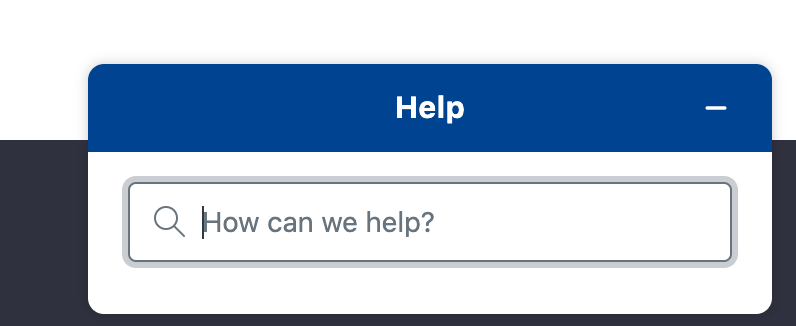

# Configuring Instance Settings

Liferay instances share the same installation but are configured to serve unique digital experiences from different domain names. Each instance has its own settings. 

Here, you'll configure the user authentication settings for the virtual instance you created in the previous step. For `www.bulkbonsaimaplesyeup.com`, Delectable Bonsai wants to prevent guests from creating user accounts. Instead, accounts are created by account managers for each buyer.

## Configuring User Authentication

1. Navigate to `www.bulkbonsaimaplesyrup.com` instance you created in the previous step.

1. Navigate to _Global Menu_ () &rarr; _Control Panel_ &rarr; _Instance Settings_. Under _Platform_, select _User Authentication_.

1. Uncheck the box labeled _Allow strangers to create accounts_.

   

   Now guests are prevented from creating new user accounts.

The next step is [server administration and email](./server-administration-and-email.md). 

## Relevant Concepts

- [Instance Configuration](https://learn.liferay.com/en/w/dxp/system-administration/configuring-liferay/virtual-instances/instance-configuration)
