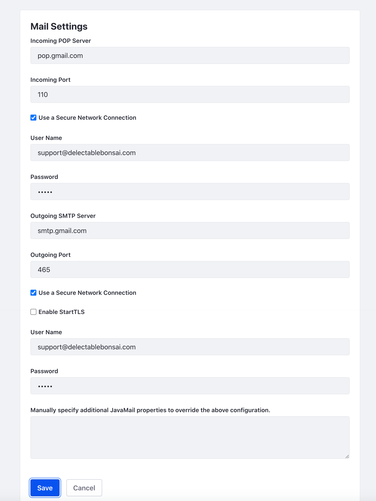

# Configuring Instance Settings

Liferay can be configured to use a mail server to send email notifications. Email notifications are sent for various purposes (e.g. user registration or password management). To learn more, see [Configuring Mail](https://learn.liferay.com/dxp/latest/en/installation-and-upgrades/setting-up-liferay/configuring-mail.html)

### Configuring Mail in LXC

If this wasn't already configured for you, contact your Liferay Cloud support person.

### Configuring Mail in LXC-SM or On-Premises

1. Navigate to _Global Menu_ () &rarr; _Control Panel_ &rarr; _Instance Settings_. Under _Platform_, click _Email_. Click _Email Sender_.

1. Set the email sender.

   * Set the name as `Support`.
   * Set the address as `support@delectablebonsai.com`.
   * Click _Save_.

1. In the left navigation, click _Mail Settings_. Enter the following values.

   * Incoming POP Server: `pop.gmail.com`.
   * Incoming Port: `110`.
   * Use a Secure Network Connection: checked.
   * User Name: `support@delectablebonsai.com`.
   * Password: `learn`.
   * Outgoing SMTP Server: smtp.gmail.com
   * Outgoing Port: 465
   * Use a Secure Network Connection: checked
   * User Name: `support@delectablebonsai.com`.
   * Password: `learn`.

   

   Click _Save_.

```{note}
The settings above are for demonstration purposes only. For your business, input your relevant email provider values and credentials.
```

## Relevant Documentation

- [Configuring Mail](https://learn.liferay.com/dxp/latest/en/installation-and-upgrades/setting-up-liferay/configuring-mail.html)
- [Email Settings](https://learn.liferay.com/dxp/latest/en/system-administration/configuring-liferay/virtual-instances/email-settings.html)
