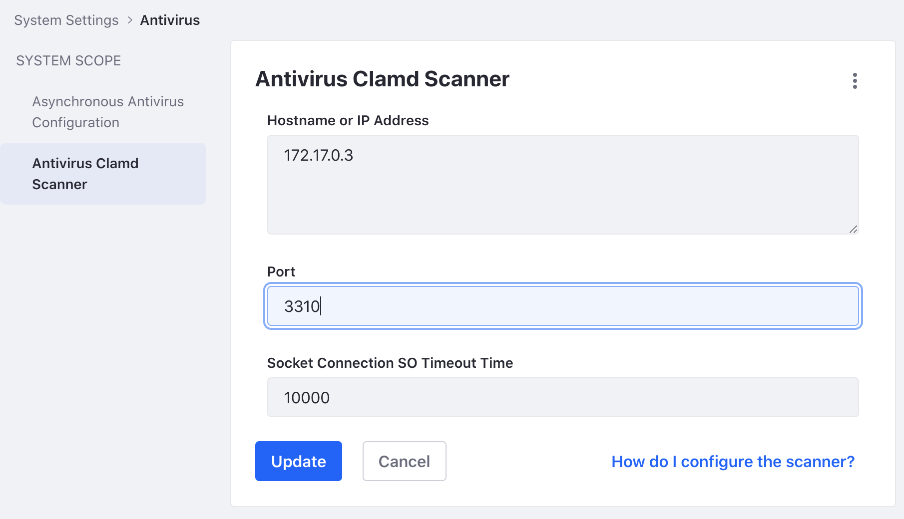

# Configuring System Settings

{bdg-secondary}`Liferay PaaS or Self-hosted`

System settings apply across instances, sites, or widgets. Settings made here apply across your entire environment. Some of these cannot be changed at lower scopes (for example, configuring antivirus) and some become defaults that can be overridden at lower scopes. See [System Settings](https://learn.liferay.com/en/w/dxp/system-administration/configuring-liferay/system-settings) to learn more.

### System Settings in Liferay SaaS

System settings are not accessible in Liferay SaaS. Contact Liferay Cloud support to configure system settings.

### System Settings in Liferay PaaS and Self-hosted

Liferay supports [ClamAV](https://www.clamav.net/), an open source antivirus solution. You can configure ClamAV antivirus software in system settings.

```{note}
Follow the [ClamAV Documentation](https://docs.clamav.net/) to install and run ClamAV on the platform you plan to use with your Liferay environment.
```

1. Navigate to _Global Menu_ () &rarr; _Control Panel_ &rarr; _System Settings_. 

1. Under security, click _Antivirus_.

1. In the left navigation, click _Antivirus Clamd Scanner_.

1. Enter the settings.

   * Hostname or IP Address - The server name or address running the ClamAV service. 
   * Port - The port number for the ClamAV service.
   * Socket Connection SO Timeout Time - A time in milliseconds after which the connection is invalid.

   

1. Click _Update_. Your Liferay environment now scans uploaded files with ClamAV. To see how this works, see the relevant concepts below. 

The next step is [configuring virtual instances](./configuring-virtual-instances.md).

## Relevant Concepts

- [System Settings](https://learn.liferay.com/en/w/dxp/system-administration/configuring-liferay/system-settings)
- [Enabling Antivirus Scanning for Uploaded Files](https://learn.liferay.com/en/w/dxp/system-administration/file-storage/enabling-antivirus-scanning-for-uploaded-files)
