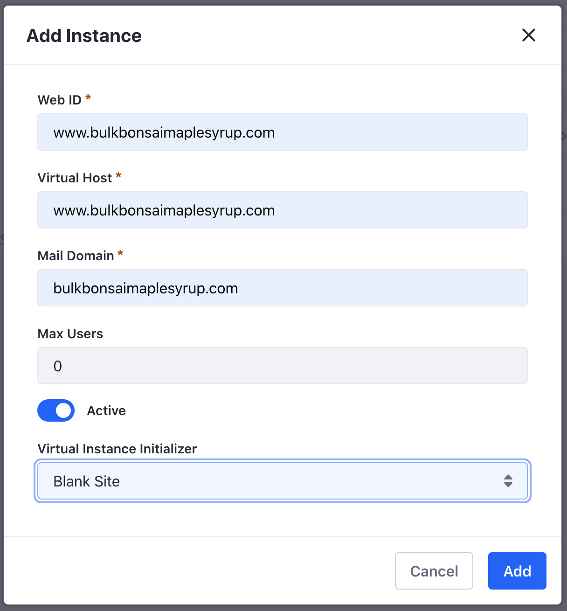
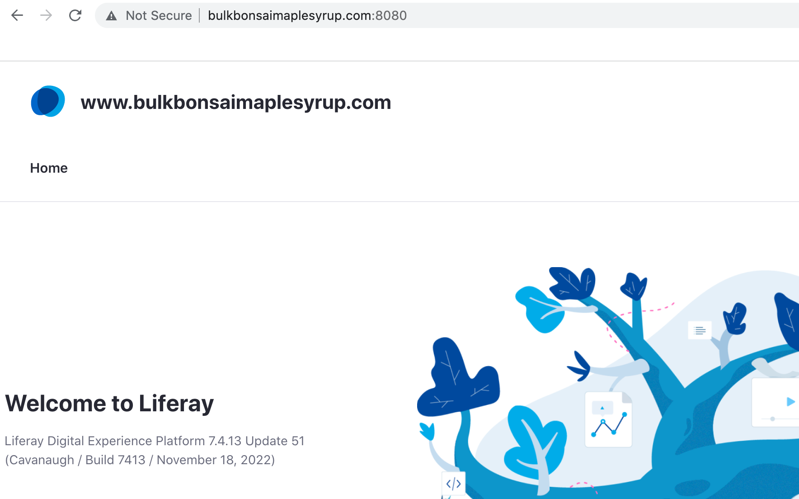

# Configuring Virtual Instances

{bdg-secondary}`Liferay PaaS or Self-hosted`

You may have a business use case where you need another Liferay environment with its own set of sites, users, and organizations. Rather than spinning up a brand new server, you can create a virtual instance.

For example, Clarity Vision Solutions has both an external, public facing website for their business and an internal intranet for its employees that it calls Glance. These are built using virtual instances. 

## Virtual Instances in Liferay SaaS

Contact your Liferay Cloud support person for setting up virtual instances.

## Virtual Instances in Liferay PaaS and Self-hosted

1. Navigate to _Global Menu_ () &rarr; _Control Panel_ &rarr; _Virtual Instances_.

1. Click _Add_ () and enter the following information.

   * Web ID: `glance.clarityvisionsolutions.com`
   * Virtual Host: `glance.clarityvisionsolutions.com`
   * Mail Domain: `clarityvisionsolutions.com`
   * Max Users: `0` (note, this means unlimited users)
   * Active: toggle on
   * Virtual Instance Initializer: select _Blank Site_.

   

   Click _Save_. Your new virtual instance ready.

1. Since this is not a real externally hosted site, add the domain to your `/etc/hosts` file of your local system.

   `127.0.0.1 glance.clarityvisionsolutions.com`

   ```{note}
   If using a docker container, `--add-host glance.clarityvisionsolutions.com:127.0.0.1` entry must be included in your run command.
   ```

1. Once the virtual instance is successfully added, navigate to `http://glance.clarityvisionsolutions.com:8080/`. 

   

## Create an Administrator for the New Instance

Virtual instances are separate Liferay instances. The new instance you just created has no user accounts in it. Create one for Kyle Klein so he can administer this instance as well. 

If you need a reminder for how to do that, you can [go back](../users-accounts-organizations/managing-users.md#create-an-administrator) and follow the instructions to register him and make him an administrator of this instance. 

The next step is to [configure instance settings](./configuring-instance-settings.md).

## Relevant Concepts

- [Understanding Virtual Instances](https://learn.liferay.com/en/w/dxp/system-administration/configuring-liferay/virtual-instances/understanding-virtual-instances)
- [Adding a Virtual Instance](https://learn.liferay.com/en/w/dxp/system-administration/configuring-liferay/virtual-instances/adding-a-virtual-instance)
