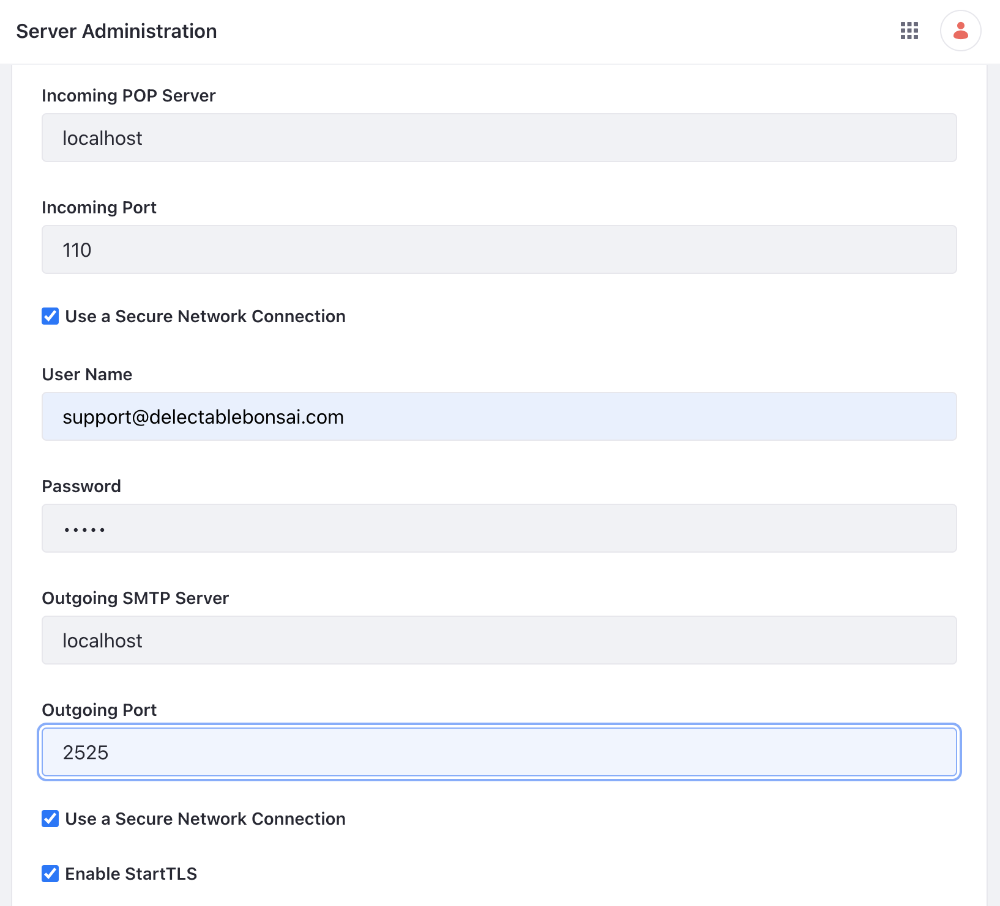
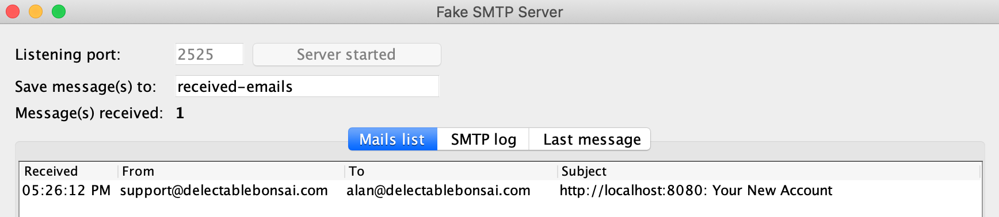

# Server Administration and Email

You can manage and monitor your Liferay instance from the server administration console. For example, you can view the current system or portal properties or configure logging and log levels. This is also where you can configure the email server for the whole system. See [Using the Server Administration Panel](https://learn.liferay.com/en/w/dxp/system-administration/using-the-server-administration-panel) to learn more.

Configure a mail server that is used for email notifications (e.g. user registration, password management, etc.). Follow the steps below to configure the mail server for Clarity Vision Solutions. 

### Configuring Mail in Liferay SaaS

If this wasn't already configured for you, contact your Liferay Cloud support person.

### Configuring Mail in Liferay PaaS or Self-hosted

In real life, you'd already have a mail server for Liferay to use. Here, you'll simulate one. 

1. Download [FakeSMTP](http://nilhcem.com/FakeSMTP/). 

1. Unzip the file. Start the FakeSMTP mail server with the following command:

   `java -jar fakeSMTP-2.0.jar`

1. Set the listening port to `2525` and click _Start server_.

   Note, if using a docker container, the following env variables must be included in the your run command.

   ```properties
   --env LIFERAY_MAIL_PERIOD_SESSION_PERIOD_MAIL_PERIOD_SMTP_PERIOD_PORT=2525 \
   --env LIFERAY_MAIL_PERIOD_SESSION_PERIOD_MAIL_PERIOD_SMTP_PERIOD_HOST=172.17.0.1 \
   ```


1. In Liferay, navigate to _Global Menu_ () &rarr; _Control Panel_ &rarr; _Server Administration_. Click the _Mail_ tab.

1. Set the following configuration.

   * Incoming POP Server: `localhost`
   * Incoming Port: `110`
   * Use a Secure Network Connection: checked
   * User Name: `support@clarityvisionsolutions.com`
   * Password: `learn`
   * Outgoing SMTP Server: `localhost`
   * Outgoing Port: `2525`
   * Use a Secure Network Connection: checked
   * User Name: `support@clarityvisionsolutions.com`
   * Password: `learn`

   

   Click _Save_.

1. Navigate to _Global Menu_ () &rarr; _Control Panel_ &rarr; _Instance Settings_. Click _Email_.

1. In the left navigation, click _Email Sender_. Set the options below.

   * Name: `Support`
   * Address: `support@clarityvisionsolutions.com`

   Click _Save_.

1. Navigate to _Global Menu_ () &rarr; _Control Panel_ &rarr; _Users and Organizations_. Click _Add User_ ().

1. Enter the following account information:

   * Screen Name: `alan`
   * Email Address: `alan@clarityvisionsolutions.com`
   * First Name: `Alan`
   * Last Name: `Adams`
   * Job Title: `Sales & Marketing Manager`

   Click _Save_. 

1. Liferay has sent a welcome email to Alan Adams.

   

Your Liferay environment is now configured with a mail server. You can further customize mail to configure different email senders and messages for each instance. See [Instance Email Settings](https://learn.liferay.com/en/w/dxp/system-administration/configuring-liferay/virtual-instances/email-settings) to learn more.

## Relevant Concepts

- [Using the Server Administration Panel](https://learn.liferay.com/en/w/dxp/system-administration/using-the-server-administration-panel)
- [Configuring Mail](https://learn.liferay.com/en/w/dxp/installation-and-upgrades/setting-up-liferay/configuring-mail)
- [Email Settings](https://learn.liferay.com/en/w/dxp/system-administration/configuring-liferay/virtual-instances/email-settings)
