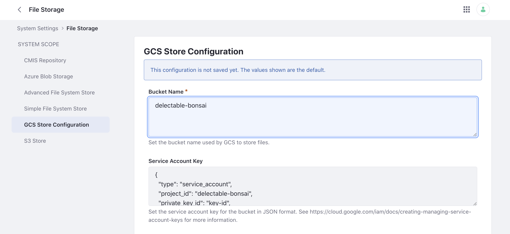

# Using File Storage

Liferay can be configured to use different file storage solutions. For example, Delectable Bonsai uses Google Cloud Storage (GCS) as their file storage system.

Choose the solution that best fits your business needs. See [File Storage](https://learn.liferay.com/dxp/latest/en/system-administration/file-storage.html) to learn more.

### File Storage in LXC

If this wasn't already configured for you, contact your Liferay Cloud support person.

### File Storage in LXC-SM or On-Premises

Follow the steps to integrate Google Cloud Storage with Liferay.

1. Navigate to _Global Menu_ () &rarr; _Control Panel_ &rarr; _System Settings_. 

1. Under platform, click _File Storage_.

1. In the left navigation, click _GCS Store Configuration_.

1. Input the settings.

   * Bucket Name: `delectable-bonsai`
   * Service Account Key: The private JSON key provided by Google.
  
   

   Configure the optional retry and timeout settings. Click _Save_.

Next, set Google Cloud Storage as the default in portal properties.

### Portal Properties in LXC-SM

1. In your Liferay Cloud repository, create a new working branch. Note, make sure your master branch is up-to-date.

1. Add the following line to your `portal-ext.properties` file in the `<project>\liferay\configs\` folder.

   `dl.store.impl=com.liferay.portal.store.gcs.GCSStore`

1. Add and commit your change. 

1. Push up your branch to your repository.

1. Deploy the new build from Liferay Cloud Console. See [Deploying Changes via the Liferay Cloud Console](https://learn.liferay.com/liferay-cloud/latest/en/build-and-deploy/deploying-changes-via-the-liferay-cloud-console.html) to learn more.

### Portal Properties in On-Premises

1. Add the following line to your `portal-ext.properties` file in your Liferay Home folder.

   `dl.store.impl=com.liferay.portal.store.gcs.GCSStore`

1. Restart the Liferay server.

The next step is [Server Administration and Email](./server-administration-and-email.md)

## Relevant Concepts

- [File Storage](https://learn.liferay.com/dxp/latest/en/system-administration/file-storage.html)