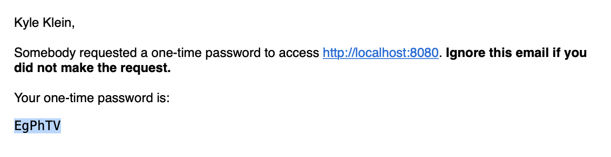

# Configuring Multi-Factor Authentication

Multi-Factor Authentication requires users to both know something and have something. Usually, this is a password and a device or service, like a mobile phone or an email address. To log in, users must supply their passwords and a code sent to this device. 

Liferay supports both one-time codes through email and third-party services that support SMS or authenticator apps. See [using multi-factor-authentication](https://learn.liferay.com/w/dxp/installation-and-upgrades/securing-liferay/multi-factor-authentication/using-multi-factor-authentication) to learn more.

Clarity Vision Solutions has come a long way from its days selling frames out of a garage. Now with many employees and customers, the IT department is requiring MFA as part of its enhanced security efforts.

## Setting Up MFA

1. Follow the steps in [Configuring Mail in Liferay](../../configuration/server-administration-and-email.md#configuring-mail-in-liferay-paas-or-self-hosted) to simulate an SMTP mail server.

1. Log into Liferay as the administrator (i.e. [Kyle Klein](../../users-accounts-organizations/managing-users.md#creating-users)).

1. Next, navigate to _Global Menu_ () &rarr; _Control Panel_ &rarr; _Instance Settings_. Click _Multi-Factor Authentication_ under the security section.

1. Tick the _Enabled_ box and click _Save_. See [Enabling Multi-Factor Authentication](https://learn.liferay.com/w/dxp/installation-and-upgrades/securing-liferay/multi-factor-authentication/using-multi-factor-authentication#enabling-multi-factor-authentication) to learn more about the configuration options.

Note, ensure you can successfully receive email through FakeSMTP before proceeding to prevent locking yourself out of the system.

## Testing the MFA

1. Click the user profile image in the top right and click _Sign Out_.

1. Sign back into Liferay as the administrator (i.e. Kyle Klein). 

1. On the next page, click _Send_ for Liferay to send the one-time password to kyle@clarityvisionsolutions.com. 

1. Get the one-time password from the sent email.

   

1. Copy and paste the one-time password onto the login page. Click _Submit_. You successfully logged into Liferay.

```{note}
Logging in for the rest of the course will be difficult with Multi-Factor Authentication enabled. When finished with this exercise, go back and uncheck the _Enabled_ box and click _Save_ to disable Multi-Factor Authentication. 
```

Awesome! You have now completed the Authentication module. 

Next: [Securing Web Services](../securing-web-services.md)

## Relevant Concepts

- [Using Multi-Factor Authentication](https://learn.liferay.com/w/dxp/installation-and-upgrades/securing-liferay/multi-factor-authentication/using-multi-factor-authentication)
- [Multi-Factor Authentication Checkers](https://learn.liferay.com/w/dxp/installation-and-upgrades/securing-liferay/multi-factor-authentication/multi-factor-authentication-checkers)
