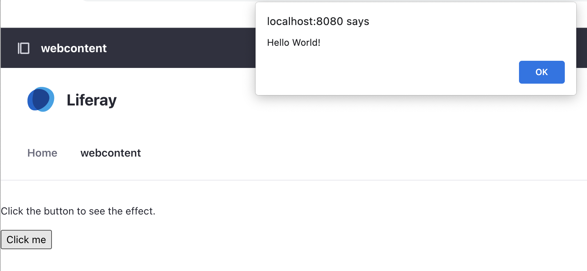
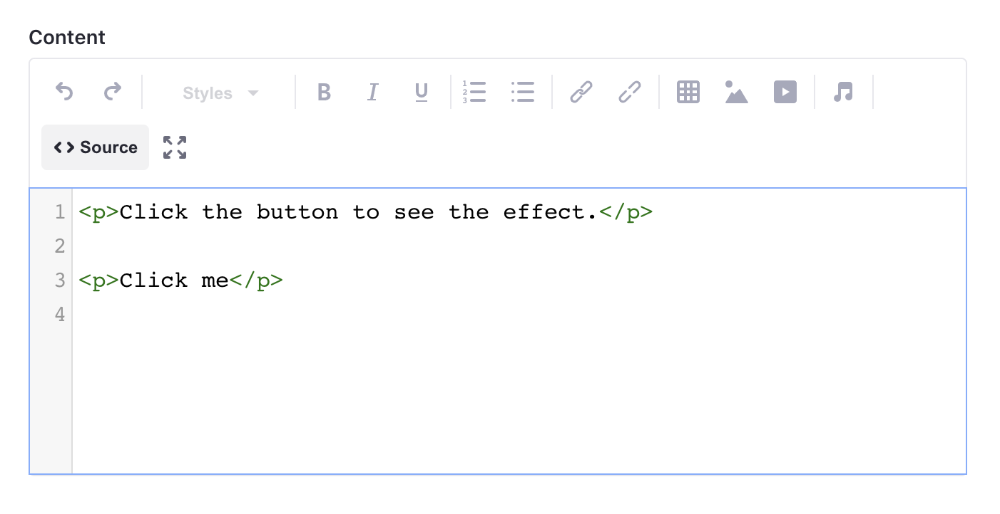

# Managing AntiSamy

An AntiSamy sanitizer is enabled by default in Liferay. This sanitizer prevents malicious JavaScript code from being injected into the system when users use HTML and CSS in various Liferay applications. See [AntiSamy](https://learn.liferay.com/web/guest/w/dxp/installation-and-upgrades/securing-liferay/using-antisamy) to learn more. 

To prevent malicious activity, the IT department of Delectable Bonsai decides to forbid JavaScript code from being placed in web content. See this in action below. 

## Configuring AntiSamy

By default, all JavaScript code is sanitized and prevented from being executed except for [fragments](https://learn.liferay.com/web/guest/w/dxp/site-building/creating-pages/page-fragments-and-widgets/using-fragments) and [web content](https://learn.liferay.com/web/guest/w/dxp/content-authoring-and-management/web-content). This is controlled by what is blacklisted and whitelisted in the configuration. Follow the steps below to see this in action.

1. Publish a basic web content to a site page.

   * Open the _Product Menu_ ().
   * Click _Web Content_ under _Content & Data_.
   * Click _Add_ () and select _Basic Web Content_.
   * Input _foo_ as the title.
   * Click _Source_ () to switch to code view.
   * Paste the following JavaScript snippet.

   ```html
   <script>
   function foo() {
   alert("Hello World!");
   }
   </script>
   <p>Click the button to see the effect.</p>

   <p><button onclick="foo()">Click me</button></p>
   ```
   * Click _Publish_.
   * In the left navigation, click _Pages_ under _Site Builder_.
   * Click _Add_ () to add a new page. Select _Page_.
   * In the next screen, select the blank template. Input `Webcontent` as the page name. Click _Add_.
   * In the left navigation, select _Widgets_ under the fragments and widgets tab.
   * Find the web content display widget under content management. Drag it onto the page.
   * Click _Options_ ([!Options icon](../../images/icon-actions.png)) on the widget and click _Configuration_.
   * In the pop-up window, select the foo web content you just created. Click _Save_.
   * Finally, click _Publish_.

1. See the script in action.

   * Navigate to the site page you created (i.e. `http://localhost:8080/webcontent`).
   * Click the _Click me_ button. See the JavaScript alert box pop up.

   

1. Apply AntiSamy to web content.

   * Navigate to _Global Menu_ () &rarr; _Control Panel_ &rarr; _System Settings_.
   * Click _Security Tools_ under the security section.
   * In the left navigation, click _AntiSamy Sanitizer_.
   * Remove the `com.liferay.journal.model.JournalArticle` whitelist entry by clicking the minus button.
   * Click _Save_.

1. See the sanitizer take effect.

   * Open the _Product Menu_ ().
   * Click _Web Content_ under _Content & Data_.
   * Click the foo web content you created previously.
   * Click _Source_ () to switch to code view.
   * Make a small change to the content. For example, change the `Hello World!` to `Hello Foo!`. 
   * Click _Publish_.
   * Click back into the web content. See that the Javascript code has been removed and the content has been sanitized.

   

Congratulations on completing this security module.

## Relevant Concepts

- [AntiSamy](https://learn.liferay.com/web/guest/w/dxp/installation-and-upgrades/securing-liferay/using-antisamy)
