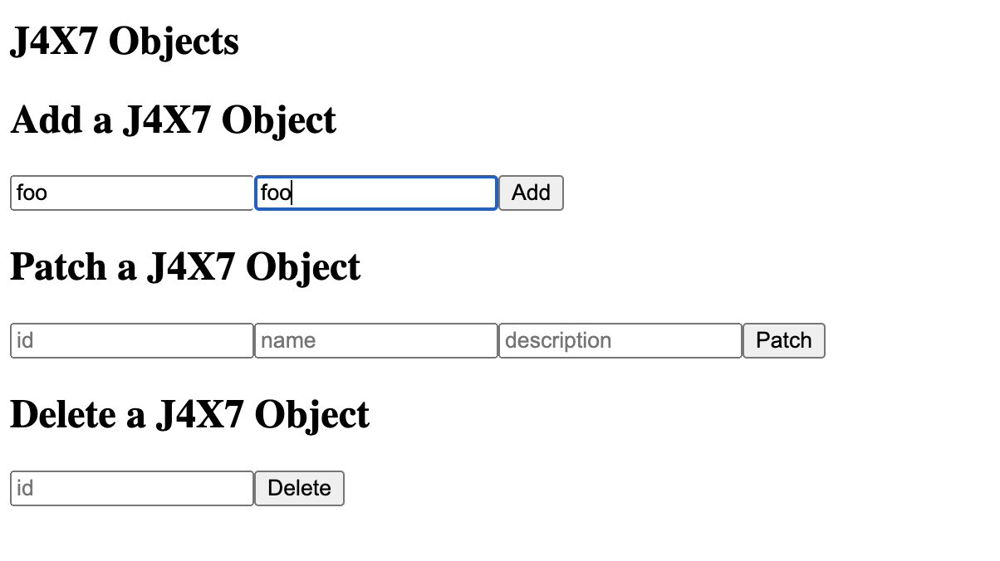
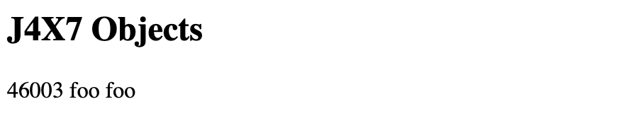

## Enabling Cross-Origin Resource Sharing

When a server from a different domain tries to access Liferay web services, the cross-origin resource sharing (CORS) policy allows or denies each request. See [setting up CORS](https://learn.liferay.com/w/dxp/installation-and-upgrades/securing-liferay/securing-web-services/setting-up-cors) to learn more.

Delectable Bonsai may choose to create a [Liferay object](https://learn.liferay.com/w/dxp/building-applications/objects) for users to have customized profile fields. Follow the steps below to see an example of this with a React application running locally. 

1. Create a Liferay object.

   * Navigate to _Global Menu_ () &rarr; _Control Panel_ &rarr; _Objects_.
   * Click _Add_ ().
   * Enter the following object:
     * Label: `J4X7-Object`
     * Plural Label: `J4X7-Objects`
     * Name: `J4X7Object`
   * Click _Save_.
   * Select the J4X7-Object you just created. Click the _Fields_ tab.
   * Click _Add_ () and add the following field:
     * Label: `name`
     * Field Name: `name`
     * Type: `Text`
   * Click _Save_.
   * Click _Add_ () and add the following field:
     * Label: `description`
     * Field Name: `description`
     * Type: `Text`
   * Click _Save_.
   * Click back to the _Details_ tab and click _Publish_.

1. Download and unzip the React application.

   ```bash
   curl https://resources.learn.liferay.com/dxp/latest/en/building-applications/developing-a-javascript-application/using-react/liferay-j4x7.zip -O
   ```

   ```bash
   unzip liferay-j4x7.zip
   ```

   ```bash
   cd liferay-j4x7
   ```

1. Navigate to the application's folder and start the React server.

   ```bash
   cd j4x7-custom-element
   ```

   ```bash
   yarn start
   ```

1. Try to add a J4X7 object entry. Enter `foo` as the name and description and click _Add_.

   

   See that the entry was prevented from being added.

1. In Liferay, navigate to _Global Menu_ () &rarr; _Control Panel_ &rarr; _Instance Settings_.

1. Add a CORS policy for the object.

   * Click _Security Tools_.
   * Click _Portal Cross-Origin Resource Sharing (CORS)_ in the left navigation.
   * Click _Add_.
   * Enter _Foo_ as the name.
   * Add a *URL Pattern* with the value `/o/c/j4x7objects/*` and click *Update*.

1. Back in the React app, add a J4X7 object entry. Enter `foo` as the name and description and click _Add_.

   

   With the CORS policy updated, a J4X7 object entry is now successfully added.

Excellent! You have now configured CORS, and you have completed the Securing Web Services module. 

Next: [Authorizing and Single Sign-On](../authorizing-and-single-sign-on.md)
