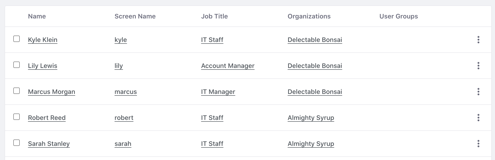

# Importing and Exporting Users

Once the LDAP server is connected to your Liferay environment, you can import or export users. 

## Importing LDAP Users

1. Navigate to _Global Menu_ () &rarr; _Control Panel_ &rarr; _Instance Settings_. 

1. Under security, click _LDAP_.

1. In the left navigation, click _Import_. 

1. Check the box for _Enable Import_. Click _Save_. Note, the default import interval is set to 10 minutes. Liferay performs a bulk import at this interval. 

1. Navigate to _Global Menu_ () &rarr; _Control Panel_ &rarr; _Users and Organizations_. The user from the LDAP server has been imported.

   

```{note}
If you leave the _Enable _Import_ box unchecked, users are imported individually when they log in. Use the import if you want to do a bulk import from LDAP. 
```

## Exporting LDAP Users

1. Navigate to _Global Menu_ () &rarr; _Control Panel_ &rarr; _Instance Settings_. 

1. Under security, click _LDAP_.

1. In the left navigation, click _Export_. 

1. Check the boxes for _Enable Export_ and _Enable Group Export_. Click _Save_. 

1. Now modify an existing user. Navigate to _Global Menu_ () &rarr; _Control Panel_ &rarr; _Users and Organizations_. 

1. Click on the user Kyle Klein. See [creating users](https://learn.liferay.com/w/courses/liferay-administrator/users-accounts-organizations/managing-users#creating-users), if you need to create this user.

1. Make a change to his personal information. For example, change his birth year from 1970 to 1971. Click _Save_.

1. Go back to the LDAP server settings. Navigate to _Global Menu_ () &rarr; _Control Panel_ &rarr; _Instance Settings_. 

1. In the left navigation, click _Servers_. 

1. Click _Edit_ () for the `almightysyrup` LDAP directory.

1. Scroll down and click _Test LDAP Users_. See that Kyle Klein has been added to the LDAP.

   

Next:  [understanding GDPR](./understanding-gdpr.md).

## Relevant Concepts

- [Configuring User Import and Export](https://learn.liferay.com/en/w/dxp/users-and-permissions/connecting-to-a-user-directory/configuring-user-import-and-export)

- [LDAP Reference Configuration](https://learn.liferay.com/en/w/dxp/users-and-permissions/connecting-to-a-user-directory/ldap-configuration-reference)
