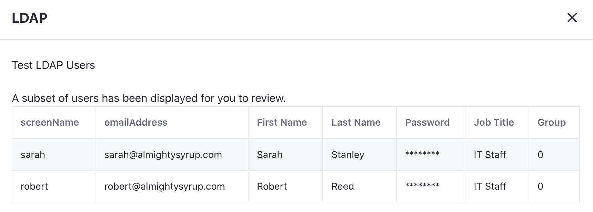

---
toc:
uuid: 9540baaf-7e04-40a2-9a4a-1409d3526092
---
# Setting up Liferay with LDAP

An LDAP server can be configured at the system level or instance level in Liferay. Choose the scope based on your needs. Note, when configuring at the system scope, you must specify each instance ID. See [Connecting to an LDAP Directory](https://learn.liferay.com/dxp/latest/en/users-and-permissions/connecting-to-a-user-directory/connecting-to-an-ldap-directory.html)

Delectable Bonsai needs to bring in user data from a company they just acquired. Connect to the company's LDAP server with the steps below.

### Connecting an LDAP Server in LXC

Contact your Liferay Cloud support person about connecting a LDAP server.

### Connecting an LDAP Server in LXC-SM or On-Premises

1. Navigate to _Global Menu_ () &rarr; _Control Panel_ &rarr; _Instance Settings_. 

1. Under security, click _LDAP_.

1. In the left navigation, click _Servers_. 

1. Click the _Add_ button.

1. In the new page, fill in the LDAP connection information.

   * Server Name: `Almight Syrup`
   * Base Provider URL: `ldap://127.0.0.1:389`
   * Base DN: `dc=almightysyrup,dc=com`
   * Principal: `cn=admin,dc=almightysyrup,dc=com`
   * Credentials: `learn`

   

   Click _Test LDAP Connection_. A new popup window shows a message that Liferay has successfully connected to the LDAP server. Click the _X_ and close the window.

1. Next, fill in the LDAP user information section. Make sure that required fields such as name and email are mapped correctly. Click _Test LDAP Users_ to preview the mapping of user fields.

   

1. Next, fill out the LDAP groups information. Click _Test LDAP Groups_ to see a preview.

1. Finally, fill out the LDAP export information. Click _Save_.

The next step is [importing users](./importing-users.md).

## Relevant Concepts

- [Connecting to an LDAP Directory](https://learn.liferay.com/dxp/latest/en/users-and-permissions/connecting-to-a-user-directory/connecting-to-an-ldap-directory.html)
