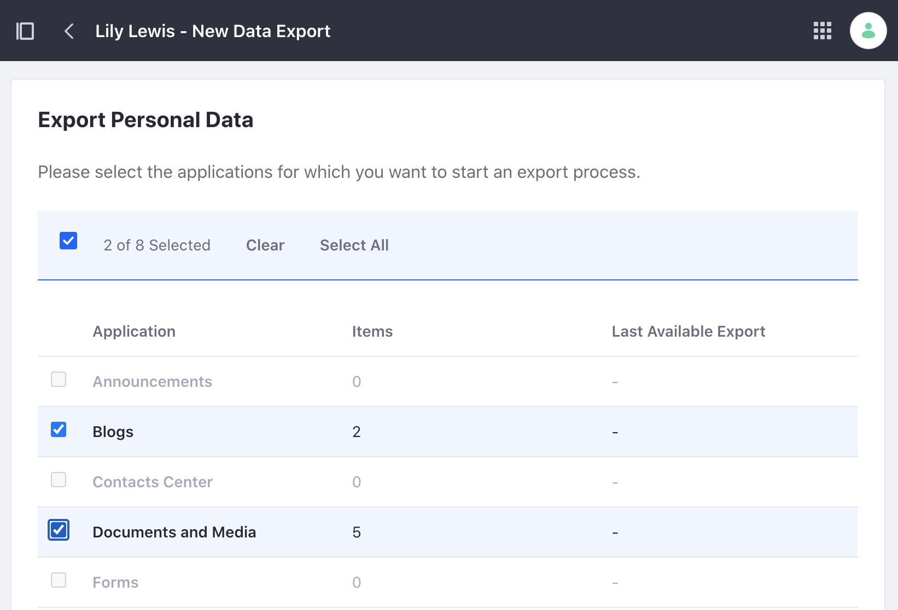
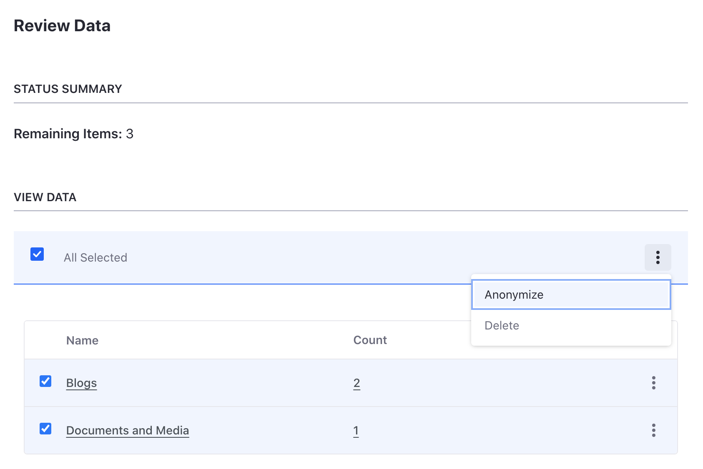
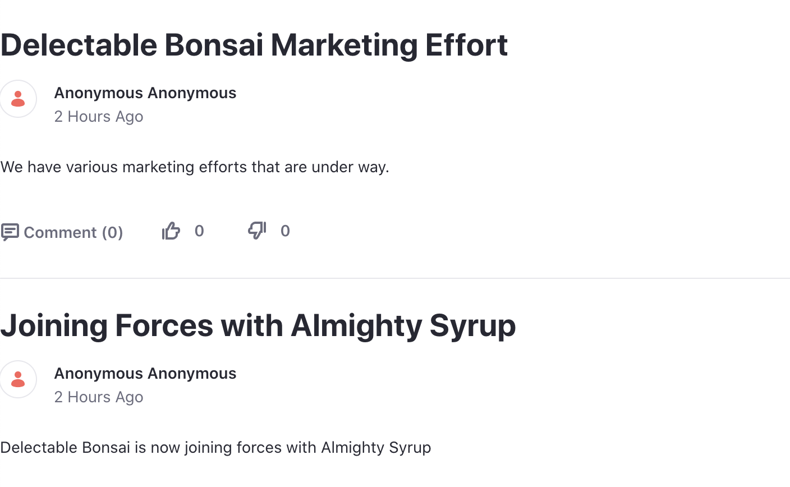

# Understanding GDPR

Liferay provides user data tools for managing and deleting personal user data. Though these tools can help with GDPR requirements, they do not guarantee compliance. See [managing user data](https://learn.liferay.com/w/dxp/users-and-permissions/managing-user-data) to learn more.

## Working with Personal Data

Data such as blog posts, uploaded documents, and message board replies are examples of content that may contain users' personal data. 

<!-- I don't think this example is "real world" enough. If Sarah Stanley is an employee of the company, anything she posts is owned by the company. It's not her data. Plus, if Sarah is an administrator, she can export it herself. :-) The example should be for a user of the public website. -Rich -->

1. Change the user authentication setting. Note, this is only for our learning and testing purposes.

   * Navigate to _Global Menu_ () &rarr; _Control Panel_ &rarr; _Instance Settings_.
   * Under Platform, click _User Authentication_.
   * Uncheck the box next to require strangers to verify their email address.
   * Click _Save_.

1. Give Sarah the administrator role.

   * Navigate to _Global Menu_ () &rarr; _Control Panel_ &rarr; _Users and Organizations_. Click _Sarah Stanley_.
   * In the left navigation, click _Roles_.
   * Next to Regular Roles, click _Select_.
   * In the new window, click _Choose_ next to Administrator.
   * Scroll down to the bottom and click _Save_.

1. Login as Sarah Stanley and create a blog post.

   * Click the user profile image in the top right and click _Sign Out_.
   * Click _Sign In_ at the top right.
   * Sign in with `sarah@almightysyrup.com` as the email address and `learn` as the password.
   * Open the _Product Menu_ (). Click _Blogs_ under _Content & Data_.
   * Click _Add_ ().
   * Add the following entry. 
     * Title: Foo
     * Content: Bar 
   * Click _Publish_.

1. Log back in as the main administrator (i.e. Kyle Klein).

## Exporting User Data

You may need to export personal user data. For example, Sarah Stanley is requesting a copy of all her personal data. Follow the steps to export her user data.

1. Navigate to _Global Menu_ () &rarr; _Control Panel_ &rarr; _Users and Organizations_.

1. Click _Options_ () for Sarah Stanley. Click _Export Personal Data_.

1. In the next page, click _Add_ () to start a new export process.

1. In the next page, select all items you wish to export. For example, select all personal data from blogs. Click _Export_ after making your selection.

   

1. The next page shows an export process for each category of personal data. To download, click _Options_ () and select _Download_. The personal user data is downloaded to your machine.

<!-- Not sure we're done here. What format is the data in? How can you read it? -Rich --> 

## Anonymizing User Data

Choose to anonymize personal data if you want to keep existing content on your site. For example, you want to keep blog posts of former employees without their personal data. Follow the steps to anonymize data.

1. Navigate to _Global Menu_ () &rarr; _Control Panel_ &rarr; _Users and Organizations_.

1. Click _Options_ () for Sarah Stanley. Click _Delete Personal Data_. Click _OK_ in the pop-up window explaining that the user must first be deactivated.

1. The next page shows all personal data associated with the user. Select each category you wish to anonymize (e.g. Select blogs).

   

1. Click _Options_ () for either All Selected or for each category and click _Anonymize_. Click _OK_ in the pop-up window. The user's personal data has now been anonymized (e.g. Blog posts no longer show the author as the user.)

   

## Deleting User Data

Finally, you can choose to delete personal data completely. This option deletes any data or content the user generated.

1. Navigate to _Global Menu_ () &rarr; _Control Panel_ &rarr; _Users and Organizations_.

1. Click _Options_ () for the user to delete. Click _Delete Personal Data_. Click _OK_ in the pop-up window explaining that the user must first be deactivated.

1. The next page shows all personal data associated with the user. Select each category you wish to delete (e.g. Select message boards).

1. Click _Options_ () for either All Selected or for each category and click _Delete_. Click _OK_ in the pop-up window. Any existing content was generated by the user has now been deleted.

Congratulations! You have completed this module on user data.

## Relevant Concepts

- [Exporting User Data](https://learn.liferay.com/en/w/dxp/users-and-permissions/managing-user-data/exporting-user-data)

- [Sanitizing User Data](https://learn.liferay.com/en/w/dxp/users-and-permissions/managing-user-data/sanitizing-user-data)

- [Configuring the Anonymous User](https://learn.liferay.com/en/w/dxp/users-and-permissions/managing-user-data/configuring-the-anonymous-user)
