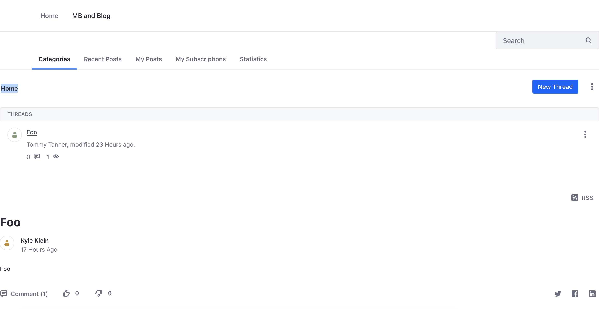

# Understanding Personal Data

Customers interact with your site in various ways. Some of these interactions, such as message board replies or form submissions, leave behind personal data on your system. If you must comply with regulations such as the EU's GDPR, Liferay gives you tools for managing that data so you can be in compliance. See [managing user data](https://learn.liferay.com/w/dxp/users-and-permissions/managing-user-data) to learn about all the different types of personal data that might get generated on your site.

In this step and the next, you'll use Liferay's user data tools to deactivate or delete a user and anonymize or delete the user's data.

1. Log into Liferay as the administrator (i.e. [Kyle Klein](../users-accounts-organizations/managing-users.md#creating-users)).

1. Change the user authentication setting so you can log in as the user you'll create below. Note, this is only for our learning and testing purposes.

   * Navigate to _Global Menu_ () &rarr; _Control Panel_ &rarr; _Instance Settings_.
   * Under Platform, click _User Authentication_.
   * Uncheck the box next to require strangers to verify their email address.
   * Click _Save_.

1. Set permissions for the regular user role so that users by default can access the Message Boards.

   * Navigate to _Global Menu_ () &rarr; _Control Panel_ &rarr; _Roles_.
   * Scroll down and click _User_.
   * Click the _Define Permissions_ tab.
   * Navigate to _Site and Asset Library Administration_ &rarr; _Content & Data_ &rarr; _Message Boards_.
   * Under _Messages_, tick the box for _Add Message_.
   * Scroll down and click _Save_.

1. Create a simple form.

   * Open the _Product Menu_ ().
   * Click _Forms_ under _Content & Data_.
   * Click _New Form_ in the new page.
   * Input `Foo` as the form title.
   * Drag a single selection field onto the form.
   * Click _Publish_.

2. Add the message boards widget and forms widget to a site page.

   * Open the _Product Menu_ ().
   * Click _Pages_ under _Site Builder_.
   * Click _Add_ () to add a new page. Select _Page_.
   * In the next screen, select the blank template. Input `MB and Form` as the page name. Click _Add_.
   * In the left navigation, select _Widgets_ under the fragments and widgets tab.
   * Find the message boards widget under collaboration. Drag it onto the page.
   * Then find the form widget and drag it onto the page under the message boards widget.
   * Click _Options_ ([!Options icon](../../images/icon-actions.png)) of the form widget and click _Configuration_.
   * In the pop-up window, click the form you just created. Click _Save_.
   * Finally, click _Publish_.

3. Create a sample customer.

   * Click the user profile image in the top right and click _Sign Out_.
   * Click _Sign in_ and in the pop-up window, click _Create Account_.
   * Input the following user information.
     * **Screen Name:** tommy
     * **Email Address:** tommy@tanner.com
     * **First Name:** Tommy
     * **Last Name:** Tanner
     * **Password:** test
     * **Enter Again:** test
     * **Text Verification:** input the text shown on the screen
   * Click _Save_.
   * Login in with the email address `tommy@tanner.com` and password `test`.
   * On the change password page, set the password as `learn`.

4. Add sample data.

   * Click _MB and Form_ in the top navigation.
   * Click _New Thread_ to add a message board thread.
   * Input `Foo` for the subject and `Bar` for the body. 
   * Click _Publish_.
   * Next, tick `Option` for the single selection field of the form.
   * Click _Submit_.

   

In this way, as customers interact with your site, they leave behind personal data. 

Next, you'll learn how to manage this data, should users wish their data to be anonymized or deleted: [Managing and Deleting Personal Data](./managing-and-deleting-personal-data.md)

## Relevant Concepts

- [Managing User Data](https://learn.liferay.com/w/dxp/users-and-permissions/managing-user-data)
