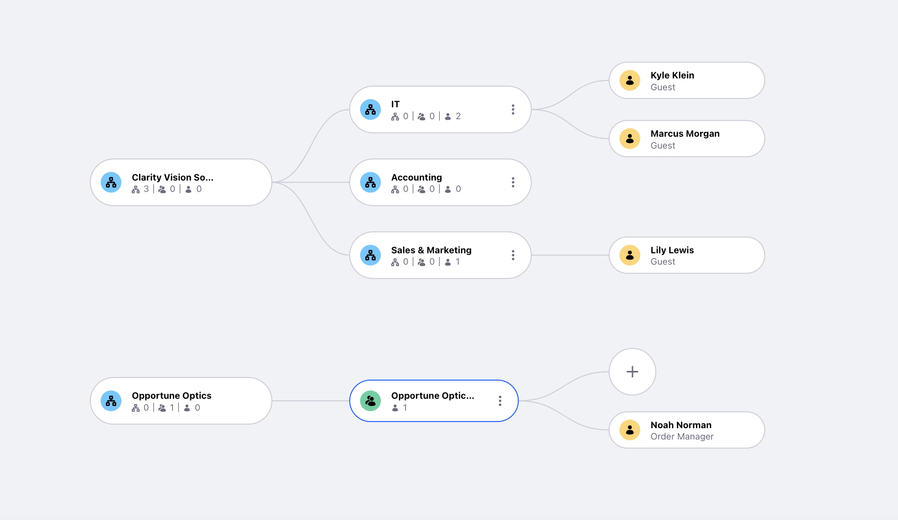

---
toc:
- ./users-accounts-organizations/creating-organizations.md
- ./users-accounts-organizations/creating-users.md
- ./users-accounts-organizations/setting-roles-and-permissions.md
- ./users-accounts-organizations/working-with-accounts.md
---
# Users, Accounts, Organizations, and Permissions

```{toctree}
:maxdepth: 3

users-accounts-organizations/creating-organizations.md
users-accounts-organizations/managing-users.md
users-accounts-organizations/setting-roles-and-permissions.md
users-accounts-organizations/working-with-accounts.md
```

- [Creating Organizations](./users-accounts-organizations/creating-organizations.md)
- [Managing Users](./users-accounts-organizations/managing-users.md)
- [Setting Roles and Permissions](./users-accounts-organizations/setting-roles-and-permissions.md)
- [Working with Accounts](./users-accounts-organizations/working-with-accounts.md)

The new Liferay DXP instance is up and running. Kyle Klein has been asked by his boss, Marcus Morgan to begin setting up Liferay as their new digital experience platform for Delectable Bonsai.

At the end of this module, you will have four user accounts assigned across different organizations.



The first step is creating some organizations for users. See [Creating Organizations](./users-accounts-organizations/creating-organizations.md) and follow the steps.
