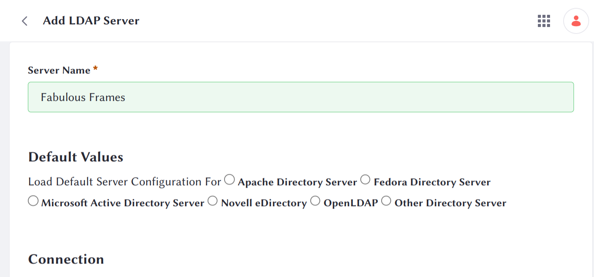

# Connecting to LDAP

You can configure an LDAP server at the system level or instance level. If you are on Liferay PaaS or self-hosted, you can choose the [configuration scope](https://learn.liferay.com/w/dxp/system-administration/configuring-liferay/understanding-configuration-scope) based on your needs. Note, when configuring at the system scope, you must specify each instance ID. If you're on Liferay SaaS, you must configure LDAP at the instance scope. See [Connecting to an LDAP Directory](https://learn.liferay.com/w/dxp/users-and-permissions/connecting-to-a-user-directory/connecting-to-an-ldap-directory).

Clarity Vision Solutions must import user data from a company they just acquired. 

## Start and Populate an LDAP Directory

1. Start a new OpenLDAP container.

   ```bash
   docker run \
	   --env LDAP_ORGANISATION="Fabulous Frames" \
	   --env LDAP_DOMAIN="fabulousframes.com" \
	   --env LDAP_BASE_DN="dc=fabulousframes,dc=com" \
	   --name fabulousframesldap \
	   -p 389:389 \
	   -p 636:636 \
	   osixia/openldap:1.5.0
   ```

1. Find the IP address of the `fabulousframesldap` container. This will be used in the configuration step below.

   ```bash
   docker network inspect bridge
   ```

1. Generate an LDIF file to seed LDAP with a user and a user group.

   ```bash
   cat <<EOT >> sarah.ldif
   dn: cn=sarah,dc=fabulousframes,dc=com
   objectClass: inetOrgPerson
   objectClass: organizationalPerson
   objectClass: person
   objectClass: top
   cn: Sarah
   sn: Stanley
   givenName: Sarah
   mail: sarah@fabulousframes.com
   title: IT Staff
   userPassword: learn

   cn: fabulousframes
   dn: cn=fabulousframes,dc=fabulousframes,dc=com
   objectClass: groupOfUniqueNames
   objectClass: top
   uniqueMember: cn=sarah,dc=fabulousframes,dc=com
   EOT
   ```

1. In your shell, navigate to the same folder as the LDIF file. Copy the file into the container.

   ```bash
   docker cp sarah.ldif fabulousframesldap:/container/service/slapd/assets/test
   ```

1. Add the entry into the OpenLDAP server.

   ```bash
   docker exec fabulousframesldap ldapadd -x -D "cn=admin,dc=fabulousframes,dc=com" -w admin -f /container/service/slapd/assets/test/sarah.ldif -H ldap://localhost
   ```

## Connect Liferay to the LDAP Directory

1. Navigate to _Global Menu_ () &rarr; _Control Panel_ &rarr; _Instance Settings_. 

1. Under security, click _LDAP_.

1. In the left navigation, click _Servers_. 

1. Click _Add_.

1. In the new page, enter the LDAP connection information.

   * Server Name: `Fabulous Frames`
   * Base Provider URL: `ldap://[IP address]:389`
   * Base DN: `dc=fabulousframes,dc=com`
   * Principal: `cn=admin,dc=fabulousframes,dc=com`
   * Credentials: `admin`

   

   Click _Test LDAP Connection_. A popup window shows that Liferay has connected successfully to the LDAP server. Click the _X_ and close the window.

1. In the LDAP user information section, map your LDAP fields to the appropriate Liferay fields. Type `uid` into the _UUID_ field to map Liferay's UUID field to LDAP's `uid` field. This is necessary to export data to LDAP. Click _Test LDAP Users_ to preview the mapping of user fields.

   

1. In the LDAP groups section, enter `Fabulous Frames` into the _Description_ field. Click _Test LDAP Groups_ to verify that the `fabulousframes` user group is visible.

1. Click _Save_.

Clarity Vision Solutions' Liferay instance is now connected to Fabulous Frames's LDAP directory. 

Next: [Importing and Exporting users](./importing-and-exporting-users.md).

## Relevant Concepts

- [Connecting to an LDAP Directory](https://learn.liferay.com/w/dxp/users-and-permissions/connecting-to-a-user-directory/connecting-to-an-ldap-directory)
