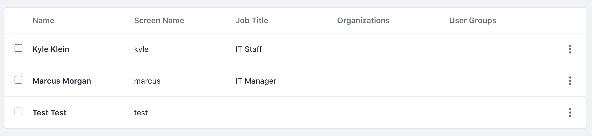

# Managing Users

Whether you bring in users from an LDAP or create them within Liferay, use the available tools to manage your users. See [Create and Manage Users](https://learn.liferay.com/en/w/dxp/users-and-permissions/users/adding-and-managing-users) to learn more.

## Create an Administrator

Instead of continuing to use the default Liferay admin account, create a new Clarity Vision Solutions administrator account that will go on to create the other users, organizations, and accounts.

!!! warning
   In a production environment, you should not use the default admin account. Instead, create admin accounts specific to your business.

1. Change the user authentication setting. Note, this is only for our learning and testing purposes.

   - Navigate to _Global Menu_ () &rarr; _Control Panel_ &rarr; _Instance Settings_.
   - Under Platform, click _User Authentication_.
   - Uncheck the box next to require strangers to verify their email address.
   - Click _Save_.

1. Navigate to _Global Menu_ () &rarr; _Control Panel_ &rarr; _Users and Organizations_. Click _Add User_ ().

1. Enter the following account information:

   - Screen Name: `kyle`
   - Email Address: `kyle@clarityvisionsolutions.com`
   - First Name: `Kyle`
   - Last Name: `Klein`
   - Job Title: `IT Staff`

   Click _Save_.

1. Give Kyle the administrator role.

   - In the left navigation, click _Roles_.
   - Next to Regular Roles, click _Select_.
   - In the new window, click _Choose_ next to Administrator.
   - Scroll down to the bottom and click _Save_.

1. Set Kyle's password.

   - In the left navigation, click _Password_.
   - Input `test` in the two fields.
   - Click _Save_.

1. Logout of the default admin account and Login as Kyle Klein.

   - Click the user profile image in the top right and click _Sign Out_.
   - Click _Sign In_ at the top right.
   - Sign in with `kyle@clarityvisionsolutions.com` as the email address and `test` as the password.
   - In the next page to reset password, set the new password as `learn`.

## Create an Account for the IT Manager.

1. Navigate to _Global Menu_ () &rarr; _Control Panel_ &rarr; _Users and Organizations_. Click _Add User_ ().

1. Create a user account for Kyle's manager:

   - Screen Name: `marcus`
   - Email Address: `marcus@clarityvisionsolutions.com`
   - First Name: `Marcus`
   - Last Name: `Morgan`
   - Job Title: `IT Manager`

   The list of users should look like this:

   

The next step is creating [organizations](./creating-organizations.md).

## Relevant Concepts

- [Users](https://learn.liferay.com/en/w/dxp/users-and-permissions/users)
- [Adding and Managing Users](https://learn.liferay.com/en/w/dxp/users-and-permissions/users/adding-and-managing-users)
- [Adding Users to Organizations](https://learn.liferay.com/en/w/dxp/users-and-permissions/organizations/adding-users-to-organizations)
