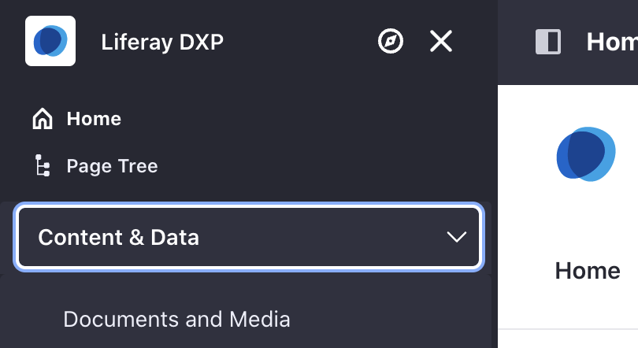

# Setting Roles and Permissions

In Liferay, users get different permissions based on assigned roles. See [Understanding Roles and Permissions](https://learn.liferay.com/dxp/latest/en/users-and-permissions/roles-and-permissions/understanding-roles-and-permissions.html) to learn more.

## Assigning Users to Roles

As the main IT staff working on this Liferay project, Kyle needs administrator permissions. 

1. Navigate to _Global Menu_ () &rarr; _Control Panel_ &rarr; _Roles_. Under the _Regular Roles_ tab, click _Administrator_.

1. In the new page, click on the _Assignees_ tab. Click _Add_ (). In the new window, select _Kyle Klein_ and click _Add_. Kyle now has the administrator role.

Users can also be assigned roles from the edit user page. 

1. Navigate to _Global Menu_ () &rarr; _Control Panel_ &rarr; _Users and Organizations_. Click on _Marcus Morgan_.

1. In the left navigation, click _Roles_. Click _Select_ next to regular roles. In the new window, click _Choose_ for administrator. Click _Save_ at the bottom of the page. Now Marcus has also been assigned the administrator role.

## Creating Roles

Different people at Delectable Bonsai need different permissions based on their work. For example, those in the Sales & Marketing department need access to their organization site blog. They also require access to documents and media for their marketing campaigns.

1. Navigate to _Global Menu_ () &rarr; _Control Panel_ &rarr; _Roles_. Click _Add_ () under the _Regular Roles_ tab.

1. In the new window, input the following:

   * Title: `Sales & Marketing Staff`
   * Description: `Staff member of sales & marketing`

   Click _Save_.

1. Next, click on the _Define Permissions_ tab. Scroll down the left navigation and navigate to _Site and Asset Library Administration_ &rarr; _Content & Data_ &rarr; _Blogs_. Add the following permissions:

   **Resource Permissions - Blog Entries**
   - `Add Entry`
   - `Subscribe`

   **Resource Permissions - Blog Entry**
   - `Add Discussion`
   - `Update`
   - `Update Discussion`
   - `View`

   Click _Save_.

1. Still under _Content & Data_, click _Documents and Media_. Add the following permissions:

   **General Permissions**
   - `Access in Site and Asset Library Administration`
   - `View`

   **Resource Permissions**
   - Select all actions for Documents, Documents Folder, Document, Shortcut, Document Type, and Metadata.

   Click _Save_. The different permissions are now set for the new role.

1. We can now assign users to this role. Click the _Assignees_ tab. Click _Add_ (). In the new window, select _Lily Lewis_ and click _Add_. Now Lily Lewis, or others with this role, have access to documents and media through the site administration menu. They also have access to view and add blog posts in the sales & marketing organization site.

   

The next step is creating and managing accounts. See [Working with Accounts](./working-with-accounts.md). 

## Relevant Concepts
- [Understanding Roles and Permissions](https://learn.liferay.com/dxp/latest/en/users-and-permissions/roles-and-permissions/understanding-roles-and-permissions.html)
- [Assigning Users to Roles](https://learn.liferay.com/dxp/latest/en/users-and-permissions/roles-and-permissions/assigning-users-to-roles.html)
- [Creating and Managing Roles](https://learn.liferay.com/dxp/latest/en/users-and-permissions/roles-and-permissions/creating-and-managing-roles.html)