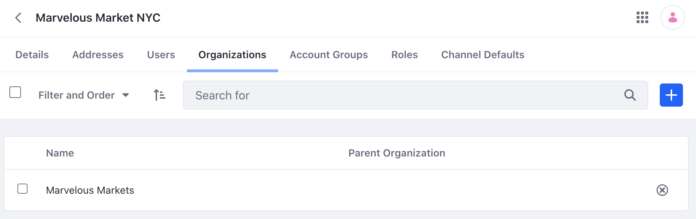
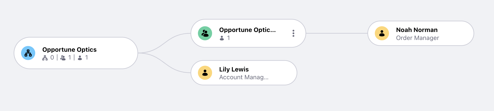

# Working with Accounts

In Liferay, accounts can represent individual buyers in a B2C (i.e. business to consumer) context, as well as a B2B (business to business) context. See [Accounts](https://learn.liferay.com/dxp/latest/en/users-and-permissions/accounts.html) to learn more. Delectable Bonsai sells maple syrup to both individuals, as well as to other businesses (i.e. various markets across the country). 

## Adding Accounts

Create a business type account:

1. Navigate to _Global Menu_ () &rarr; _Control Panel_ &rarr; _Accounts_. Click _Add Account_ ().

1. In the new window, input `Acme Market NYC` for account name. Click _Save_.

1. Click the _Addresses_ tab. Click _Add_ (). Input the following:

   * Name: `Acme Market NYC`
   * Country: `United States`
   * Street 1: `123 Anywhere St`
   * City: `New York`
   * Region: `New York`
   * Postal Code: `10027`

1. Click back to the _Details_ tab. Scroll down to the default account address section. Click _Set Default Address_ under the billing heading. Select the address you just created. Click _Save_. In the same way, set the default address for the shipping address.

## Adding Account Users

Create a new user for the account you just made. Note, new users can be created for accounts, or existing users can be associated to accounts.

1. Navigate to _Global Menu_ () &rarr; _Control Panel_ &rarr; _Account Users_. Click _Add User_ (). Click _Choose_ next to Acme Market NYC.

1. Create the following store manager:

   * Screen Name: `Noah`
   * Email Address: `noah@acmemarket.com`
   * First Name: `Noah`
   * Last Name: `Norman`
   * Job Title: `Store Manager`

   Click _Save_. 

## Assigning Account Roles

For each account, a business might have multiple users and multiple roles. For example, the account buyer might handle creating orders but the order manager might handle approving the orders. Assign Noah with the order manager role.

1. Navigate to _Global Menu_ () &rarr; _Control Panel_ &rarr; _Accounts_. Click on _Acme Market NYC_. Click the _Roles_ tab. Click _Order Manager_.

1. In the next window, click _Assign User_ (). Select Noah Norman and click _Assign_.

   As Noah's employees add orders to their account, Noah is able to approve and manager orders. See [Commerce Roles Reference](https://learn.liferay.com/commerce/latest/en/users-and-accounts/roles-and-permissions/commerce-roles-reference.html) to learn more about these roles.

## Managing Accounts

Use account groups to help organize multiple accounts.

1. Navigate to _Global Menu_ () &rarr; _Control Panel_ &rarr; _Account Groups_. Click _Add Account Group_ (). 

1. Give the name `Acme Market East Coast` for the account group name. Click _Save_.

1. Click the _Accounts_ tab and click _Assign Account_ (). In the new window, select _Acme Market NYC_ and click _Assign_. In this way, multiple Acme markets in the east coast region an be added to the group.

In addition to account roles, an account manager role can be assigned to a whole organization. Therefore, in a situation where an entity (e.g. Acme Markets) has multiple accounts, create an organization for the accounts to be a part of. Then assign an account manager to that organization. 

1. Navigate to _Global Menu_ () &rarr; _Control Panel_ &rarr; _Users and Organizations_. Click the _Organizations_ tab. Click _Add_ (). Input `Acme Markets` in the _Name_ field. Click _Save_.

1. Navigate to _Control Panel_ &rarr; _Accounts_. Click _Acme Market NYC_. Click the _Organizations_ tab. Click _Assign Organizations_ (). 

1. In the new window, select _Acme Markets_ and click _Assign_. The Acme Market NYC account is now part of the Acme Markets organization.

   

1. Now make Lily Lewis an account manager. Navigate to _Control Panel_ &rarr; _Users and Organizations_. Click on _Lily Lewis_. Click _Organizations_ in the left navigation. Click _Select_ and click _Choose_ next to Acme Markets. Click _Save_. Lily Lewis is now also part of the Acme Markets organization.

1. Click _Roles_ in the left navigation. Click _Select_ next to organization roles. Click _Choose_ next to Account Manager. Click _Save_. 

   

   Lily Lewis is now an account manager for all accounts in the Acme Market organization. The account manager can take actions, such as placing orders, on behalf of accounts. 

You have completed this module on users, accounts, organizations, and permissions. The next module is all about [User Data]().

## Relevant Documentation
- [Accounts](https://learn.liferay.com/dxp/latest/en/users-and-permissions/accounts.html)
- [Account Users](https://learn.liferay.com/dxp/latest/en/users-and-permissions/accounts/account-users.html)
- [Account Groups](https://learn.liferay.com/dxp/latest/en/users-and-permissions/accounts/account-groups.html)
- [Account Roles](https://learn.liferay.com/dxp/latest/en/users-and-permissions/accounts/account-roles.html)
