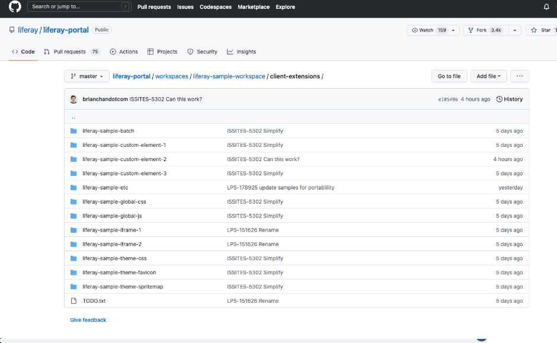

# Cloud and Infrastructure

Liferay Experience Cloud is Liferay’s SaaS offering, that empowers customers to focus on business processes and time-to-value while still providing powerful customization capabilities. Liferay Experience Cloud Self-Managed is Liferay’s PaaS offering. It gives customers the ability to directly manage their solution lifecycle with built-in CI/CD, automated backups, monitoring, and alerts.

## Related Features

* [Introduction to Liferay Cloud Infrastructure](https://learn.liferay.com/w/liferay-cloud/getting-started)
* [Overview of the Liferay Cloud Deployment Workflow](https://learn.liferay.com/w/liferay-cloud/build-and-deploy/overview-of-the-liferay-cloud-deployment-workflow)
* [Backup Service Overview](https://learn.liferay.com/w/liferay-cloud/platform-services/backup-service/backup-service-overview)

## What's Next

Congratulations! You've completed the Liferay Product Overview module!

[Back to Level 0](../../level-0.md)
