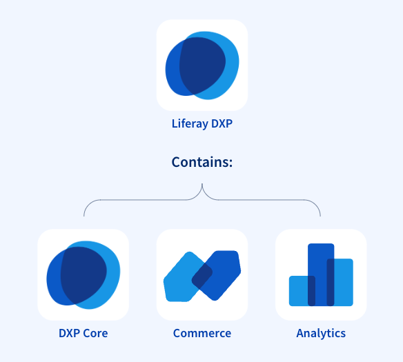

# Liferay DXP Product Capabilities

As a quick refresher, Liferay's product is Liferay DXP, and includes core Digital Experience Platform capabilities along with Commerce and Analytics capabilities. **All** customers get access to all of the product's features and capabilities, irrespective of their deployment approach.

This module provides introductions to the numerous capabilities of Liferay DXP and how they relate to solving a customers business problems.

::::{grid} 2
:gutter: 3 3 3 3

:::{grid-item-card} Design Systems and Experience Management
:link: ./liferay-dxp-product-capabilities/design-systems-and-experience-management.md

This module provides an introduction to the Liferay product and product offerings.
:::
:::{grid-item-card} Content and Asset Management
:link: ./liferay-dxp-product-capabilities/content-and-asset-management.md

This module provides an introduction to the Liferay product and product offerings.
:::
:::{grid-item-card} Low Code and No Code Application Building
:link: ./liferay-dxp-product-capabilities/low-code-no-code-application-building.md

This module provides an introduction to the Liferay product and product offerings.
:::
:::{grid-item-card} Data Modelling and Process Management
:link: ./liferay-dxp-product-capabilities/data-modelling-and-process-management.md

This module provides an introduction to the Liferay product and product offerings.
:::
:::{grid-item-card} Commerce
:link: ./liferay-dxp-product-capabilities/commerce.md

This module provides an introduction to the Liferay product and product offerings.
:::
:::{grid-item-card} Analytics and Optimization
:link: ./liferay-dxp-product-capabilities/analytics-and-optimization.md

This module provides an introduction to the Liferay product and product offerings.
:::
:::{grid-item-card} Segmentation and Personalization
:link: ./liferay-dxp-product-capabilities/segmentation-and-personalization.md

This module provides an introduction to the Liferay product and product offerings.
:::
:::{grid-item-card} Search and Navigation
:link: ./liferay-dxp-product-capabilities/search-and-navigation.md

This module provides an introduction to the Liferay product and product offerings.
:::
:::{grid-item-card} Headless APIs and Multichannel
:link: ./liferay-dxp-product-capabilities/headless-apis-and-multichannel.md

This module provides an introduction to the Liferay product and product offerings.
:::
:::{grid-item-card} Collaboration and Knowledge Sharing
:link: ./liferay-dxp-product-capabilities/collaboration-and-knowledge-sharing.md

This module provides an introduction to the Liferay product and product offerings.
:::
:::{grid-item-card} Identity Management and Access Control
:link: ./liferay-dxp-product-capabilities/identity-management-and-access-control.md

This module provides an introduction to the Liferay product and product offerings.
:::
:::{grid-item-card} Integration and Interoperability
:link: ./liferay-dxp-product-capabilities/integration-and-interoperability.md

This module provides an introduction to the Liferay product and product offerings.
:::
:::{grid-item-card} Developer Tooling
:link: ./liferay-dxp-product-capabilities/developer-tooling.md

This module provides an introduction to the Liferay product and product offerings.
:::
:::{grid-item-card} Platform Services
:link: ./liferay-dxp-product-capabilities/platform-services.md

This module provides an introduction to the Liferay product and product offerings.
:::
:::{grid-item-card} Cloud and Infrastructure
:link: ./liferay-dxp-product-capabilities/cloud-and-infrastructure.md

This module provides an introduction to the Liferay product and product offerings.
:::
::::
