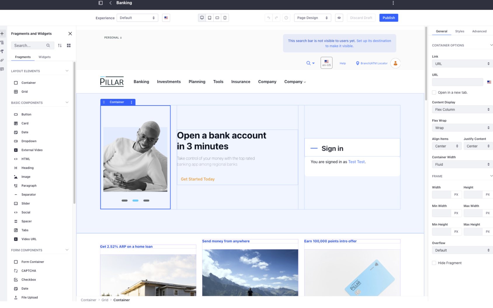

# Low Code and No Code Application Building

Liferay’s Low-Code and No-Code tools make it possible for non-developers to build pages, and create business applications, forms and workflows. With Liferay’s low-code/no-code capabilities, business users can quickly compose and launch new applications, capture user data without having to write a single line of code or wait for developers to build and test solutions for them.

## Related Features

### Objects

### Forms

### Pages
