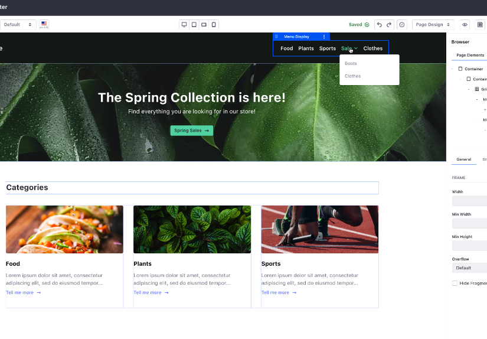

# Search and Navigation

Liferay DXP allows you to build digital experiences with dynamic navigation, categories, and search results that can change depending on your audience. The result is a user experience that makes it easy for customers, partners, or employees to locate what they're looking for and discover other highly relevant services, products, or content you can offer them.

## Related Features

### Site Search

* [Search Overview](https://learn.liferay.com/w/dxp/using-search/getting-started/search-overview)
* [Searching for Content](https://learn.liferay.com/w/dxp/using-search/getting-started/searching-for-content)

### Custom Search and Search Blueprints

* [Search Administration and Tuning](https://learn.liferay.com/w/dxp/using-search/search-administration-and-tuning)
* [Search Blueprints](https://learn.liferay.com/w/dxp/using-search/liferay-enterprise-search/search-experiences/search-blueprints)

### Basic Navigation

* [Site Navigation](https://learn.liferay.com/w/dxp/site-building/site-navigation)
* [Managing Site Navigation](https://learn.liferay.com/w/dxp/site-building/site-navigation/managing-site-navigation)

### Enhanced Navigation

* [Navigation Menus](https://learn.liferay.com/w/dxp/site-building/site-navigation/using-the-navigation-menus-application)
* [Configuring Menu Displays](https://learn.liferay.com/w/dxp/site-building/site-navigation/configuring-menu-displays)
